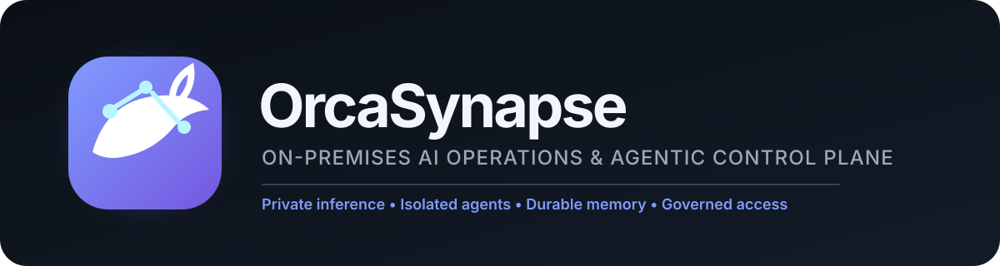
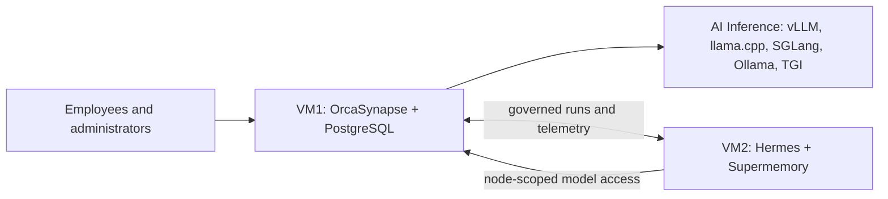

<p align="center">
  
</p>

<h3 align="center">Your private AI. One control plane. Fully on-premises.</h3>

<p align="center">
  Connect any OpenAI-compatible inference server to governed Hermes agents with durable Supermemory, enterprise access, and end-to-end operational visibility.
</p>

<p align="center">
  <a href="https://github.com/multichainerz/AI/actions/workflows/verify.yml"></a>
  
  
  
  
</p>

## Install OrcaSynapse

Start with one clean Debian or Ubuntu VM. The installer provisions Docker, PostgreSQL, the API, worker, dashboard, encrypted secrets, and the first local administrator.

```bash
curl -fsSL https://raw.githubusercontent.com/multichainerz/AI/main/install.sh | sudo bash
```

Open the dashboard URL printed by the installer. That is the only command needed on VM1.

<details>
<summary>Prefer to inspect the bootstrap first?</summary>

```bash
curl -fsSLo orcasynapse-install.sh https://raw.githubusercontent.com/multichainerz/AI/main/install.sh
sed -n '1,260p' orcasynapse-install.sh
sudo bash orcasynapse-install.sh
```

Production environments can pin an approved commit and archive checksum. See the [installation and recovery guide](deploy/BOOTSTRAP.md).
</details>

## Private AI without the infrastructure maze

OrcaSynapse turns three clear layers into one governed experience:

| Layer | What the administrator does | What OrcaSynapse manages |
| --- | --- | --- |
| **AI Inference** | Select an existing inference endpoint | Discovery, model validation, routing, credentials, health, and usage |
| **Agentic System** | Enroll one isolated VM | Hermes, Supermemory, managed policy, node identity, and observability |
| **Enterprise Access** | Connect organizational identity | Local recovery, OIDC / Microsoft Entra ID, roles, sessions, and audit |



No LiteLLM tier, Redis, Valkey, pg-boss, object store, or duplicate vector database is required.

## From two empty VMs to governed agents

1. **Install VM1** with the one-line command above and sign in to OrcaSynapse.
2. **Connect AI Inference** from the dashboard. OrcaSynapse discovers compatible API paths and available models instead of asking you to guess endpoint URLs.
3. **Enroll VM2** from **Deployment > Agentic System**. Only after administrator setup and AI Inference validation does the dashboard generate a one-time claim and unlock the OrcaSynapse-hosted installer that provisions Hermes and Supermemory together.
4. **Add Enterprise Access** when ready by connecting OIDC or Microsoft Entra ID and mapping groups to administrative roles.

The VM2 installer creates its identity locally, consumes the claim once, receives the dashboard-selected model alias through a scoped OrcaSynapse inference route, applies the managed guardrail baseline, and starts signed health reporting. The installer URL returns no script until these prerequisites and a live invitation exist. OrcaSynapse never needs the VM's SSH password or Docker socket.

## What you get

- Responsive Chat with streaming, cancellation, token usage, latency, throughput, feedback, and retained conversations.
- Smart inference discovery for vLLM, llama.cpp, SGLang, Ollama, TGI, and compatible OpenAI-style servers.
- Governed Hermes profiles, skills, tools, prompts, guardrails, lifecycle states, runs, and safe event projections.
- Durable semantic memory through self-hosted Supermemory Local without a second vector plane in OrcaSynapse.
- Ephemeral document processing with durable knowledge publication and no permanent source-file repository.
- Encrypted PostgreSQL-backed configuration, sessions, authorization, workflow state, audit, and operational evidence.
- Local recovery plus optional OIDC / Microsoft Entra ID for enterprise administration.

## Trust boundaries that stay understandable

- **OrcaSynapse** owns identity, authorization, policy, encrypted configuration, audit, and inference access.
- **PostgreSQL** owns control-plane state—not embeddings, model weights, or original enterprise files.
- **Hermes** runs in an isolated environment with only approved model, memory, and tool capabilities.
- **Supermemory** owns long-lived semantic memory; enterprise knowledge retrieval remains governed by OrcaSynapse.
- **Inference credentials** remain on VM1. Agent nodes receive a bounded node-scoped gateway credential.

Production acceptance still requires customer-approved TLS/PKI, firewall policy, exact artifact pins, backup and restore testing, identity acceptance, GPU capacity testing, and security approval.

## Development

Requirements: Node.js 24+, pnpm 10+, PostgreSQL 17, and Docker.

```bash
pnpm install
pnpm db:generate
pnpm dev
```

Vite serves the React dashboard; pnpm manages the TypeScript workspace. Run the worker separately with `pnpm dev:worker`, or verify the complete monorepo with `pnpm verify`.

## Documentation

- [Architecture and trust boundaries](docs/ARCHITECTURE.md)
- [Installation and recovery](deploy/BOOTSTRAP.md)
- [Hermes and Supermemory enrollment](docs/HERMES_NODE_ENROLLMENT_RUNBOOK.md)
- [Product requirements](docs/ORCASYNAPSE_PRD.md)
- [Delivery and acceptance plan](docs/ORCASYNAPSE_PHASED_PLAN.md)

> OrcaSynapse is currently an on-premises acceptance candidate. Production approval remains environment-specific.
