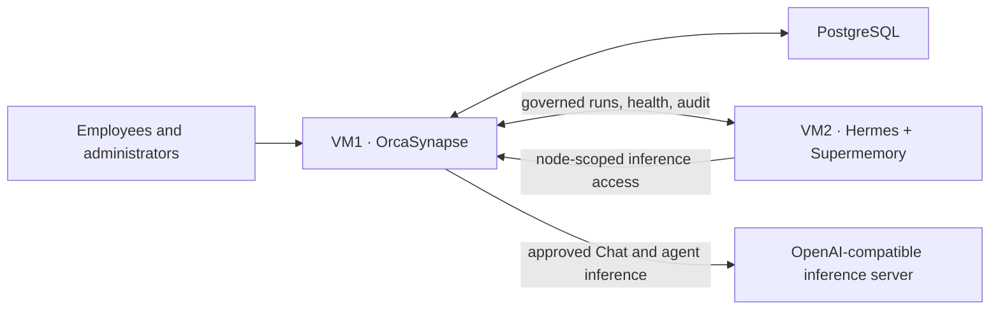

<p align="center">
  
</p>

<p align="center">
  <a href="https://github.com/multichainerz/AI/actions/workflows/verify.yml"></a>
  
  
  
  
</p>

OrcaSynapse is a self-hosted control and observability plane for private AI. It connects an enterprise-approved inference server to an isolated Hermes agent runtime, gives Hermes durable Supermemory, and centralizes chat, model routes, prompts, guardrails, knowledge, identity, audit, and operational evidence.

The design is intentionally small: no LiteLLM tier, Redis, Valkey, pg-boss, object store, or duplicate vector database is required.

## Three coherent layers

| Layer | Purpose | Primary components |
| --- | --- | --- |
| **AI Inference** | Discover, validate, select, and monitor an OpenAI-compatible model endpoint | vLLM, llama.cpp, SGLang, Ollama, TGI, or a compatible server |
| **Agentic System** | Run isolated, governed agents with long-lived semantic memory | Hermes Agent + Supermemory Local on VM2 |
| **Enterprise Access** | Authenticate people, assign administrative roles, and retain policy evidence | Local recovery account, OIDC / Microsoft Entra ID, PostgreSQL audit and configuration |



## Install with two scripts on two VMs

### 1. Install OrcaSynapse on VM1

Use a clean Debian or Ubuntu host with network access and enough capacity for the application services and PostgreSQL. The public bootstrap is hosted free of charge through GitHub Raw. Installation is two commands:

```bash
curl --proto '=https' --tlsv1.2 -fsSLo orcasynapse-install.sh \
  https://raw.githubusercontent.com/multichainerz/AI/main/install.sh
sudo bash orcasynapse-install.sh
```

The previous `less install.sh` instruction opened a full-screen terminal pager, which can resemble Vim. It was only for inspection and was never part of the installer. To review the script without opening a pager, download it and print it directly:

```bash
curl --proto '=https' --tlsv1.2 -fsSLo orcasynapse-install.sh \
  https://raw.githubusercontent.com/multichainerz/AI/main/install.sh
sed -n '1,240p' orcasynapse-install.sh
sudo bash orcasynapse-install.sh
```

The installer uses a branded, color-aware terminal interface when attached to a terminal and plain log-safe output in automation. Set `NO_COLOR=1` to disable ANSI colors explicitly.

The bootstrap resolves the selected GitHub ref to an immutable commit, downloads that source archive from GitHub, installs it under `/opt/orcasynapse`, builds the pinned Compose application locally, and starts PostgreSQL, migrations, the API, runtime executor, and dashboard. It prints:

- the initial `admin` temporary password, which must be changed at first sign-in; and
- a permanent Installation Key for offline local-account recovery, which the customer must store in an organizational password vault.

GitHub Raw hosts only the small bootstrap file; it is not an image registry or a trust substitute. For an accepted production build, pin a reviewed 40-character commit and its archive checksum:

```bash
sudo env \
  ORCASYNAPSE_REF=<approved-commit-sha> \
  ORCASYNAPSE_ARCHIVE_SHA256=<approved-archive-sha256> \
  bash install.sh
```

If the repository is already checked out locally, run `sudo ./scripts/install-orcasynapse.sh` instead.

### 2. Configure AI Inference

Open the dashboard, sign in, and use **Deployment → AI Inference**. OrcaSynapse probes likely OpenAI-compatible paths, discovers model IDs, validates chat and streaming behavior, and saves the chosen endpoint and credential in its encrypted PostgreSQL-backed configuration store.

### 3. Install the Agentic System on VM2

After activating an Agent model route, use **Deployment → Agentic System → Enroll node**. OrcaSynapse generates a short-lived, single-use claim and serves the second installer from the customer-owned VM1:

```bash
curl -fsS https://orcasynapse.example.internal/install/hermes-node.sh \
  -o install-orcasynapse-agent.sh
sudo bash install-orcasynapse-agent.sh \
  --connect https://orcasynapse.example.internal
```

Paste the claim at the hidden prompt. This one script installs both Hermes and Supermemory, generates the node identity on VM2, applies the approved inference route and managed guardrail baseline, registers the services, and starts signed health heartbeats. OrcaSynapse never retains VM2 SSH credentials or mounts its Docker socket.

### 4. Enable Enterprise Access

Configure OIDC or Microsoft Entra ID, map administrative groups to roles, validate sign-in and recovery, and retain the local administrator only as a controlled break-glass path. Tenant isolation remains an explicit production acceptance item; the current release must not be marketed as fully tenant-isolated until those controls pass end-to-end tests.

## What is already implemented

- responsive desktop and mobile administration dashboard;
- direct OpenAI-compatible chat with streaming, cancellation, bounded context, token usage, latency, throughput, feedback, and sanitized audit records;
- encrypted dashboard-managed endpoints and credentials;
- versioned model, prompt, and deterministic guardrail controls;
- local administrator authentication, forced temporary-password replacement, offline recovery, optional OIDC, session limits, and lockout controls;
- transient encrypted TXT document staging with durable publication to governed Supermemory namespaces;
- immutable Hermes profile distributions, standby/active lifecycle, governed runs, safe event projection, cancellation, and approved MCP-tool controls;
- one-time signed node enrollment, node-generated Ed25519 identity, recurring heartbeats, recovery evidence, and service diagnostics;
- PostgreSQL as the durable control, audit, session, configuration, authorization, and workflow system of record.

## Security and data boundaries

- Original enterprise files remain in their authoritative repositories; OrcaSynapse keeps uploaded source bytes only in encrypted ephemeral scratch space.
- Supermemory is the semantic-memory plane. PostgreSQL does not duplicate embeddings or knowledge graphs.
- Hermes owns its local runtime state and profile-scoped memory but receives no PostgreSQL credential, infrastructure-admin credential, or unrestricted enterprise connector.
- Inference credentials terminate at OrcaSynapse. Enrolled runtimes receive a bounded node-scoped gateway key and an approved model alias.
- Production requires customer-approved TLS/PKI, firewall rules, exact image and artifact pins, backup/restore drills, OIDC acceptance, GPU capacity tests, SIEM integration, and formal security approval.

## Development

Requirements: Node.js 24+, pnpm 10+, PostgreSQL 17, and Docker for the release topology.

```bash
pnpm install
pnpm db:generate
pnpm dev
```

Vite serves and builds the React application; pnpm manages the JavaScript workspace. Run the runtime executor separately with `pnpm dev:worker` and verify the complete monorepo with `pnpm verify`.

## Documentation

- [Architecture and trust boundaries](docs/ARCHITECTURE.md)
- [Product requirements](docs/ORCASYNAPSE_PRD.md)
- [Delivery and acceptance plan](docs/ORCASYNAPSE_PHASED_PLAN.md)
- [Installation and recovery](deploy/BOOTSTRAP.md)
- [Hermes and Supermemory enrollment](docs/HERMES_NODE_ENROLLMENT_RUNBOOK.md)
- [Model control](docs/MODEL_CONTROL_RUNBOOK.md)
- [Guardrail control](docs/GUARDRAIL_CONTROL_RUNBOOK.md)
- [Prompt control](docs/PROMPT_CONTROL_RUNBOOK.md)

> **Release posture:** OrcaSynapse is an on-premises acceptance candidate. The repository demonstrates the product path and safety controls; customer production approval still depends on environment-specific acceptance evidence.
