# MPM AIHub - Phased Delivery Plan

**Status:** Phase 1 local baseline complete; Phase 2 chat, Phase 3 document/OCR, private-scope Phase 4 knowledge, zero-tool Phase 5 Hermes, Phase 6 governed MCP, Phase 7 AI operations, Phase 8 pilot-readiness, and Phase 9 cohesion/onboarding foundations implemented as local acceptance candidates; upstream Profile filesystem reconciliation, delegation/native-memory expansion, and target-environment acceptance remain pending
**Related document:** `docs/AIHUB_PRD.md`  
**Delivery model:** Incremental, on-premises, security-first

## 1. Delivery Objective

Deliver MPM AIHub as a sequence of usable, testable increments. Each phase must leave the platform deployable and must establish a clear acceptance gate before the next capability is trusted in production.

The first usable release will provide controlled internal chat. Later phases add document processing, enterprise knowledge, Hermes agents, MCP integrations, approvals, full AI operations, and an enterprise Hermes Profile/onboarding experience.

## 2. Delivery Principles

- AIHub is the control plane for endpoints, credentials, connectors, models, agents, policies, and operational settings.
- Routine configuration is performed in the AIHub dashboard; only installation bootstrap secrets remain outside the application database.
- AIHub and Hermes call models through LiteLLM; vLLM remains the internal model-serving layer.
- PostgreSQL and Prisma are the operational system of record.
- PostgreSQL and `pg-boss` provide durable jobs and coordination; the AIHub application introduces no Redis or Valkey dependency.
- Enterprise repositories are authoritative for originals; AIHub is an extraction control plane, not a file repository.
- AIHub uses application-encrypted, time-bounded scratch for conversion and OCR, then purges the whole document prefix after durable publication.
- Supermemory is the sole durable enterprise normalized-knowledge, semantic-retrieval, and approved agent-memory layer; AIHub does not maintain a competing vector store or share its PostgreSQL schema with Supermemory.
- Hermes built-in `MEMORY.md` and `USER.md` remain active inside the runtime node's `HERMES_HOME`; they are not a Profile-isolated enterprise store and must not contain enterprise records or secrets.
- Hermes is default-deny and can use only AIHub-issued capabilities, approved MCP servers, and approved tools.
- Every phase includes security, audit, tests, documentation, and operational visibility.
- External systems are accessed through replaceable adapters so development can proceed with mocks before production endpoints are available.

## 3. Phase Sequence

```mermaid
flowchart LR
    P0["Phase 0: Validation"] --> P1["Phase 1: Platform Foundation"]
    P1 --> P2["Phase 2: Controlled Chat"]
    P2 --> P3["Phase 3: Documents and OCR"]
    P3 --> P4["Phase 4: Knowledge and Memory"]
    P4 --> P5["Phase 5: Controlled Hermes"]
    P5 --> P6["Phase 6: MCP and Approvals"]
    P6 --> P7["Phase 7: AI Operations"]
    P7 --> P8["Phase 8: Production Pilot"]
    P8 --> P9["Phase 9: Cohesion and Enterprise Onboarding"]
```

The phases describe the critical path. Work such as UI design, threat modeling, automated testing, and operational documentation may run continuously across phases.

## 4. Phase 0 - Technical Validation and Scope Baseline

### Outcome

Confirm the critical technical assumptions before committing the platform to specific model and service configurations.

### Scope

- Agree on the first pilot users and two or three priority use cases.
- Validate Laguna inference, context length, streaming, structured output, and tool-calling behavior through vLLM and LiteLLM.
- Validate Unlimited-OCR through a pinned serving contract rather than assuming its official direct inference API is OpenAI-compatible.
- Confirm the exact Supermemory Local artifact/edition, licensing/support, Memory API, encrypted embedded-storage behavior, optional supported backend, local-embedding default, model lock, telemetry, backup/recovery behavior, and air-gapped requirements. Do not assume hosted connectors are present in the local deployment.
- Treat Qwen3 Embedding as optional. If selected instead of Supermemory's local embedding, lock its variant, revision, dimensions, normalization, and instruction template and prove the controlled rebuild path.
- Validate encrypted scratch isolation, capacity, expiry, crash cleanup, and post-publication purge on the target API/worker topology.
- Identify the authoritative enterprise source and refetch/re-upload procedure for every production document corpus.
- Establish initial security boundaries, data classifications, and deployment topology.
- Record measurable latency, throughput, GPU memory, and concurrency baselines on the RTX PRO 6000 96 GB, including simultaneous Laguna, OCR, and embedding demand.
- Decide whether production uses another GPU, a smaller primary model, a dedicated embedding service, or an explicitly degraded scheduling policy; do not infer safe co-residency from model weight size alone.

### Exit Gate

- Selected services can be deployed on-premises and their licenses are acceptable.
- The primary model works through LiteLLM at an acceptable pilot baseline.
- The approved topology identifies one authoritative owner for operational records, original files, normalized knowledge, and Hermes state, with tested recovery paths.
- The GPU plan supports the approved concurrency and availability targets, or the recorded limitation has an owner and accepted mitigation.
- Major unknowns are either resolved or recorded with an owner and mitigation.
- Pilot use cases and acceptance examples are approved.

## 5. Phase 1 - Platform Foundation and Configuration Control Plane

### Outcome

Create the deployable AIHub foundation and make the dashboard the normal place to configure the platform.

### Scope

- Establish the TypeScript monorepo, React application, Node.js API, workers, shared contracts, and automated tests.
- Establish PostgreSQL, Prisma migrations, `pg-boss`, service health checks, and audit events.
- Implement bootstrap installation for database access and the AIHub credential-encryption key.
- Implement the PostgreSQL-backed encrypted credential store. This is an application capability, not HashiCorp Vault or Vault KV.
- Build administrative pages for service endpoints, credentials, certificates, model aliases, connectors, and test-connection actions.
- Add configuration versioning, activation, rollback, masking, and rotation.
- Establish initial RBAC, administrator separation, and local bootstrap administration.
- Provide the pinned release-bundle manifest and signed installer workflow.

### Exit Gate

- An authorized administrator can configure and test supported services without editing routine environment files.
- Secrets are encrypted, masked, excluded from logs, and unavailable to frontend clients.
- Database migrations, jobs, health checks, audit records, and backup procedures have been exercised.
- A clean environment can be installed from documented steps.

### Current implementation note

The repository contains the Phase 1 baseline: protected bootstrap, a PostgreSQL-backed encrypted write-only credential store, expiring administrator sessions and scoped roles, service-specific diagnostics, append-only revisions with guarded non-secret rollback, PostgreSQL-native job operations, responsive administration UI, and automated coverage. Phase 9 supersedes the original reusable bootstrap credential with atomic single-use installation claiming and mapped OIDC administrator sessions. Signed-installer/TLS deployment, live database and queue migrations, backup restoration, private-CA lifecycle requirements, real service endpoints, and target-environment identity exercises remain acceptance gates; they are not represented as completed by local unit tests.

## 6. Phase 2 - Controlled Internal Chat

### Outcome

Deliver the first end-user capability: authenticated, governed chat with the on-premises model.

### Scope

- Integrate MPM identity through OIDC/SSO and role mappings.
- Build chat, conversation history, streaming responses, cancellation, and feedback.
- Connect AIHub to LiteLLM using administrator-configured model routes.
- Add model catalogue, access policy, request limits, timeout handling, and usage records.
- Preserve required reasoning and tool-call fields between LiteLLM, Hermes-compatible interfaces, and conversation storage.
- Provide a basic dashboard for model health, latency, usage, and failures.

### Exit Gate

- Authorized pilot users can reliably chat with the approved model.
- Unauthorized users and roles cannot access restricted models or conversations.
- Requests, policy decisions, errors, and administrative changes are traceable.
- The chat path has passed functional, security, and pilot-load testing.

### Current implementation note

The repository now includes the locally testable controlled-chat candidate: PostgreSQL conversation and message persistence, stable enterprise-user ownership, OIDC authorization code with PKCE and verified group allowlisting, opaque sessions, encrypted backend-only credential resolution, server-sent token streaming, cancellation, bounded context, PostgreSQL request limits, response feedback, rolling usage/failure telemetry, audit events, and a responsive Chat workspace. The Models workspace adds versioned workload routes, bounded limits, serving-connection validation, safe draft staging, exact model-evaluation activation gates, one default per workload, conversation alias stickiness, and fail-closed enforcement after first activation. The scoped bootstrap administrator remains an explicitly labelled preview and recovery path. Phase 2 target acceptance still requires the real MPM identity provider and LiteLLM/vLLM routes, approved access/retention policies, representative model evaluations, and functional, security, GPU-load, and soak gates in the on-premises environment.

## 7. Phase 3 - Document Ingestion, Conversion, and OCR

### Outcome

Allow MPM users to securely ingest documents and produce reusable normalized text and metadata.

### Scope

- Build upload, validation, ownership, checksum, quarantine, retention, and deletion controls.
- Add a shared encrypted scratch volume with document-scoped keys, strict permissions, a 24-hour deadline, and deterministic purge.
- Implement `pg-boss` document workflows with retries, idempotency, dead-letter handling, and replay.
- Convert document pages to images where required.
- Integrate Unlimited-OCR and create one normalized transient representation for publication.
- Add document status, failure review, reprocessing, and operational metrics.

### Exit Gate

- Approved sample documents complete the upload-to-normalized-text workflow.
- Failed jobs can be safely retried while transient staging remains available.
- Document ownership, classification, access, retention, and deletion are enforced and audited.
- Scratch expiry, successful-publication purge, purge failure, crash recovery, and source re-upload have been tested.
- Queue payloads and PostgreSQL contain no source bytes or normalized document bodies.

### Current implementation note

The repository now includes the locally testable Phase 3 candidate: ownership-scoped uploads, content sniffing and SHA-256 checksums, classification and retention metadata, quarantine review, application-encrypted scratch shared by API and worker, generation-safe `pg-boss` conversion/OCR jobs, LibreOffice and Poppler page rendering, bounded Unlimited OCR requests, normalized transient Markdown, expiry and post-publication purge, bounded reprocessing, deletion controls, audit events, metrics, and a responsive Documents workspace. The worker avoids Redis and uses PostgreSQL for durable coordination. Phase 3 is not accepted until representative MPM documents pass against Unlimited OCR and the scratch isolation, purge, crash, capacity, security, performance, retention, and source-recovery procedures are demonstrated in the target environment. Quarantine is an authorization workflow, not a substitute for approved malware scanning.

## 8. Phase 4 - Enterprise Knowledge and Agent Memory

### Outcome

Add source-aware retrieval and governed memory without introducing a second semantic database.

### Scope

- Integrate the self-hosted Supermemory service.
- Publish approved normalized document content and metadata from transient scratch through durable jobs.
- Implement organizational, departmental, project, agent, and user memory scopes.
- Add retrieval to chat with visible sources and traceable memory bindings.
- Support bounded failed-publication retry, correction through re-ingestion, forgetting, deletion, and synchronization status.
- Evaluate retrieval relevance and test cross-scope leakage protections.

### Exit Gate

- Chat can answer from approved MPM content and show the supporting sources.
- Retrieval respects user, department, project, and document permissions.
- AIHub purges transient extraction content after publication and enforces semantic deletion in Supermemory, with PostgreSQL retaining authoritative operation state and audit evidence.
- Retrieval quality meets the agreed pilot evaluation set.
- Supermemory's persistent data has passed backup/restore testing, and a representative corpus can be rebuilt from authorized enterprise sources.

### Current implementation note

The repository now includes the locally testable private-scope Phase 4 candidate: a backend-only self-hosted Supermemory adapter, ownership-derived container tags, stable document custom IDs, generation-safe PostgreSQL/`pg-boss` publication, synchronization and deletion state, scratch-aware administrative retry, post-publication purge, source-aware chat messages, and a local authorization gate that rejects remote hits unless current PostgreSQL ownership and publication state remain eligible. The Memory workspace exposes publication health without exposing credentials or raw container identifiers. This is not target-environment acceptance: the exact pinned Supermemory deployment, API contract, persistent-data backup/recovery, enterprise-source rebuild procedure, representative retrieval evaluation set, deletion propagation, latency, concurrency, and cross-user leakage tests must still pass. Shared scopes require approved ownership and inheritance rules.

## 9. Phase 5 - Hardened Hermes Agent Runtime

### Outcome

Introduce agentic workflows while keeping AIHub as the authoritative execution and permission boundary.

### Scope

- Deploy Hermes as an isolated runtime behind AIHub.
- Build agent profiles, versions, instructions, model assignment, limits, and lifecycle controls.
- Calculate per-run effective capabilities from user, role, department, agent, environment, and policy.
- Implement the AIHub tool gateway and revalidate every invocation.
- Add timeouts, maximum turns, concurrency limits, cancellation, safe mode, and kill switches.
- Restrict network egress and prevent direct access to PostgreSQL, enterprise-storage administration, deployment control planes, host filesystems, Docker, and unrestricted internet.
- Record agent runs, capability grants, tool attempts, results, and failures.

### Exit Gate

- Hermes can complete an approved test workflow through AIHub.
- Denied endpoints, tools, scopes, and actions remain unreachable even when requested by a prompt.
- Capability revocation takes effect for new calls and is auditable.
- Security tests demonstrate default-deny behavior and credential isolation.

### Current implementation note

The repository now contains a deliberately zero-tool Phase 5 candidate: dashboard-managed immutable profiles and activation, a fail-closed global execution switch, PostgreSQL run ledgers and audits, a `pg-boss` worker, authenticated Hermes Runs API integration, mandatory capability and toolset discovery, single-turn safe mode, concurrency and timeout enforcement, cancellation, profile/version revocation, approval denial, and optional private Supermemory retrieval with local authorization rechecks. The responsive Agents workspace exposes these controls and source provenance without exposing service credentials. MCP, native tools, approvals, shared memory, and consequential actions remain disabled until Phase 6. The Phase 5 exit gate is not yet met: an isolated live Hermes deployment, its provider route to MPM LiteLLM/vLLM, network segmentation, GPU/load behavior, recovery, adversarial prompts, and end-to-end revocation must be demonstrated in the target on-premises environment.

## 10. Phase 6 - MCP Connectors and Human Approvals

### Outcome

Connect Hermes to selected MPM applications through controlled, observable tools.

### Scope

- Build the MCP server and tool registry.
- Configure connector endpoints, authentication, certificates, health checks, ownership, and permitted environments from AIHub.
- Define per-agent and per-role tool grants, resource scopes, and read/write permissions.
- Proxy sensitive operations so Hermes does not receive general connector credentials.
- Build approval policies, reviewer inbox, expiry, rejection, cancellation, and decision history.
- Deliver the first priority read-only connector and one carefully scoped action connector.

### Exit Gate

- Approved users and agents can use only the assigned MCP tools and resource scopes.
- Consequential actions cannot execute before required approval.
- Revoked or expired credentials and approvals fail closed.
- Connector activity is visible in health, run history, and audit views.

### Current implementation note

The repository now contains the local Phase 6 control-plane and AIHub-side handoff candidate: a dual-era Streamable HTTP endpoint supporting the current stateless MCP `2026-07-28` protocol and the legacy `2025-11-25` handshake, hashed and revocable gateway credentials, digest-only retry-safe run capabilities, private-header-scoped tool discovery and calls, an immutable tool registry, exact agent-version grants, exact group or administrator-role constraints, owner-only resource checks, an idempotent call ledger, a fail-closed runtime boundary, and expiring human approvals. Approval and action-dispatch creation commit in one PostgreSQL transaction. Workers recover abandoned leases, retry transient submission failures with bounded backoff, repeat mutable authorization checks before queueing approved work, and clear run capabilities on terminal state. The responsive **Integrations** workspace exposes registry state, grants, one-time credential issuance, approval decisions, calls, and metrics. The Hermes connection form centrally stores the governed MCP endpoint, toolset name, and write-only gateway credential. Initial built-ins are limited to owner-scoped document metadata and an approval-gated Supermemory resync action.

This is not the Phase 6 exit gate. Standard Hermes remains zero-tool because its documented MCP headers are static. AIHub enables governed mode only for a hardened build that advertises `aihub_mcp_headers_v1`, guarantees private-context redaction and prompt isolation, enables exactly the configured AIHub toolset, and passes an authenticated gateway preflight. The matching Hermes-side implementation and live modern or legacy interoperability, the first real application connector, and target-environment interruption, identity/group change, revocation, network, load, adversarial, backup, and recovery acceptance remain pending. See `docs/PHASE_6_MCP_APPROVALS_RUNBOOK.md`.

## 11. Phase 7 - AI Operations, Guardrails, and Evaluation

### Outcome

Provide MPM with a central operational view and repeatable controls for safe AI releases.

### Scope

- Expand dashboards for GPU, vLLM, LiteLLM, PostgreSQL, jobs, transient staging, Supermemory, OCR, Hermes, and connectors.
- Add alerts, service degradation states, incident context, and SIEM forwarding.
- Implement layered input, output, retrieval, model-access, tool-use, and data-egress guardrails.
- Add prompt, model, policy, and agent version evaluation.
- Establish regression datasets for chat, retrieval, OCR, tool use, safety, and permission boundaries.
- Add usage, capacity, latency, error, adoption, and business-outcome reporting.

### Exit Gate

- Operators can identify service failures and affected workflows from AIHub.
- Model, prompt, policy, or agent changes cannot be promoted without defined evaluation evidence.
- Guardrail violations and operational alerts are traceable to an owner and response procedure.
- Capacity limits and degraded-service behavior are documented and tested.

### Current implementation note

The repository now contains the local Phase 7 control-plane foundation: a responsive AI operations control room, live PostgreSQL and `pg-boss` observations, dashboard-controlled scheduled credential-aware service checks, explicit freshness labelling, PostgreSQL-only multi-instance leases, workflow impact mapping, durable automatic and operator-raised incidents, layered guardrail posture, immutable evaluation evidence, distinct completion and promotion permissions, and enforced promoted-evidence gates for model routes, Hermes agent-profile activation, chat guardrail policies, and chat-system prompts. Chat, document, Supermemory, agent, tool, queue, worker, connection-monitoring, model, policy, and prompt signals are aggregated without Redis or a parallel telemetry database.

This is not the Phase 7 exit gate. GPU and vLLM metrics, alert notification delivery, SIEM forwarding, deployed LiteLLM safety classifiers, representative MPM regression datasets, capacity baselines, and deployed failure-mode tests require the real on-premises environment. Scheduled service monitoring is implemented but remains disabled until an administrator records a reason and enables it; recent scheduled results are shown as **live**, while manual, disabled, or overdue results are shown as **last verified**. The deployed endpoints, credentials, classifier hook modes, cadence, alert ownership, prompt behavior, and recovery behavior still require MPM acceptance. Model, chat-policy, and chat-system prompt runtime paths are evidence-gated. See `docs/PHASE_7_AI_OPERATIONS_RUNBOOK.md`, `docs/GUARDRAIL_CONTROL_RUNBOOK.md`, and `docs/PROMPT_CONTROL_RUNBOOK.md`.

## 12. Phase 8 - Production Hardening and Pilot Rollout

### Outcome

Move from an engineering system to a supportable on-premises production pilot.

### Scope

- Conduct security review, threat-model review, dependency scanning, and penetration testing.
- Run load, soak, concurrency, failure, and recovery tests.
- Exercise PostgreSQL, Supermemory, enterprise-source, encrypted-credential-store, and credential-encryption-key backup and recovery; verify scratch is excluded.
- Define availability targets, maintenance procedures, incident response, and escalation paths.
- Validate signed-installer deployment, TLS, internal DNS, network segmentation, monitoring, and log retention.
- Train administrators, reviewers, support personnel, and pilot users.
- Run a limited pilot, measure acceptance criteria, remediate findings, and obtain go-live approval.

### Exit Gate

- MPM Security, Infrastructure, Product, and business owners approve production use.
- Backup and recovery objectives have been demonstrated, not only documented.
- Pilot success measures meet agreed thresholds.
- Known residual risks have named owners and accepted mitigations.

### Current implementation note

The repository now contains the local Phase 8 pilot-readiness foundation. The AI Operations workspace includes twelve seeded security, infrastructure, recovery, operations, training, and business controls; evidence references, owners, waivers, blockers, and revisions are retained in PostgreSQL. Security, Infrastructure, Product, and Business sign-offs are append-only external-authority records. AIHub separately retains the signed-in recorder, binds every approval to the exact control revisions, and makes an approval stale after any evidence change. The derived gate cannot report **ready** until every control is verified or formally waived and all four latest authority decisions approve the current evidence snapshot.

Deployment hardening now distinguishes `/healthz` process liveness from database-backed `/readyz`, uses readiness for API container orchestration, exposes request correlation IDs, closes API resources on termination, and probes the web container independently. `pnpm verify` runs the local quality gate, `pnpm verify:postgres` exercises clean migrations in a disposable PostgreSQL schema, and `pnpm security:audit` applies the high-severity production dependency threshold.

This is not the Phase 8 exit gate. Penetration testing, image scanning, target-GPU load and soak tests, PostgreSQL/Supermemory/configuration-key restore demonstrations, enterprise-source rebuild, scratch purge validation, signed-installer/TLS/DNS/network validation, monitoring and SIEM delivery, training completion, pilot measures, residual-risk acceptance, and formal MPM approvals require the deployed on-premises environment. See `docs/PHASE_8_PRODUCTION_PILOT_RUNBOOK.md`.

## 13. Phase 9 - Cohesion, Architecture, Guardrails, and Enterprise Onboarding

### Outcome

Prove that AIHub is coherent as one on-premises product, optimize component and data ownership, harden every principal flow and guardrail boundary, and provide a resumable customer installation experience. Isolated Hermes enrollment, governed Profiles, Agent Chat, and safe activity visibility are validated outcomes after the cohesion gates pass.

### Scope

- Audit implemented code, schemas, UI, configuration, documentation, deployment assumptions, data ownership, trust boundaries, failure behavior, and readiness claims before expanding the runtime.
- Reconcile a component-by-component official contract matrix for Node.js, TypeScript, React/Vite, Fastify, PostgreSQL, Prisma/`pg`, `pg-boss`, LiteLLM, vLLM, Laguna, Unlimited-OCR, Supermemory Local, optional Qwen3 Embedding, Hermes, MCP, OIDC, the signed installer and its pinned manifest, and the GPU/driver/CUDA stack.
- Remove obsolete AIHub application dependencies on Redis/Valkey, object storage, direct pgvector, duplicate knowledge, and competing orchestrators; keep the minimum production-grade service set. A private Supermemory-supported backend remains a Supermemory deployment detail, not an AIHub vector plane.
- Make PostgreSQL and `pg-boss` AIHub's durable control/work authority, Supermemory the durable enterprise semantic-knowledge authority, encrypted scratch ephemeral, Hermes `state.db` runtime-local operational session state, and Hermes built-in memory non-authoritative runtime-local notes.
- Default Supermemory Local to its private embedded store and local embedding for the streamlined pilot; use a supported separate backing store or Qwen3 route only when measured requirements justify it, and never place Supermemory tables in AIHub's schema.
- Choose one LiteLLM ownership mode: AIHub validates externally managed immutable aliases/guardrail names, or a pinned AIHub reconciler uses a supported management API with drift detection and rollback.
- Treat the current generic OpenAI-compatible OCR client as an adapter assumption; keep it only if the pinned Unlimited-OCR service passes the contract suite, otherwise add a dedicated official-inference adapter.
- Optimize standard chat, Agent Chat, document/OCR, retrieval, memory promotion, MCP/approval, cancellation, event, and recovery flows with bounded retries and explicit failure semantics.
- Give AIHub, LiteLLM, Hermes Toolsets, network policy, MCP authorization, approval, and output redaction distinct guardrail responsibilities that can narrow but never widen effective policy.
- Add a one-server release-bundle installer that generates PostgreSQL and credential-encryption material internally, starts the control plane, and emits only a short-lived single-use installation claim. Complete publisher signing, image-digest publication, and offline provenance in the release pipeline.
- Add a resumable, idempotent, mobile-usable customer wizard for installation claim, host/topology, identity/recovery, AI services, knowledge flow, Hermes/Profiles, guardrails/tools, automated validation, environment activation, and handover.
- Replace routine manual technical pass/fail and free-form evidence controls with derived state and immutable evidence generated by contract, recovery, and negative-security tests. Retain authority-bound external attestations only for controls AIHub cannot exercise.
- Move the full component contract register and architecture modes into Advanced Readiness; compute requirements from topology and selected capabilities instead of requiring vLLM, GPU, remote Hermes, and local Supermemory in every deployment. The signed installer contract is always required.
- Make LiteLLM the only inference-routing gateway used by AIHub and Hermes. Treat direct vLLM access as optional read-only operational telemetry, and treat Supermemory's backing store as its private deployment concern rather than a primary wizard decision.
- Add an encrypted recovery-kit export and verification flow for the AIHub credential-encryption key. Block Production until the kit is retained off-host, recovery owners are named, a PostgreSQL backup is current, and verification/restore evidence passes.
- After onboarding, turn Setup into a persistent Deployment workspace for health, nodes, recovery, upgrades, topology changes, evidence, and revalidation.
- Pin and verify the exact Hermes API Server, Runs/events/approval/stop APIs, configured model behavior, `state.db`, additive built-in/external memory behavior, Profile, Profile Distribution, Toolset, `delegate_task`, and guardrail contracts used by AIHub.
- Establish GPU admission from tests of the exact Laguna NVFP4 revision, vLLM `>=0.25.0`, parser, driver, CUDA runtime, context, batching, and OCR/embedding contention; do not infer safe co-residency from the 96 GB capacity.
- Add governed Profiles and Agent Chat only after cohesion, ownership, compatibility, and negative-security gates pass.

### Exit Gate

- Every durable datum and operational decision has one named authority, and no conflicting job, knowledge, vector, file, or session plane remains.
- Every component is pinned in a bill of materials with a compatibility result, supported contract, owner, license/support decision, failure behavior, and rollback target.
- Every primary flow has an owner, versioned policy, correlation path, bounded retry behavior, negative tests, and documented recovery semantics.
- A clean customer deployment can reach verified zero-tool Agent Chat through the wizard without giving AIHub reusable VM administrator credentials.
- Authorized users can chat with an approved Hermes Profile and inspect a safe, correlated parent/tool/subagent timeline.
- Hermes `state.db` persistence, retention, backup, restore, affinity, and loss behavior are tested without pretending PostgreSQL or Supermemory can recreate native session state.
- Hermes built-in memory cannot become an enterprise knowledge or secret store, and optional direct Supermemory provider traffic passes isolation, egress, retention, deletion, and cross-tenant tests.
- Delegation cannot widen Toolsets, knowledge, tools, network access, model routes, width, depth, duration, or cost.
- Security, Infrastructure, Product, and Business approvals are refreshed against the optimized deployed architecture.

### Current implementation note

The recalibrated Phase 9 onboarding foundation is implemented. PostgreSQL retains a revision-safe component register, topology/target/install decisions, eight derived stages, immutable automated versus authority-bound evidence, environment activation, single-use claim consumption, and recovery controls. The responsive Setup surface is now a persistent **Deployment** workspace. The release-bundle installer builds before generating the expiring claim, and local-root break glass can issue an audited replacement without revoking federated administrators. The encrypted credential-key recovery kit is exported to the browser without being stored by AIHub and must be verified against its retained checksum/fingerprint. OIDC user groups and scoped administrator-role groups receive separate opaque sessions.

This is still not the Phase 9 production exit gate. Single-node enrollment now has a one-time claim, VM-generated Ed25519 identity, replay-protected heartbeat, automatic Hermes connector, bidirectional route evidence, and revocation without standing SSH. Publisher signing, immutable image digests, SBOM/provenance publication, customer PKI/mTLS, multi-node drain/upgrade/replacement, controlled delegation/native-memory expansion, signed handover export, PostgreSQL/Supermemory/Hermes restore drills, and the target-environment compatibility, GPU, negative-security, accessibility, load, soak, and acceptance exercises remain pending. Official Hermes exposes no documented remote Profile mutation API, so AIHub pins and injects the immutable Profile Distribution into each governed run instead of pretending that saving desired state installed upstream files. The calibrated architecture and remaining evidence gates are in `docs/PHASE_9_COHESION_ARCHITECTURE_ONBOARDING_PLAN.md`.

Phase 9 uses upstream terminology precisely: an upstream durable configuration boundary is a Hermes **Profile**, a portable package is a **Profile Distribution**, an ephemeral child is a `delegate_task` **subagent**, and durable upstream multi-profile work is **Hermes Kanban**. AIHub versions governed Profile Distributions and injects them per run; the baseline one-container runtime does not remotely instantiate multiple upstream Profile directories. AIHub's terms **runtime node**, **standby**, and **Agent Chat** are explicit control-plane concepts rather than claimed upstream features. Because Phase 9 materially changes the deployed boundary, existing Phase 8 evidence and approvals must be refreshed after it is introduced.

## 14. Indicative Delivery Cadence

The plan should be estimated after Phase 0 because model performance, integration complexity, security review, and infrastructure readiness materially affect delivery. For planning purposes, use the following relative sizing rather than fixed calendar commitments:

| Phase | Relative size | First usable result |
|---|---:|---|
| 0. Validation | 1 iteration | Confirmed architecture and benchmarks |
| 1. Foundation | 2 iterations | Configurable, deployable AIHub shell |
| 2. Chat | 2 iterations | Controlled internal chat MVP |
| 3. Documents | 2 iterations | OCR document workflow |
| 4. Knowledge | 2 iterations | Source-aware enterprise RAG |
| 5. Hermes | 2-3 iterations | Restricted agent execution |
| 6. MCP and approvals | 2-3 iterations | First governed enterprise actions |
| 7. AI Operations | 2 iterations | Central operational control and evaluations |
| 8. Production pilot | 2-4 iterations | Approved production pilot |
| 9. Cohesion and enterprise onboarding | 4-6 iterations | Optimized, wizard-installed AIHub with validated governed expert conversations |

An iteration may be treated as two weeks for initial portfolio planning, but the plan should be re-estimated at every phase gate.

## 15. MPM Inputs by Phase

| When needed | MPM input |
|---|---|
| Phase 0 | Pilot use cases, GPU access, service packages/licenses, model endpoints, evaluation examples, and security constraints |
| Phase 1 | Supported Linux host, internal DNS/TLS approach, backup destination, and initial administrator owners |
| Phase 2 | OIDC/SSO application registration, group mappings, pilot users, and model-access rules |
| Phase 3 | Representative documents, classifications, retention rules, and OCR acceptance examples |
| Phase 4 | Knowledge ownership, scope rules, retrieval evaluation questions, and Supermemory deployment access |
| Phase 5 | Approved agent use cases, prohibited capabilities, execution limits, and security test scenarios |
| Phase 6 | MCP/connector owners, endpoints, authentication, resource scopes, action risk ratings, and approval matrix |
| Phase 7 | SIEM/alert targets, operational owners, evaluation thresholds, and reporting requirements |
| Phase 8 | Production network, support model, recovery objectives, training participants, and formal approvers |
| Phase 9 | Supported topology and installer constraints; exact component/model/driver bill of materials; Supermemory artifact/edition/storage/embedding mode; LiteLLM ownership mode; GPU admission decision; ownership/recovery decisions; enrollment trust; retention policy; expert roles; Profile/SOUL owners; approved Skills; delegation limits; guardrail tests; wizard UX; and acceptance cases |

Secrets do not need to be provided in documents or chat. After Phase 1, authorized MPM administrators enter and test them directly through AIHub's encrypted credential store.

## 16. Cross-Phase Workstreams

The following work continues throughout delivery:

- automated unit, integration, contract, browser, security, and recovery tests;
- threat modeling and least-privilege review;
- Prisma migration and data lifecycle management;
- API, configuration, agent, and policy versioning;
- accessibility and usability review;
- operational documentation and runbooks;
- dependency, license, and vulnerability review;
- evaluation dataset growth and regression testing;
- capacity measurement on the available GPU and infrastructure.
- Hermes release compatibility, Profile/Skill supply-chain review, node identity, and event-redaction regression testing.

## 17. Definition of Done for Every Phase

A phase is complete only when:

- its exit gate is demonstrated in the target on-premises environment;
- automated tests pass and relevant failure paths have been exercised;
- permissions and audit coverage are reviewed;
- secrets and sensitive data are absent from logs and client responses;
- dashboards and health checks cover the added services;
- migrations, rollback, backup, and recovery impacts are understood;
- user and operator documentation is current;
- remaining risks, deferred work, and owners are recorded;
- MPM accepts the phase before expansion of scope or autonomy.

## 18. Recommended First Milestone

Begin with Phases 0 through 2 as the first milestone. This produces a secure, configurable AIHub with real on-premises chat while establishing the architecture required for every later component. Document ingestion, memory, and agent autonomy should be layered on only after the encrypted credential store, identity, policy, audit, and inference path are stable.
