# MPM AIHub - Phased Delivery Plan

**Status:** Phase 1 local baseline complete; Phase 2 chat, Phase 3 document/OCR, private-scope Phase 4 knowledge, zero-tool Phase 5 Hermes, Phase 6 governed MCP, Phase 7 AI operations, and Phase 8 pilot-readiness foundations implemented as local acceptance candidates; live Hermes tooling and target-environment acceptance remain pending
**Related document:** `docs/AIHUB_PRD.md`  
**Delivery model:** Incremental, on-premises, security-first

## 1. Delivery Objective

Deliver MPM AIHub as a sequence of usable, testable increments. Each phase must leave the platform deployable and must establish a clear acceptance gate before the next capability is trusted in production.

The first usable release will provide controlled internal chat. Later phases add document processing, enterprise knowledge, Hermes agents, MCP integrations, approvals, and full AI operations.

## 2. Delivery Principles

- AIHub is the control plane for endpoints, credentials, connectors, models, agents, policies, and operational settings.
- Routine configuration is performed in the AIHub dashboard; only installation bootstrap secrets remain outside the application database.
- AIHub and Hermes call models through LiteLLM; vLLM remains the internal model-serving layer.
- PostgreSQL and Prisma are the operational system of record.
- PostgreSQL and `pg-boss` provide durable jobs and coordination; no Redis dependency is introduced.
- SeaweedFS is the S3-compatible object store.
- Supermemory is the sole semantic retrieval and memory layer; AIHub does not maintain a competing vector store.
- Hermes is default-deny and can use only AIHub-issued capabilities, approved MCP servers, and approved tools.
- Every phase includes security, audit, tests, documentation, and operational visibility.
- External systems are accessed through replaceable adapters so development can proceed with mocks before production endpoints are available.

## 3. Phase Sequence

```mermaid
flowchart LR
    P0["Phase 0: Validation"] --> P1["Phase 1: Platform Foundation"]
    P1 --> P2["Phase 2: Controlled Chat"]
    P2 --> P3["Phase 3: Documents and OCR"]
    P3 --> P4["Phase 4: Knowledge and Memory"]
    P4 --> P5["Phase 5: Controlled Hermes"]
    P5 --> P6["Phase 6: MCP and Approvals"]
    P6 --> P7["Phase 7: AI Operations"]
    P7 --> P8["Phase 8: Production Pilot"]
```

The phases describe the critical path. Work such as UI design, threat modeling, automated testing, and operational documentation may run continuously across phases.

## 4. Phase 0 - Technical Validation and Scope Baseline

### Outcome

Confirm the critical technical assumptions before committing the platform to specific model and service configurations.

### Scope

- Agree on the first pilot users and two or three priority use cases.
- Validate Laguna inference, context length, streaming, structured output, and tool-calling behavior through vLLM and LiteLLM.
- Validate Unlimited-OCR and the selected Qwen3 Embedding model.
- Confirm Supermemory self-hosting, licensing, API behavior, and air-gapped requirements.
- Validate SeaweedFS S3 compatibility for AIHub artifacts.
- Establish initial security boundaries, data classifications, and deployment topology.
- Record measurable latency, throughput, GPU memory, and concurrency baselines on the RTX PRO 6000 96 GB.

### Exit Gate

- Selected services can be deployed on-premises and their licenses are acceptable.
- The primary model works through LiteLLM at an acceptable pilot baseline.
- Major unknowns are either resolved or recorded with an owner and mitigation.
- Pilot use cases and acceptance examples are approved.

## 5. Phase 1 - Platform Foundation and Configuration Control Plane

### Outcome

Create the deployable AIHub foundation and make the dashboard the normal place to configure the platform.

### Scope

- Establish the TypeScript monorepo, React application, Node.js API, workers, shared contracts, and automated tests.
- Establish PostgreSQL, Prisma migrations, `pg-boss`, service health checks, and audit events.
- Implement bootstrap installation for database access and the master encryption key.
- Implement the encrypted configuration and secrets vault.
- Build administrative pages for service endpoints, credentials, certificates, model aliases, connectors, and test-connection actions.
- Add configuration versioning, activation, rollback, masking, and rotation.
- Establish initial RBAC, administrator separation, and local bootstrap administration.
- Provide container definitions and initial Coolify deployment guidance.

### Exit Gate

- An authorized administrator can configure and test supported services without editing routine environment files.
- Secrets are encrypted, masked, excluded from logs, and unavailable to frontend clients.
- Database migrations, jobs, health checks, audit records, and backup procedures have been exercised.
- A clean environment can be installed from documented steps.

### Current implementation note

The repository now contains the local Phase 1 baseline: protected bootstrap, an encrypted write-only credential vault, expiring administrator sessions and scoped roles, service-specific diagnostics, append-only revisions with guarded non-secret rollback, PostgreSQL-native job operations, responsive administration UI, and automated coverage. Coolify/TLS deployment, live database and queue migrations, backup restoration, private-CA lifecycle requirements, real service endpoints, and enterprise identity mapping remain target-environment acceptance gates; they are not represented as completed by local unit tests.

## 6. Phase 2 - Controlled Internal Chat

### Outcome

Deliver the first end-user capability: authenticated, governed chat with the on-premises model.

### Scope

- Integrate MPM identity through OIDC/SSO and role mappings.
- Build chat, conversation history, streaming responses, cancellation, and feedback.
- Connect AIHub to LiteLLM using administrator-configured model routes.
- Add model catalogue, access policy, request limits, timeout handling, and usage records.
- Preserve required reasoning and tool-call fields between LiteLLM, Hermes-compatible interfaces, and conversation storage.
- Provide a basic dashboard for model health, latency, usage, and failures.

### Exit Gate

- Authorized pilot users can reliably chat with the approved model.
- Unauthorized users and roles cannot access restricted models or conversations.
- Requests, policy decisions, errors, and administrative changes are traceable.
- The chat path has passed functional, security, and pilot-load testing.

### Current implementation note

The repository now includes the locally testable controlled-chat candidate: PostgreSQL conversation and message persistence, stable enterprise-user ownership, OIDC authorization code with PKCE and verified group allowlisting, opaque sessions, one approved LiteLLM model alias, encrypted backend-only credential resolution, server-sent token streaming, cancellation, bounded context, PostgreSQL request limits, response feedback, rolling usage/failure telemetry, audit events, and a responsive Chat workspace. The scoped bootstrap administrator remains an explicitly labelled preview and recovery path. Phase 2 target acceptance still requires the real MPM identity provider and LiteLLM/vLLM route, approved access/retention policies, and functional, security, GPU-load, and soak gates in the on-premises environment.

## 7. Phase 3 - Document Storage, Conversion, and OCR

### Outcome

Allow MPM users to securely ingest documents and produce reusable normalized text and metadata.

### Scope

- Integrate SeaweedFS through its S3-compatible API.
- Build upload, validation, ownership, checksum, quarantine, retention, and deletion controls.
- Implement `pg-boss` document workflows with retries, idempotency, dead-letter handling, and replay.
- Convert document pages to images where required.
- Integrate Unlimited-OCR and store OCR, Markdown, JSON, and processing metadata.
- Add document status, failure review, reprocessing, and operational metrics.

### Exit Gate

- Approved sample documents complete the upload-to-normalized-text workflow.
- Failed jobs can be safely retried without duplicate artifacts.
- Document ownership, classification, access, retention, and deletion are enforced and audited.
- Restore and corruption-recovery procedures have been tested for representative artifacts.

### Current implementation note

The repository now includes the locally testable Phase 3 candidate: ownership-scoped uploads, content sniffing and SHA-256 checksums, classification and retention metadata, quarantine review, SeaweedFS S3 artifacts, generation-safe `pg-boss` conversion/OCR jobs, LibreOffice and Poppler page rendering, bounded Unlimited OCR requests, normalized text/Markdown/JSON outputs, reprocessing, deletion controls, audit events, metrics, and a responsive Documents workspace. The worker avoids Redis and uses PostgreSQL for durable coordination. Phase 3 is not accepted until representative MPM documents pass against the real SeaweedFS and Unlimited OCR services and backup, restore, corruption, security, performance, retention, and deletion procedures are demonstrated in the target environment. Quarantine is an authorization workflow, not a substitute for an approved malware-scanning control if MPM policy requires one.

## 8. Phase 4 - Enterprise Knowledge and Agent Memory

### Outcome

Add source-aware retrieval and governed memory without introducing a second semantic database.

### Scope

- Integrate the self-hosted Supermemory service.
- Publish approved document content and metadata through durable jobs.
- Implement organizational, departmental, project, agent, and user memory scopes.
- Add retrieval to chat with visible sources and traceable memory bindings.
- Support reindexing, correction, forgetting, deletion, and synchronization status.
- Evaluate retrieval relevance and test cross-scope leakage protections.

### Exit Gate

- Chat can answer from approved MPM content and show the supporting sources.
- Retrieval respects user, department, project, and document permissions.
- Deletion and retention propagate predictably from AIHub to SeaweedFS and Supermemory.
- Retrieval quality meets the agreed pilot evaluation set.

### Current implementation note

The repository now includes the locally testable private-scope Phase 4 candidate: a backend-only self-hosted Supermemory adapter, ownership-derived container tags, stable document custom IDs, generation-safe PostgreSQL/`pg-boss` publication, synchronization and deletion state, administrative retries, source-aware chat messages, and a local authorization gate that rejects remote hits unless the current PostgreSQL document owner, lifecycle state, and memory publication are all eligible. The Memory workspace exposes publication health without exposing credentials or raw container identifiers. This is not target-environment acceptance: the real Supermemory deployment, representative retrieval evaluation set, deletion propagation, backup/recovery, latency, concurrency, and cross-user leakage tests must still pass. Organizational, departmental, project, and agent scopes are intentionally not inferred from identity groups; MPM must approve those ownership and inheritance rules before shared containers are implemented.

## 9. Phase 5 - Hardened Hermes Agent Runtime

### Outcome

Introduce agentic workflows while keeping AIHub as the authoritative execution and permission boundary.

### Scope

- Deploy Hermes as an isolated runtime behind AIHub.
- Build agent profiles, versions, instructions, model assignment, limits, and lifecycle controls.
- Calculate per-run effective capabilities from user, role, department, agent, environment, and policy.
- Implement the AIHub tool gateway and revalidate every invocation.
- Add timeouts, maximum turns, concurrency limits, cancellation, safe mode, and kill switches.
- Restrict network egress and prevent direct access to PostgreSQL, SeaweedFS administration, Coolify, host filesystems, Docker, and unrestricted internet.
- Record agent runs, capability grants, tool attempts, results, and failures.

### Exit Gate

- Hermes can complete an approved test workflow through AIHub.
- Denied endpoints, tools, scopes, and actions remain unreachable even when requested by a prompt.
- Capability revocation takes effect for new calls and is auditable.
- Security tests demonstrate default-deny behavior and credential isolation.

### Current implementation note

The repository now contains a deliberately zero-tool Phase 5 candidate: dashboard-managed immutable profiles and activation, a fail-closed global execution switch, PostgreSQL run ledgers and audits, a `pg-boss` worker, authenticated Hermes Runs API integration, mandatory capability and toolset discovery, single-turn safe mode, concurrency and timeout enforcement, cancellation, profile/version revocation, approval denial, and optional private Supermemory retrieval with local authorization rechecks. The responsive Agents workspace exposes these controls and source provenance without exposing service credentials. MCP, native tools, approvals, shared memory, and consequential actions remain disabled until Phase 6. The Phase 5 exit gate is not yet met: an isolated live Hermes deployment, its provider route to MPM LiteLLM/vLLM, network segmentation, GPU/load behavior, recovery, adversarial prompts, and end-to-end revocation must be demonstrated in the target on-premises environment.

## 10. Phase 6 - MCP Connectors and Human Approvals

### Outcome

Connect Hermes to selected MPM applications through controlled, observable tools.

### Scope

- Build the MCP server and tool registry.
- Configure connector endpoints, authentication, certificates, health checks, ownership, and permitted environments from AIHub.
- Define per-agent and per-role tool grants, resource scopes, and read/write permissions.
- Proxy sensitive operations so Hermes does not receive general connector credentials.
- Build approval policies, reviewer inbox, expiry, rejection, cancellation, and decision history.
- Deliver the first priority read-only connector and one carefully scoped action connector.

### Exit Gate

- Approved users and agents can use only the assigned MCP tools and resource scopes.
- Consequential actions cannot execute before required approval.
- Revoked or expired credentials and approvals fail closed.
- Connector activity is visible in health, run history, and audit views.

### Current implementation note

The repository now contains the local Phase 6 control-plane foundation: a dual-era Streamable HTTP endpoint supporting the current stateless MCP `2026-07-28` protocol and the legacy `2025-11-25` handshake, hashed and revocable gateway credentials, short-lived run-capability persistence, an immutable tool registry, exact agent-version grants, exact group or administrator-role constraints, owner-only resource checks, an idempotent call ledger, a fail-closed runtime boundary, and expiring human approvals whose authorization is repeated before execution. The responsive **Integrations** workspace exposes registry state, grants, one-time credential issuance, approval decisions, calls, and metrics. Initial built-ins are limited to owner-scoped document metadata and an approval-gated Supermemory resync action.

This is not the Phase 6 exit gate. Phase 5 remains zero-tool because current Hermes MCP configuration is static while AIHub authorization is derived per run. The worker does not yet mint and convey the persisted per-run capability to Hermes, and the selected live Hermes build has not passed modern or legacy interoperability. The first real application connector, durable recovery across approval-to-action submission, target identity/group changes, revocation, network, load, adversarial, backup, and recovery acceptance remain pending. See `docs/PHASE_6_MCP_APPROVALS_RUNBOOK.md`.

## 11. Phase 7 - AI Operations, Guardrails, and Evaluation

### Outcome

Provide MPM with a central operational view and repeatable controls for safe AI releases.

### Scope

- Expand dashboards for GPU, vLLM, LiteLLM, PostgreSQL, jobs, SeaweedFS, Supermemory, OCR, Hermes, and connectors.
- Add alerts, service degradation states, incident context, and SIEM forwarding.
- Implement layered input, output, retrieval, model-access, tool-use, and data-egress guardrails.
- Add prompt, model, policy, and agent version evaluation.
- Establish regression datasets for chat, retrieval, OCR, tool use, safety, and permission boundaries.
- Add usage, capacity, latency, error, adoption, and business-outcome reporting.

### Exit Gate

- Operators can identify service failures and affected workflows from AIHub.
- Model, prompt, policy, or agent changes cannot be promoted without defined evaluation evidence.
- Guardrail violations and operational alerts are traceable to an owner and response procedure.
- Capacity limits and degraded-service behavior are documented and tested.

### Current implementation note

The repository now contains the local Phase 7 control-plane foundation: a responsive AI operations control room, live PostgreSQL and `pg-boss` observations, explicitly labelled last-verified service checks, workflow impact mapping, durable automatic and operator-raised incidents, layered guardrail posture, immutable evaluation evidence, distinct completion and promotion permissions, and an enforced promoted-evidence gate for Hermes agent-profile activation. Chat, document, Supermemory, agent, tool, queue, and worker signals are aggregated without Redis or a parallel telemetry database.

This is not the Phase 7 exit gate. GPU and vLLM metrics, continuous scheduled service probes, alert notification delivery, SIEM forwarding, configurable LiteLLM safety classifiers, representative MPM regression datasets, capacity baselines, and failure-mode tests require the real on-premises environment. Current service-connection health is a retained credential-aware check and is deliberately shown as **last verified**, not as continuous monitoring. Model, prompt, and policy evidence can be recorded and promoted, but their runtime deployment paths are not yet present; only agent activation is currently bound to the release gate. See `docs/PHASE_7_AI_OPERATIONS_RUNBOOK.md`.

## 12. Phase 8 - Production Hardening and Pilot Rollout

### Outcome

Move from an engineering system to a supportable on-premises production pilot.

### Scope

- Conduct security review, threat-model review, dependency scanning, and penetration testing.
- Run load, soak, concurrency, failure, and recovery tests.
- Exercise database, object, configuration-vault, and master-key backup and recovery.
- Define availability targets, maintenance procedures, incident response, and escalation paths.
- Validate Coolify deployment, TLS, internal DNS, network segmentation, monitoring, and log retention.
- Train administrators, reviewers, support personnel, and pilot users.
- Run a limited pilot, measure acceptance criteria, remediate findings, and obtain go-live approval.

### Exit Gate

- MPM Security, Infrastructure, Product, and business owners approve production use.
- Backup and recovery objectives have been demonstrated, not only documented.
- Pilot success measures meet agreed thresholds.
- Known residual risks have named owners and accepted mitigations.

### Current implementation note

The repository now contains the local Phase 8 pilot-readiness foundation. The AI Operations workspace includes twelve seeded security, infrastructure, recovery, operations, training, and business controls; evidence references, owners, waivers, blockers, and revisions are retained in PostgreSQL. Security, Infrastructure, Product, and Business sign-offs are append-only external-authority records. AIHub separately retains the signed-in recorder, binds every approval to the exact control revisions, and makes an approval stale after any evidence change. The derived gate cannot report **ready** until every control is verified or formally waived and all four latest authority decisions approve the current evidence snapshot.

Deployment hardening now distinguishes `/healthz` process liveness from database-backed `/readyz`, uses readiness for API container orchestration, exposes request correlation IDs, closes API resources on termination, and probes the web container independently. `pnpm verify` runs the local quality gate and `pnpm security:audit` applies the high-severity production dependency threshold.

This is not the Phase 8 exit gate. Penetration testing, image scanning, target-GPU load and soak tests, PostgreSQL/SeaweedFS/configuration-key restore demonstrations, Coolify/TLS/DNS/network validation, monitoring and SIEM delivery, training completion, pilot measures, residual-risk acceptance, and formal MPM approvals require the deployed on-premises environment. See `docs/PHASE_8_PRODUCTION_PILOT_RUNBOOK.md`.

## 13. Indicative Delivery Cadence

The plan should be estimated after Phase 0 because model performance, integration complexity, security review, and infrastructure readiness materially affect delivery. For planning purposes, use the following relative sizing rather than fixed calendar commitments:

| Phase | Relative size | First usable result |
|---|---:|---|
| 0. Validation | 1 iteration | Confirmed architecture and benchmarks |
| 1. Foundation | 2 iterations | Configurable, deployable AIHub shell |
| 2. Chat | 2 iterations | Controlled internal chat MVP |
| 3. Documents | 2 iterations | OCR document workflow |
| 4. Knowledge | 2 iterations | Source-aware enterprise RAG |
| 5. Hermes | 2-3 iterations | Restricted agent execution |
| 6. MCP and approvals | 2-3 iterations | First governed enterprise actions |
| 7. AI Operations | 2 iterations | Central operational control and evaluations |
| 8. Production pilot | 2-4 iterations | Approved production pilot |

An iteration may be treated as two weeks for initial portfolio planning, but the plan should be re-estimated at every phase gate.

## 14. MPM Inputs by Phase

| When needed | MPM input |
|---|---|
| Phase 0 | Pilot use cases, GPU access, service packages/licenses, model endpoints, evaluation examples, and security constraints |
| Phase 1 | Coolify project access, internal DNS/TLS approach, backup destination, and initial administrator owners |
| Phase 2 | OIDC/SSO application registration, group mappings, pilot users, and model-access rules |
| Phase 3 | Representative documents, classifications, retention rules, and OCR acceptance examples |
| Phase 4 | Knowledge ownership, scope rules, retrieval evaluation questions, and Supermemory deployment access |
| Phase 5 | Approved agent use cases, prohibited capabilities, execution limits, and security test scenarios |
| Phase 6 | MCP/connector owners, endpoints, authentication, resource scopes, action risk ratings, and approval matrix |
| Phase 7 | SIEM/alert targets, operational owners, evaluation thresholds, and reporting requirements |
| Phase 8 | Production network, support model, recovery objectives, training participants, and formal approvers |

Secrets do not need to be provided in documents or chat. After Phase 1, authorized MPM administrators will enter and test them directly in the AIHub vault.

## 15. Cross-Phase Workstreams

The following work continues throughout delivery:

- automated unit, integration, contract, browser, security, and recovery tests;
- threat modeling and least-privilege review;
- Prisma migration and data lifecycle management;
- API, configuration, agent, and policy versioning;
- accessibility and usability review;
- operational documentation and runbooks;
- dependency, license, and vulnerability review;
- evaluation dataset growth and regression testing;
- capacity measurement on the available GPU and infrastructure.

## 16. Definition of Done for Every Phase

A phase is complete only when:

- its exit gate is demonstrated in the target on-premises environment;
- automated tests pass and relevant failure paths have been exercised;
- permissions and audit coverage are reviewed;
- secrets and sensitive data are absent from logs and client responses;
- dashboards and health checks cover the added services;
- migrations, rollback, backup, and recovery impacts are understood;
- user and operator documentation is current;
- remaining risks, deferred work, and owners are recorded;
- MPM accepts the phase before expansion of scope or autonomy.

## 17. Recommended First Milestone

Begin with Phases 0 through 2 as the first milestone. This produces a secure, configurable AIHub with real on-premises chat while establishing the architecture required for every later component. Document ingestion, memory, and agent autonomy should be layered on only after the configuration vault, identity, policy, audit, and inference path are stable.
