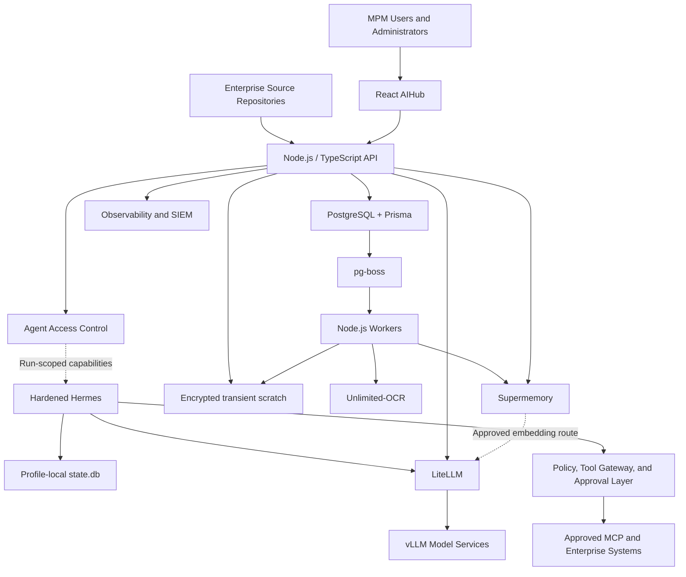

# MPM AIHub — Product Requirements Document

**Status:** Draft v0.1  
**Product:** MPM AIHub  
**Deployment:** On-premises  
**Audience:** MPM IT, AI Engineering, Security, Infrastructure, Management, and implementation partners

## 1. Product Summary

MPM AIHub is a centralized on-premises platform for accessing, operating, governing, and monitoring MPM's AI capabilities. It provides employees with a secure AI assistant while giving authorized administrators one dashboard for AI models, agents, documents, memory, integrations, policies, infrastructure, usage, and audit activity.

AIHub will be built incrementally. This PRD defines the product boundaries and high-level responsibilities of each component; detailed workflows, schemas, interfaces, and operating procedures will be developed as each component is implemented.

## 2. Problem Statement

MPM has on-premises AI infrastructure and production AI use cases, but access, document processing, model operations, agent workflows, integrations, guardrails, and monitoring are fragmented. Employees need an accessible way to use internal AI, while IT needs centralized control over what the AI can access, which models it uses, how actions are approved, and how the platform is operated.

## 3. Product Vision

Create MPM's trusted internal AI operating platform: one secure interface for employees and one control plane for IT to manage the complete lifecycle of on-premises AI services.

## 4. Goals

- Provide one internal AI interface for conversational, knowledge, document, and agent-assisted work.
- Keep MPM data, inference, memory, and document processing on-premises.
- Centralize AI operations in a management dashboard.
- Improve adoption through a consistent and user-friendly experience.
- Allow agents to access only approved tools, systems, and data.
- Provide traceability for model requests, document processing, memory, tool calls, approvals, and administrative changes.
- Support incremental delivery without locking AIHub to a specific model or storage vendor.
- Operate without an application-level Redis dependency; use PostgreSQL and `pg-boss` for durable coordination.
- Make service endpoints, model routes, credentials, connectors, and operational settings manageable from AIHub rather than requiring routine environment-file changes.

## 5. Non-Goals for the Initial Product

- Training foundation models from scratch.
- General-purpose public SaaS or external customer tenancy.
- Fully autonomous high-impact actions without approval controls.
- Replacing MPM's ERP, DMS, SIEM, identity provider, or other systems of record.
- Supporting every enterprise integration in the first release.
- Implementing an AIHub-owned vector database alongside Supermemory.

## 6. Primary Users

### Employee

Uses chat, internal knowledge, document assistance, and approved agent capabilities.

### Department Power User

Uses specialized agents, departmental knowledge, document workflows, and approved integrations.

### AI Operator

Manages models, prompts, agents, document processing, memory, evaluation, and operational health.

### System Administrator

Manages infrastructure, identity, integrations, storage, deployment, secrets, backups, and availability.

### Security and Governance Administrator

Manages policies, permissions, approvals, retention, sensitive-data controls, and audit review.

### Management

Views adoption, operational status, business usage, risks, capacity, and measurable outcomes.

## 7. Product Principles

- **On-premises first:** MPM data and inference remain under MPM control.
- **Least privilege:** users and agents receive only the access required for their task.
- **AIHub-controlled execution:** AIHub is the source of truth for every endpoint, MCP server, tool, resource scope, and action that Hermes may access.
- **Human control:** consequential tool actions require explicit policy checks and, where required, human approval.
- **Traceable by default:** significant AI and administrative events are auditable.
- **PostgreSQL first:** PostgreSQL is the operational source of truth and coordination platform.
- **One durable enterprise knowledge layer:** Supermemory is the sole normalized-knowledge, embedding, retrieval, semantic-graph, and approved agent-memory abstraction; PostgreSQL does not duplicate document bodies or vectors, and Supermemory never shares the AIHub schema.
- **Enterprise-owned originals:** authoritative files remain in MPM repositories. AIHub uses encrypted, time-bounded scratch only for extraction and never becomes a document repository.
- **Replaceable models:** applications use LiteLLM and stable internal interfaces rather than calling model servers directly.
- **Configuration control plane:** authorized administrators configure integrations, endpoints, routes, and secrets centrally through AIHub.
- **Progressive delivery:** begin with controlled use cases and add autonomy only after evaluation.

## 8. Product Components

### 8.1 Central AI Operations Dashboard

The dashboard is the primary administrative landing page for the AIHub platform.

It will provide high-level visibility into:

- platform and component health;
- GPU status and model availability;
- active users, conversations, and agent runs;
- token usage, latency, throughput, and errors;
- document-processing volume and failures;
- queue health and pending jobs;
- integration and connector status;
- pending approvals and policy violations;
- storage capacity and retention status;
- recent administrative and security events.

Dashboard visibility will be filtered by role and organizational scope.

### 8.2 Chat Workspace

The Chat workspace is the primary employee experience.

It will support:

- authenticated conversations with MPM's internal AI;
- streamed model responses;
- conversation history;
- source and document references;
- file attachments;
- agent and workspace selection where authorized;
- visibility into tool activity and approval requests;
- user feedback on answer quality;
- clear indication of model, agent, and knowledge scope in use.

### 8.3 Agent and Hermes Management

AIHub will use a hardened Hermes deployment for controlled agentic execution.

Phase 9 uses upstream Hermes terminology precisely: a durable expert is a Hermes **Profile**, its portable versioned package is a **Profile Distribution**, and a short-lived child created by `delegate_task` is a **subagent**. The Agent component will manage:

- isolated Hermes runtime-node enrollment and health;
- Hermes Profiles, purposes, routing descriptions, and Profile Distribution releases;
- per-Profile `SOUL.md` personality, kept separate from enforceable policy;
- configured model route and parser assignment, verified from the runtime rather than trusted from a request `model` label;
- governed mediated or conditional native Supermemory provider mode;
- system instructions and reviewed, checksummed Skills;
- allowed MCP servers and tools;
- data and memory scopes;
- `delegate_task` policy, maximum spawn depth/width, turns, timeouts, and concurrency;
- approval requirements;
- safe-mode and kill-switch controls;
- allowed internal AIHub infrastructure endpoints;
- network egress and destination allowlists;
- run-scoped service identities and credentials;
- agent versioning and promotion between development and production;
- standard/Agent Chat selection, run history, safe event timelines, and failure inspection.

AIHub lifecycle terms such as **runtime node**, **standby**, and **Agent Chat** are control-plane concepts layered over Hermes rather than claimed upstream features. Hermes Kanban is an upstream durable SQLite-backed multi-Profile board; it will remain disabled as an operational authority in the initial enterprise release because PostgreSQL and `pg-boss` are AIHub's durable orchestration system of record. `delegate_task` is reserved for bounded in-run fan-out, while durable expert-to-expert routing creates a new AIHub-governed Profile run.

Hermes will continue to use Profile-local `state.db` SQLite storage for active session messages, tool-call history, context lineage, token accounting, and native resume. Supermemory does not replace this operational state or reduce its writes during execution. Hermes also keeps built-in `MEMORY.md` and `USER.md` active; AIHub will constrain them to Profile-local non-secret behavioral/runtime notes rather than claiming they are disabled. PostgreSQL owns AIHub conversations, sanitized run/event projections, governance, and audit; Supermemory owns only policy-approved durable enterprise knowledge and agent memory. AIHub will correlate these stores through documented APIs and identifiers, never by reading or synchronizing Hermes SQLite rows. `state.db` therefore requires explicit retention, protected local persistence, backup/restore, single-owner affinity, and honest loss behavior.

The default memory path is AIHub-mediated retrieval and publication with Hermes' external provider disabled. Direct use of the official Hermes Supermemory provider is conditional because it can prefetch context, synchronize turns, extract sessions, mirror built-in writes, and expose memory tools. It may be enabled only for a pinned Profile after custom base URL, user/container isolation, write controls, redaction, retention/deletion, failure handling, and cross-tenant tests pass.

Hermes will operate inside a default-deny execution boundary. It will not independently decide or configure which infrastructure, MCP servers, or tools it can reach. AIHub will calculate the effective permissions for every agent run and enforce those permissions at the network, gateway, tool, and approval layers.

Hermes may access only:

- AIHub application services explicitly provided for agent use;
- the approved LiteLLM model endpoint;
- the approved memory/context interface;
- MCP servers assigned to the selected agent;
- individual tools granted within those MCP servers;
- resource scopes and actions permitted for the requesting user and agent.

Hermes will not receive direct access to PostgreSQL, enterprise-storage administration, any deployment control plane, the Docker socket, host infrastructure, unrestricted filesystems, unrestricted shell execution, or the public internet unless a future use case is explicitly approved and exposed through a controlled AIHub tool.

For each run, AIHub will produce an effective capability set based on the user, role, department, agent profile, environment, tool grants, resource scopes, and approval policies. Every tool invocation will be revalidated at execution time. Changes, grants, denials, and emergency revocations will be auditable.

### 8.4 Document and Converter Workspace

The Converter component will turn approved enterprise documents into usable AI context.

It will provide:

- document upload and batch ingestion;
- file validation and quarantine;
- native text extraction where suitable;
- page rendering for scanned or visual documents;
- OCR using Unlimited-OCR;
- normalized Markdown for durable knowledge publication;
- document status, version, source, checksum, and ownership metadata;
- processing retries and failure review;
- controlled publishing to Supermemory;
- deletion, reprocessing, and retention controls.

All long-running document work will execute asynchronously through PostgreSQL-backed jobs.

Unlimited-OCR's official examples expose direct Transformers inference and page/PDF processing; they do not by themselves guarantee AIHub's generic OpenAI-compatible multimodal endpoint. The pinned deployment must pass AIHub's OCR adapter contract and representative MPM corpus. If it does not, AIHub will use a dedicated service adapter around the official inference path rather than mislabeling the upstream API.

### 8.5 Knowledge and Memory Management

Supermemory will be AIHub's single semantic context layer for enterprise knowledge, retrieval, embeddings, and approved durable agent memory.

AIHub will publish approved normalized content through the Supermemory Memory API. Once Supermemory confirms the generation is indexed, AIHub will purge the source and all extraction intermediates from scratch. Supermemory persistent data is therefore production data and requires a tested backup/restore procedure. Clean rebuilds require authorized enterprise originals to be fetched or uploaded again; PostgreSQL metadata alone is insufficient.

The streamlined pilot will use the exact supported Supermemory Local artifact with its private embedded encrypted storage and local embedding unless measured scale, recovery, or retrieval requirements justify another officially supported mode. An optional Supermemory PostgreSQL+pgvector backend is separately operated and remains private to Supermemory; it is never installed into or accessed through AIHub's database schema. The artifact edition, license/support entitlement, telemetry, air-gap behavior, persistent path, and backup procedure must be accepted before production.

AIHub will provide controls to:

- define organizational, departmental, agent, project, and user memory scopes;
- publish approved documents and conversations;
- retrieve relevant context for chat and agents;
- inspect the source of retrieved context;
- correct, forget, or delete memories;
- apply retention and sensitivity policies;
- monitor ingestion and synchronization status;
- prevent cross-department or cross-user context leakage.

PostgreSQL will store source records and Supermemory references, not duplicate embeddings.

### 8.6 Model and Inference Management

The Models component will centralize available models and their serving endpoints.

Initial model roles are expected to include:

- Poolside Laguna S 2.1 NVFP4 for complex Hermes agent workflows;
- Unlimited-OCR for document parsing;
- Supermemory's local embedding as the streamlined default, with Qwen3 Embedding as an optional evaluated route;
- additional smaller models for efficient or specialized workloads as evaluated.

The RTX PRO 6000 96 GB must not be assumed to serve all model roles concurrently. The official Laguna NVFP4 model card reports roughly 71 GB of weights and requires vLLM `>=0.25.0` with `poolside_v1` reasoning/tool parsers; Phase 0 benchmarking must establish actual KV-cache headroom, OCR contention, embedding placement, context limit, concurrency, and recovery behavior on the exact driver/CUDA combination. Production requires either demonstrated safe co-residency, another GPU, a smaller primary model, a dedicated OCR/embedding route, or an explicitly accepted degraded scheduling policy.

The component will provide:

- model catalogue and deployment status;
- LiteLLM routes and vLLM endpoints;
- model role, license, version, and environment metadata;
- GPU assignment and memory utilization;
- health checks and availability;
- context, concurrency, and request limits;
- controlled rollout and rollback;
- benchmark and evaluation results;
- development and production separation.

### 8.7 LiteLLM Gateway

LiteLLM will be the centralized model API gateway between AIHub/Hermes and vLLM.

The baseline uses a separately configured, pinned LiteLLM Proxy: AIHub stores and validates expected immutable model aliases and guardrail identifiers, while LiteLLM owns provider credentials, inference routing/fallback, virtual-key budgets, usage, and guardrail execution. If MPM later selects a supported LiteLLM management API, AIHub may reconcile desired state with versioned drift detection, audit, rollback, and one clear configuration owner. LiteLLM is never the enterprise resource/tool authorization boundary.

It will be responsible for:

- stable OpenAI-compatible internal endpoints;
- model routing and aliases;
- authentication and virtual access keys;
- request limits and usage accounting;
- supported input/output guardrail hooks;
- model fallback where approved;
- request metadata and operational logging;
- endpoint health and failure handling.

Distributed response caching will remain disabled initially.

### 8.8 Guardrails and Policy Management

Guardrails will be managed as layered policies rather than as a single filter.

AIHub will support policies for:

- model access by user, role, department, and use case;
- sensitive-data and PII handling;
- prompt and output restrictions;
- document classification and retrieval scope;
- agent tool permissions;
- agent network destinations and internal service access;
- agent-to-MCP and agent-to-tool assignments;
- user, department, environment, and resource-level tool scopes;
- read versus write actions;
- approval thresholds;
- maximum cost, duration, turns, and concurrency;
- blocked destinations and data egress;
- emergency suspension of models, tools, agents, or integrations.

Policy decisions and violations will be auditable.

### 8.9 Integration and MCP Management

The Integration workspace will manage connections between AIHub and approved enterprise systems.

It will provide:

- connector catalogue;
- integration ownership and business purpose;
- credential references stored through an approved secrets manager;
- connection testing and health status;
- read/write scope configuration;
- allowed agents and user groups;
- synchronization schedules;
- MCP server and tool registration;
- per-agent MCP and tool grants;
- per-tool resource and action scopes;
- network destinations and service identities used by each connector;
- approval and review status;
- integration activity and audit history.

Initial integrations will be prioritized by confirmed MPM use cases.

AIHub will be the authoritative control plane for these grants. Hermes configuration may contain generated runtime settings, but those settings will be derived from AIHub and will not be treated as an independent permission source.

### 8.10 Jobs and Workflow Operations

`pg-boss` will provide durable asynchronous processing using PostgreSQL.

The Jobs component will manage:

- OCR and document conversion;
- Supermemory ingestion and deletion;
- connector synchronization;
- scheduled agent tasks;
- model and integration health checks;
- retention and cleanup;
- retries, backoff, dead-letter handling, and manual replay;
- job concurrency and priority;
- job-level operational visibility.

Workers will be idempotent and use stable operation identifiers.

### 8.11 Encrypted Transient Document Staging

AIHub API and worker instances will share a private scratch volume for the bounded extraction window. AIHub will encrypt bytes before writing them, use document- and generation-scoped paths, restrict filesystem permissions, and exclude the volume from backups and user-facing file access.

Scratch may contain only:

- quarantined uploads awaiting a decision;
- current-generation page images;
- current-generation normalized content awaiting Supermemory publication.

The default maximum lifetime is 24 hours and may be extended only by a valid queued generation. Rejection and deletion purge immediately. Successful Supermemory publication purges the whole document prefix. A periodic worker sweep removes expired or previously failed-to-purge prefixes. PostgreSQL stores only scratch lifecycle metadata, document identity, checksum, size, classification, ownership, provenance, and publication state.

Enterprise repositories remain authoritative for originals. Future repository connectors will fetch content into the same pipeline with least-privilege, read-only source access and will not turn scratch into durable storage.

### 8.12 Identity and Access Management

AIHub will integrate with MPM's identity provider using OIDC or another approved enterprise protocol.

It will support:

- SSO;
- role-based access control;
- organizational and departmental scope;
- administrative separation of duties;
- service identities for internal components;
- session and access revocation;
- periodic access review;
- least-privilege defaults.

### 8.13 Approvals

The Approvals workspace will give authorized reviewers control over consequential agent actions.

It will provide:

- pending approval inbox;
- action summary and proposed target;
- requesting user, agent, and tool identity;
- supporting context and risk classification;
- approve, reject, expire, or cancel controls;
- optional multi-reviewer requirements;
- complete decision history.

### 8.14 Audit and Governance

AIHub will maintain a traceable record of significant activity.

Audit coverage will include:

- authentication and administrative actions;
- model, agent, policy, and integration changes;
- document access and processing;
- memory publication and deletion;
- tool calls and approvals;
- model requests at an appropriate privacy-safe level;
- security events and policy violations;
- retention and deletion events.

Audit events may be forwarded to MPM's SIEM according to governance requirements.

### 8.15 Observability and Infrastructure Operations

The Operations component will provide health, performance, capacity, and reliability visibility across AIHub.

It will cover:

- application and worker health;
- PostgreSQL and `pg-boss` health;
- transient scratch capacity, age, expiry, and purge failures;
- Supermemory availability and ingestion latency;
- LiteLLM and vLLM health;
- GPU memory, utilization, temperature, and errors;
- model latency, throughput, context utilization, and failures;
- agent duration, tool calls, retries, and success rate;
- alerts and incident timelines;
- backup and restore status.

### 8.16 Platform Settings

Authorized administrators will manage shared platform configuration, including:

- organizational settings;
- environments, service endpoints, authentication methods, and TLS settings;
- LiteLLM and vLLM endpoints, model aliases, routes, limits, and health checks;
- PostgreSQL-dependent application settings and `pg-boss` worker policies;
- transient-staging policy, capacity thresholds, and purge health;
- enterprise repository connector endpoints, read-only credentials, and source scopes when implemented;
- Supermemory endpoints, credentials, embedding configuration, and memory scopes;
- OCR service endpoints and processing defaults;
- MCP servers, connector endpoints, credentials, scopes, and allowed tools;
- identity provider, notification, observability, and SIEM connections;
- feature flags;
- default models and agents;
- storage and retention policies;
- notification channels;
- maintenance mode;
- platform version and migration status.

Configuration changes will support validation, test-connection checks, version history, controlled activation, rollback, and complete audit trails. Sensitive values will be masked after entry and will never be returned to the browser or written to application logs.

### 8.17 Encrypted Credential Store

AIHub will provide an on-premises encrypted credential store so routine operation does not depend on administrators editing environment files or restarting unrelated services. This is an AIHub application capability backed by PostgreSQL; it is not HashiCorp Vault or Vault KV.

The credential store will provide:

- encrypted storage for API keys, passwords, client secrets, certificates, and connector credentials;
- envelope encryption using authenticated encryption and a separately protected AIHub credential-encryption key;
- role-separated create, update, test, rotate, disable, and audit operations;
- secret versioning and rotation without exposing previous plaintext values;
- references from models, agents, MCP servers, and connectors instead of duplicated credentials;
- runtime-only secret resolution by authorized backend services;
- configuration export and import with secrets excluded by default;
- backup and recovery procedures for both encrypted records and the credential-encryption key.

Hermes will not receive general connector credentials. AIHub will either proxy the permitted operation or issue a narrowly scoped, short-lived runtime capability when supported. Frontend clients will never receive infrastructure secrets.

AIHub still requires minimal installation trust because the application cannot securely retrieve the database credential and the key used to decrypt stored credentials from the same encrypted database. The signed installer will generate these values, mount them as protected local secret files, and emit only a short-lived single-use installation claim. After installation, all supported endpoints, keys, certificates, model routes, and connector settings will be managed from the AIHub dashboard. A future HSM or external on-premises secrets manager may protect the credential-encryption key without changing the administrator experience.

The onboarding wizard will require export and verification of an encrypted off-host recovery kit before Production activation. Losing both the mounted credential-encryption key and every recovery copy leaves PostgreSQL metadata intact but makes encrypted connector credentials unrecoverable. Key rotation will re-encrypt stored credential payloads as a controlled, audited operation.

## 9. High-Level Technical Architecture

## 10. Data Ownership

- **PostgreSQL:** operational records, configuration, identity mappings, conversations, jobs, approvals, audit metadata, and external-service bindings.
- **AIHub encrypted credential store:** encrypted credential payloads and versions stored in PostgreSQL; the credential-encryption key is held separately from the database. No HashiCorp Vault service is required.
- **Enterprise source repositories:** authoritative original files and their native access controls.
- **AIHub scratch volume:** application-encrypted source and extraction bytes retained only until publication, rejection, deletion, or the 24-hour deadline; never backed up.
- **Supermemory deployment:** durable normalized enterprise knowledge, embeddings, semantic graph, retrieval context, approved agent/user memory, and its private embedded or separately supported backing store. AIHub never reads its private schema.
- **Hermes Profile `state.db`:** Profile-local operational session history, context lineage, tool calls, token accounting, and native resume; never directly accessed by AIHub and never shared across hosts.
- **Hermes built-in memory:** Profile-local `MEMORY.md` and `USER.md`, constrained to non-secret behavioral/runtime notes; not an enterprise knowledge or compliance store.
- **vLLM/model storage:** loaded model weights and inference runtime state.
- **SIEM/observability systems:** operational telemetry and security monitoring according to MPM policy.

No component may directly depend on another component's private database schema.

## 11. Non-Functional Requirements

### Security

- On-premises processing and storage.
- Encryption in transit and at rest where supported.
- No default public model or storage endpoints.
- Strong secrets handling and service identities.
- No plaintext infrastructure credentials in the browser, logs, audit payloads, or routine configuration exports.
- Minimal install-time bootstrap secrets kept outside the AIHub database; routine service configuration is performed in the dashboard.
- Least-privilege access and network segmentation.

### Reliability

- Durable jobs and safe retries.
- Health checks for every critical service.
- Backup and restore procedures.
- Recovery from worker and model-service restarts.
- Defined degraded behavior when a non-critical component is unavailable.

### Performance

- Stream chat responses as they are generated.
- Keep administrative pages responsive during long-running AI work.
- Process document jobs asynchronously.
- Establish performance targets from pilot measurements rather than assumptions.

### Maintainability

- TypeScript contracts shared between frontend and backend.
- Stable service adapters for models, enterprise sources, memory, and integrations.
- Versioned database migrations and APIs.
- Component-level configuration and health reporting.
- Versioned, validated, and reversible configuration changes through AIHub.

### Compliance and Governance

- Support MPM retention, deletion, residency, and audit requirements.
- Prevent unauthorized cross-scope retrieval.
- Preserve evidence for agent approvals and consequential actions.

## 12. Deployment Approach

The canonical and sole supported entry experience is one supported Linux server and one pinned, signed AIHub release-bundle installer. The installer starts the AIHub Web/API/workers and PostgreSQL control plane, applies migrations, generates protected database and credential-encryption material, and emits only a short-lived single-use installation claim. The dashboard then offers Compact, Control-plane only, and Segmented production topologies without taking host or container-orchestrator credentials.

Compact mode may co-locate a hardened Hermes container and locally selected services, but it must not claim the same isolation or availability as separate hosts. Control-plane only mode connects to customer-operated LiteLLM, Unlimited-OCR, Supermemory, and Hermes APIs. Segmented production places Hermes and inference/GPU services in separate trust zones and uses certificate-bound runtime enrollment. LiteLLM is AIHub's single inference-routing gateway; direct vLLM connectivity is optional read-only health/capacity telemetry. Supermemory's internal database and embedding implementation remain private deployment details rather than routine AIHub wizard choices.

Production readiness will be evaluated independently for PostgreSQL, Supermemory persistent data, Hermes Profile session state, enterprise source availability, model serving, GPU availability, backups, and DRC recovery. Scratch must be recoverable by replaying a source, not by backing up the volume. A failure of one co-located stateful VM must not destroy the only recoverable PostgreSQL or Supermemory copy. Restoring PostgreSQL audit records without the corresponding Hermes `state.db` does not restore native Hermes session continuity.

The installer will provision AIHub's database access and credential-encryption key as protected local files. Customers will not manually create these values or enter them into the browser. Administrators will configure all subsequent supported services and credentials from AIHub's Settings and Integration workspaces. Production activation requires enterprise identity, verified off-host recovery of the credential-encryption key, a current PostgreSQL backup, and a current READY decision from the Phase 8 controls and authority approvals. Changing the selected topology or target environment invalidates dependent compatibility and onboarding evidence.

The AIHub application will not depend on Redis or Valkey. PostgreSQL and `pg-boss` provide durable coordination.

## 13. Delivery Phases

The authoritative implementation sequence, exit gates, dependencies, and MPM inputs are defined in `docs/AIHUB_PHASED_PLAN.md`. The shared phase map is:

- Phase 0: technical validation and scope baseline;
- Phase 1: platform foundation and configuration control plane;
- Phase 2: controlled internal chat and enterprise identity;
- Phase 3: document ingestion, conversion, and OCR;
- Phase 4: enterprise knowledge and agent memory;
- Phase 5: hardened Hermes agent runtime;
- Phase 6: MCP connectors and human approvals;
- Phase 7: AI operations, guardrails, and evaluation;
- Phase 8: production hardening and pilot rollout.
- Phase 9: system cohesion, architecture and guardrail optimization, enterprise onboarding, and validated governed Hermes operations.

This PRD defines the target product; a capability listed here is not considered implemented or accepted until its corresponding phase gate is demonstrated.

The calibrated Phase 9 cohesion audit, official component contract matrix, data ownership, optimized flows, guardrail responsibilities, onboarding journey, and delivery gates are defined in `docs/PHASE_9_COHESION_ARCHITECTURE_ONBOARDING_PLAN.md`.

## 14. Initial Success Measures

- Monthly and weekly active AIHub users.
- Repeat usage and department adoption.
- User-rated answer usefulness.
- Successful document processing rate.
- Retrieval relevance and source correctness.
- Agent task success and approval rate.
- Reduction in manual effort for selected workflows.
- Model availability, latency, and error rate.
- Number and severity of policy violations or unauthorized actions.
- Recovery performance for failed jobs and service interruptions.

## 15. Major Risks

- A single production GPU remains a capacity and availability constraint.
- Laguna S 2.1 NVFP4, Unlimited-OCR, and Qwen3 Embedding may not safely coexist on one 96 GB GPU at the required context and concurrency.
- Laguna's agentic coding strength may not translate directly to every MPM business use case.
- Incorrect memory or document scoping could expose information across departments.
- Broad MCP permissions could create unsafe agent actions.
- User adoption may remain limited without training and use-case ownership.
- A single-server installer deployment does not provide production-grade high availability by itself.
- Supermemory deployment topology, version support, API compatibility, backup/restore behavior, and organizational suitability must be confirmed.
- Enabling the native Hermes Supermemory provider without controlling its automatic prefetch/sync/extraction/write behavior could create ungoverned memory egress or cross-scope retention.
- AIHub's current generic OpenAI-compatible OCR adapter may not match the pinned Unlimited-OCR serving contract.
- TypeScript 7's new compiler does not expose the former programmatic compiler API, and the repository currently pairs a Node 24 runtime contract with `@types/node` 26; dependent tooling and type/runtime alignment must pass the pinned compatibility suite or use the documented fallback.
- A direct upload cannot be rebuilt after scratch purge unless its authoritative enterprise original remains available.
- Scratch purge failure or uncontrolled volume backup could retain source content beyond the intended extraction window.

## 16. Open Product Decisions

- First three employee and departmental use cases.
- Initial departments and pilot users.
- Whether Supermemory's local embedding is sufficient; if not, the exact Qwen3 Embedding variant, revision, dimensions, instruction template, and rebuild policy.
- Memory-capture policy for conversations.
- Required document classifications and retention periods.
- Initial MCP systems and read/write permissions.
- Approval matrix for consequential actions.
- Production GPU redundancy and DRC model-serving approach.
- First enterprise repository connectors, read-only source scopes, and source re-ingestion ownership.
- Whether Supermemory Local's embedded-store operating model is acceptable or a supported separate backend/commercial deployment is required.
- Required Supermemory artifact/edition, license/support entitlement, API adapter version, telemetry policy, persistent-data backup target, rebuild procedure, and air-gapped packaging.
- LiteLLM configuration ownership: externally managed validated aliases or a pinned AIHub management-API reconciler.
- Single-GPU admission limits versus an additional GPU or dedicated OCR/embedding host.

## 17. Product Acceptance at a High Level

AIHub is successful when an authorized MPM user can securely access internal AI, retrieve approved enterprise knowledge, process documents, and use controlled agent capabilities, while MPM administrators can centrally manage and audit models, agents, memory, document ingestion, integrations, policies, jobs, infrastructure, and usage from one platform.

No Hermes run will be accepted as compliant if it can reach an infrastructure endpoint, MCP server, tool, resource, or action that is not explicitly authorized by the effective AIHub policy for that run.
