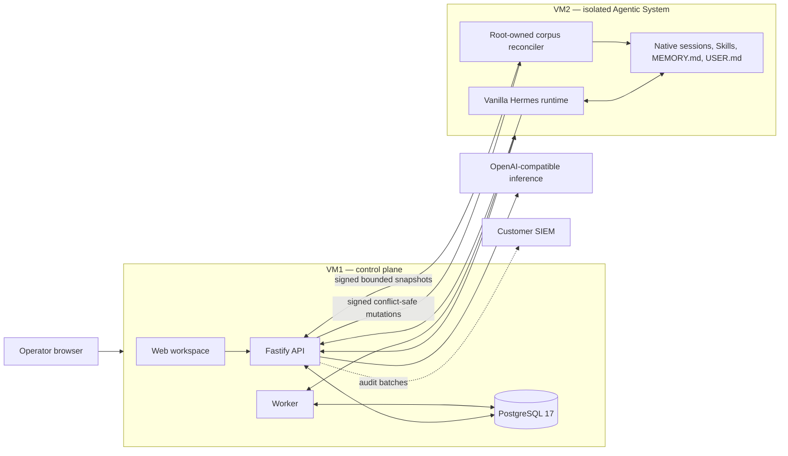

# OrcaSynapse Architecture

OrcaSynapse is an on-premises control plane around a vanilla Hermes runtime. The product governs identity, configuration, models, profiles, prompts, guardrails, toolset admission, corpus observability, operations, and audit evidence without becoming a second agent runtime or memory source.

## Deployment baseline

- **VM1** runs the browser workspace, API, worker, Nginx, and stock PostgreSQL 17.
- **VM2** runs Hermes natively under a hardened systemd unit. Hermes owns its session transcripts and file-backed memory.
- **Inference** is an operator-approved OpenAI-compatible endpoint reached through VM1's scoped gateway.
- **SIEM** forwarding is optional and exports retained audit events at least once.

### Operator workspace

The VM1 workspace is a React application built with Tailwind CSS and a
source-owned shadcn component layer. Canonical interactive controls live in
`apps/web/src/components/ui`; OrcaSynapse-specific readiness, session,
telemetry, and command-center compositions live above those primitives. Both
light and dark appearances consume the same semantic color variables and one
semi-rounded component radius.

The web container keeps `style-src 'self'` without `unsafe-inline`. Components
must not inject runtime stylesheets or JSX `style` attributes, and visual assets
and fonts must remain same-origin. Lucide provides functional interface icons;
the orca and synapse artwork remain product assets. The compatibility layer in
`apps/web/src/ui` may compose canonical controls but must not become a second
primitive or theme system.

### Release awareness

Settings can ask the API to compare the installed `vX.Y.Z` version with the
official repository tag list. The API accepts only stable OrcaSynapse release
tags and returns a release link plus a command pinned to the selected tag. The
browser may copy that command, but it cannot execute it: the application
container intentionally has no VM1 root, Docker socket, or host-update control.
VM2 remains a separately pinned Hermes installation and is repaired or
re-enrolled through its own governed workflow.

## State ownership

| State | Owner | Location |
| --- | --- | --- |
| identities, roles, profiles, model routes, prompts, guardrails, tool admissions | OrcaSynapse | VM1 PostgreSQL |
| chat projection, run lifecycle, decisions, failures, operational incidents | OrcaSynapse | VM1 PostgreSQL |
| append-only audit trail and forwarding cursor | OrcaSynapse | VM1 PostgreSQL |
| native transcript and model context | Hermes | VM2 native session store |
| `MEMORY.md`, `USER.md`, Skills, runtime workspace | Hermes | VM2 Hermes state root |
| searchable corpus mirror and immutable revisions | OrcaSynapse | VM1 PostgreSQL |

OrcaSynapse sends its conversation UUID as the Hermes session ID and never rebuilds model context from the PostgreSQL chat projection or corpus mirror. A root-owned VM2 coordinator signs requests and verifies control-plane commands while an unprivileged Hermes subprocess reads only allowlisted memory, Skill, bundle, provenance, and pending-change paths. VM1 provides lexical search and revisions. Expected-hash mutations are signed back to VM2 and applied through Hermes-native APIs in the pinned Hermes virtualenv; VM2 remains canonical. Native session databases and secret-like, symlinked, oversized, or non-allowlisted files are excluded.

Vanilla Hermes shares file-backed memory within its active home/profile even though transcripts are session-scoped. This pre-production baseline is therefore one trust boundary, not per-user memory isolation.

## Native run flow

1. The API authenticates the operator and resolves an active agent profile and model alias.
2. The worker verifies the active Hermes node, admitted native toolsets, and policy boundary.
3. The runtime client creates or reuses the Hermes native session and streams the turn through `/api/sessions/:id/chat/stream`.
4. Hermes retains conversational context and native memory on VM2.
5. OrcaSynapse stores the user-visible response plus bounded lifecycle, tool, usage, and failure projections for operations and audit.

An in-flight native turn is attached to the worker process; a worker restart can lose that live attachment, while the Hermes transcript remains durable.

## Security boundaries

- VM2 receives a node-scoped gateway credential, never the upstream inference credential.
- Signed heartbeats and desired-state messages use enrolled Ed25519 node identities with replay protection.
- Corpus snapshots and mutation receipts use that node identity; mutation commands use the pinned control-plane signing key and expire after dispatch.
- Destructive corpus operations require a different administrator to approve them. Audit events carry paths, hashes, state, and decisions—not file content.
- The Hermes unit is unprivileged, filesystem-confined, and receives root-owned managed policy read-only.
- Native toolsets fail closed unless admitted by an operator; built-in memory is the intentional baseline capability.
- Secrets on VM1 use envelope encryption, and browser sessions are role- and scope-checked.
- VM2 has no PostgreSQL access, standing SSH control channel, or Docker socket access.

## Greenfield schema

`v4.6.0` starts schema epoch `hermes-native-v1`. The migrator refuses a database with pre-existing public tables unless it already carries the matching epoch. This deliberately prevents an ambiguous partial conversion from earlier releases. Install VM1 and VM2 cleanly; the preserved `backup/pgvector` branch remains the rollback reference for the previous product generation.

The baseline requires no vector extension, embedding runtime, external memory service, Redis, queue broker, object store, or model router. Corpus search uses stock PostgreSQL lexical indexing.
