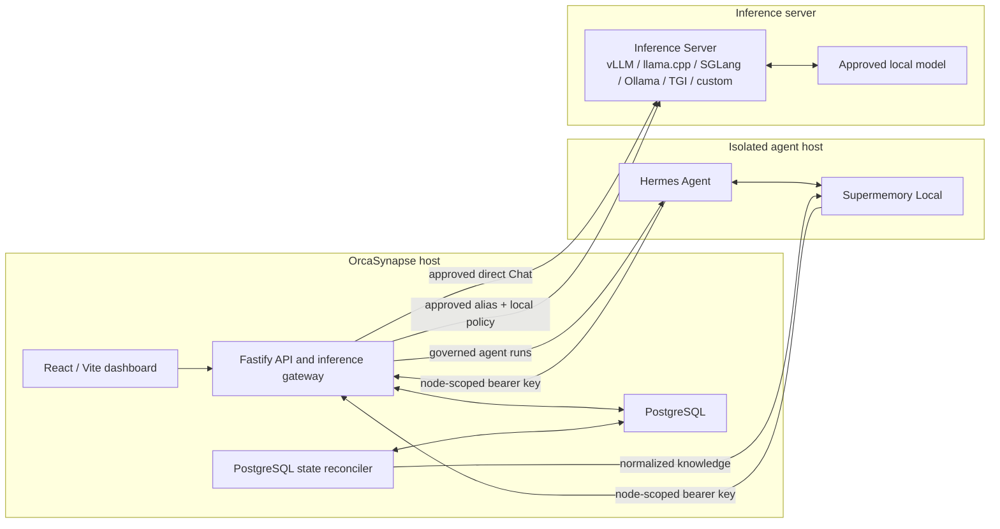

# OrcaSynapse Architecture

## Production baseline

Development may co-locate services, but production acceptance assumes separate trust zones for OrcaSynapse, the agent runtime, and GPU inference.

## Ownership

| Component | Owns | Does not own |
| --- | --- | --- |
| OrcaSynapse | identity, authorization, service configuration, encrypted credentials, model/prompt/guardrail policy, document lifecycle, agent profiles, approvals, audit, inference gateway | model serving, semantic index internals, original enterprise files |
| PostgreSQL | OrcaSynapse control data, audit, sessions, durable domain workflow state, authorization provenance | embeddings, source bytes, Hermes runtime state |
| Runtime executor | idempotent reconciliation of unfinished PostgreSQL domain rows | independent queue state, semantic memory |
| Hermes | agent loop, tools/subagents, sessions, built-in bounded memory, native Supermemory integration | enterprise authorization, inference-server credentials, OrcaSynapse database access |
| Supermemory Local | semantic graph, normalized knowledge, long-term agent memory, CPU-local `Xenova/bge-m3` embeddings (1024d) | OrcaSynapse authorization decisions, original-file authority |
| Inference Server | OpenAI-compatible inference for approved models; concrete backend is an operational choice | routing authority, enterprise policy, durable memory |

There is no LiteLLM tier. OrcaSynapse's internal gateway is deliberately narrow: it authenticates enrolled runtimes, pins the active Agent model alias, applies deterministic request checks and response bounds, rate-limits requests in PostgreSQL, and forwards to the selected OpenAI-compatible inference server. It is not a general multi-provider proxy or backend-specific control plane.

## Memory namespaces

- `orcasynapse-agent-{identity}` is Hermes's profile-scoped native memory. Hermes may read and write it through its Supermemory provider.
- `orcasynapse-knowledge` contains normalized enterprise document knowledge published by OrcaSynapse.
- OrcaSynapse reauthorizes every enterprise-knowledge result against current PostgreSQL ownership and publication state before it can enter Chat or a governed agent run.
- Hermes is not given unrestricted custom-container access. Access to enterprise knowledge remains mediated by OrcaSynapse.

Hermes's `MEMORY.md` and `USER.md` remain active because the official external-memory-provider model is additive. They hold small curated runtime facts; Supermemory provides deeper cross-session semantic memory.

The installed baseline uses Hermes's root-owned managed scope to pin the approved model route, Supermemory provider, secret redaction, loop circuit breakers, and the `api_server` platform to `no_mcp`; it exposes no native model-callable toolsets. This does not disable automatic Supermemory recall/capture. Managed scope prevents an ordinary runtime user from overriding pinned keys, but it is not a substitute for VM isolation or network policy. Tools and subagent delegation are capabilities of Hermes, but they are not part of the production trust boundary until an OrcaSynapse-reviewed distribution explicitly enables and verifies them.

Node lifecycle is an execution boundary: Drain rejects new agent work while allowing already-submitted Hermes runs to finish; Suspend denies both new and active work; Resume restores admission only when the signed heartbeat and managed Hermes connection are healthy; Revoke permanently disables the node-scoped inference, Hermes, and Supermemory routes.

## Document lifecycle

1. OrcaSynapse validates, classifies, checksums, encrypts, and quarantines an upload in transient scratch space.
2. OrcaSynapse accepts UTF-8 TXT input and normalizes it directly; rich documents and images are rejected by this release.
3. The runtime executor reconciles the document row and publishes normalized content to `orcasynapse-knowledge`.
4. After Supermemory confirms indexing, OrcaSynapse purges every staged byte for that document generation.
5. PostgreSQL retains only lifecycle, authorization, provenance, checksum, and audit metadata.
6. Deletion removes the Supermemory object and related transient staging.

This is intentionally not an enterprise file store. Source systems remain authoritative, and failed publication after staging expiry requires a fresh upload or connector fetch.

## Network policy

| Source | Destination | Purpose |
| --- | --- | --- |
| Browser | OrcaSynapse HTTPS | dashboard/API only |
| OrcaSynapse | PostgreSQL | private application/data network |
| OrcaSynapse | Inference Server | direct Chat and gateway forwarding over the approved OpenAI-compatible contract |
| OrcaSynapse runtime | Supermemory TCP 6767 | governed knowledge publication/retrieval |
| OrcaSynapse | Hermes TCP 8642 | governed run submission/status/stop |
| Hermes host | OrcaSynapse `/internal/v1` | model inference without an upstream serving credential |
| Hermes host | OrcaSynapse runtime-node API | enrollment, memory registration, signed heartbeat |
| Hermes | local Supermemory TCP 6767 | native memory |

Deny browser-to-Hermes, browser-to-inference-server, Hermes-to-PostgreSQL, Hermes-to-Docker-control, and unrestricted outbound runtime access. Production must use customer-approved TLS/mTLS or equivalent private-network controls; the enrollment signature is application identity, not a replacement for transport security.

## Durability and recovery

- Back up PostgreSQL with point-in-time recovery appropriate to the customer RPO/RTO.
- Back up the complete Supermemory data directory consistently; it contains graph state, auth state, and local embedding state.
- Back up Hermes `/opt/data` when session continuity, Skills, built-in memory, and runtime configuration must survive host loss.
- Never back up OrcaSynapse document scratch as a knowledge repository.
- Retain the encrypted OrcaSynapse credential-recovery kit off-host and test it.
- Test restore into an isolated environment and verify model-route, namespace, authorization, and deletion behavior before declaring production readiness.

## Explicit non-dependencies

The application does not require Redis, Valkey, pg-boss, LiteLLM, S3-compatible storage, SeaweedFS, MinIO, or a separate pgvector service. Those may exist elsewhere in a customer's infrastructure but are not OrcaSynapse runtime dependencies.
