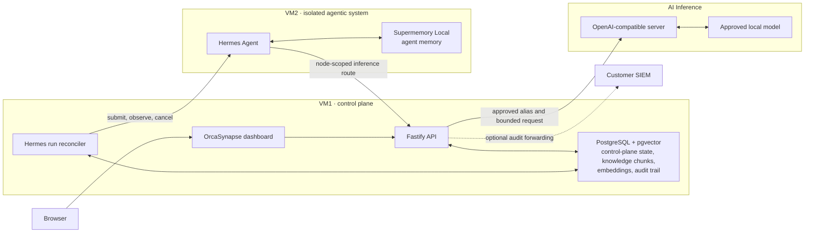

# OrcaSynapse Architecture

OrcaSynapse is the identity, policy, orchestration, and observability plane around an isolated Hermes runtime. It is not a second agent framework, a file repository, or a model server.

## Production baseline

The minimum deployment is two VMs plus an existing inference endpoint. VM1 runs OrcaSynapse and PostgreSQL (the bundled image is `pgvector/pgvector:pg17`; the migrator creates the `vector` extension). VM2 runs Hermes and Supermemory. The inference endpoint may be vLLM, llama.cpp, SGLang, Ollama, TGI, or another compatible server.

## One owner for each kind of state

| Component | Owns | Never owns |
| --- | --- | --- |
| OrcaSynapse | workforce and administrator identity, authorization, encrypted endpoints, Profile releases, policy, audit, document knowledge (extracted chunks and their embeddings), metadata, incidents, and operational evidence | agent execution, original files, or model weights |
| PostgreSQL | OrcaSynapse control-plane state, durable Hermes-run state, extracted knowledge chunks with pgvector embeddings, and the append-only audit trail | original source bytes, Hermes session internals, or model weights |
| Hermes | agent sessions, loop execution, Skills, tool and sub-agent behavior, and bounded native memory | enterprise authorization, PostgreSQL access, or inference credentials |
| Supermemory Local | long-duration agent memory for Hermes on VM2 | document knowledge, enterprise authorization decisions, or original-file authority |
| AI Inference | OpenAI-compatible model serving | routing authority, durable memory, or enterprise credentials |

There is no direct Chat-to-model path. Normal Chat creates a governed Hermes Agent Run. A PostgreSQL worker acquires an exclusive renewable processing lease, submits the run to VM2, follows safe lifecycle events, supports explicit cancellation, and finalizes both the run and linked Chat message. The browser stream is only a live subscriber: disconnecting it does not cancel durable execution. The run ID is the idempotency key; the conversation ID is the stable Hermes session ID.

After VM2 is enrolled and healthy, a Development administrator can use **Create & activate** once: OrcaSynapse runs the Hermes compatibility check, activates the immutable Profile Distribution, and enables the global execution boundary. Pilot and Production continue requiring promoted evaluation evidence before activation.

## Knowledge lifecycle

Document knowledge is entirely local to VM1; no VM2 service participates.

1. The browser uploads a source to OrcaSynapse.
2. OrcaSynapse authenticates the identity and validates classification, file name, MIME type, retention, and the 50 MB limit. Supported formats: TXT, Markdown, HTML, CSV, JSON, PDF, DOCX, PPTX, XLSX (images are rejected).
3. OrcaSynapse extracts the text **in flight** (unpdf for PDF, officeparser for Office formats, direct decoding for text formats), chunks it, and embeds each chunk with CPU-local BGE-M3 (1024 dimensions).
4. PostgreSQL stores the chunks and embeddings (`DocumentChunk`, HNSW cosine index) plus ownership, classification, checksum, size, status, retention, and audit metadata. **Original file bytes are never stored**; a failed transfer requires re-upload.
5. Retrieval is an owner-scoped pgvector similarity search. Chat can **pin documents to a conversation** (`ChatConversationDocument`), and each agent run records the document set it was allowed to consult (`AgentRun.knowledgeDocumentIds`).
6. Deletion removes the chunks and marks the metadata record deleted.

There is no OCR: scanned or image-only PDFs carry no extractable text layer and fail indexing with an explicit error; the dashboard states this limitation instead of claiming universal local extraction.

## Memory boundaries

- **Agent memory** (Hermes recall and capture) lives in Supermemory Local on VM2, under the node-scoped `orcasynapse-agent-*` container tag configured at enrollment. New nodes pin Supermemory `v0.0.7-rc.2` (v0.0.6 is hard-blocked for its upstream document-workflow defects) and must pass a disposable end-to-end document check before enrollment reports ready.
- **Document knowledge** (enterprise sources) lives in PostgreSQL/pgvector on VM1, scoped per owner by SQL predicate — it never transits VM2.
- Hermes `MEMORY.md` and `USER.md` remain small native runtime files because the upstream external-memory provider is additive.

## Audit trail and SIEM forwarding

Every governed action writes an append-only `AuditEvent`. The trail is readable in the dashboard (**Operations > Audit trail**, `audit:read` scope, keyset-paged) and can be forwarded to a customer SIEM configured as a service connection: a timer-driven forwarder POSTs JSON batches with a keyset cursor, at-least-once delivery (a failed batch never advances the cursor), and duplicate-safe event IDs. Forwarding health (`HEALTHY` / `BEHIND` / `FAILING` / `NOT_CONFIGURED`) is reported in the audit view and observed by AI Ops, which opens an incident when the destination rejects batches. See [AUDIT_TRAIL_RUNBOOK.md](AUDIT_TRAIL_RUNBOOK.md).

## Runtime and tool boundaries

The VM2 installer pins the OrcaSynapse inference route, resolves the pulled Hermes container to an immutable registry digest, pins the Supermemory provider, and applies secret redaction and loop circuit breakers in Hermes managed configuration. The default distribution exposes no native model-callable MCP toolset. OrcaSynapse's governed MCP surface remains default-deny and currently exposes only its implemented read-only document-metadata handler. The dashboard does not advertise a consequential-action approval inbox because this release cannot originate those actions; legacy approval records remain migration-compatible but are not an active product surface.

Node lifecycle is an execution boundary:

- **Drain** rejects new work and lets accepted work finish.
- **Suspend** denies new and active work.
- **Resume** restores admission only after the signed heartbeat and Hermes connection are healthy.
- **Revoke** permanently disables node-scoped Hermes, Supermemory, and inference access.
- **Remove** deletes the dashboard registration only after revocation; the operator separately runs the generated VM2 cleanup command to destroy local runtime data.

## Network policy

| Source | Destination | Purpose |
| --- | --- | --- |
| Browser | OrcaSynapse HTTPS | dashboard and API only |
| OrcaSynapse | PostgreSQL | private control-plane data, knowledge index, audit trail |
| OrcaSynapse | Hermes TCP 8642 | governed runs, status, and stop |
| OrcaSynapse | Supermemory TCP 6767 | connection health and memory-registration verification |
| Hermes | local Supermemory TCP 6767 | native agent memory |
| Hermes | OrcaSynapse internal inference API | node-scoped model access |
| OrcaSynapse | AI Inference | approved OpenAI-compatible model calls |
| OrcaSynapse | Customer SIEM (optional) | forwarded audit batches |

Deny browser access to VM2 and inference, Hermes access to PostgreSQL or Docker control, and unrestricted VM2 egress. Enrollment signatures identify the node but do not replace customer-approved TLS/mTLS and firewall controls.

## Durability and recovery

- Back up PostgreSQL with a tested customer RPO/RTO and point-in-time recovery where required. The backup now carries the knowledge index and audit trail alongside control-plane state.
- Back up the complete Supermemory data directory consistently; it contains the agents' semantic graph, auth, and embedding state.
- Back up Hermes persistent data when sessions, Skills, and native memory must survive VM replacement.
- Store the OrcaSynapse Installation Key and encrypted recovery kit off-host, then test recovery.
- Restore into an isolated environment and verify identity, Profile, model route, knowledge retrieval, and deletion behavior.
- Worker leases expire and can be recovered by another VM1 worker; terminal worker transitions also finalize linked Chat messages so browser or API-stream loss does not strand the conversation.

## Explicit non-dependencies

OrcaSynapse does not require Redis, Valkey, pg-boss, LiteLLM, S3-compatible storage, SeaweedFS, MinIO, an external vector database service, or a separate OCR service. pgvector is required and ships inside the bundled PostgreSQL image.
