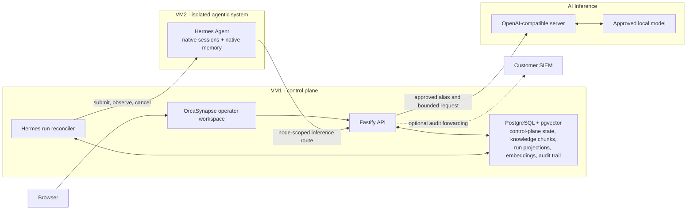

# OrcaSynapse Architecture

OrcaSynapse is the identity, policy, orchestration, and observability plane around an isolated Hermes runtime. It is not a second agent framework, a file repository, or a model server.

## Production baseline

The minimum deployment is two VMs plus an existing inference endpoint. VM1 runs OrcaSynapse and PostgreSQL (the bundled image is `pgvector/pgvector:pg17`; the migrator creates the `vector` extension). VM2 runs only the Hermes runtime. The inference endpoint may be vLLM, llama.cpp, SGLang, Ollama, TGI, or another compatible server.

## One owner for each kind of state

| Component | Owns | Never owns |
| --- | --- | --- |
| OrcaSynapse | workforce and administrator identity, authorization, encrypted endpoints, Profile releases, policy, audit, document knowledge (extracted chunks and their embeddings), metadata, incidents, and operational evidence | agent execution, original files, or model weights |
| PostgreSQL | OrcaSynapse control-plane state, sanitized Hermes-run projections, extracted document knowledge with pgvector embeddings, and the append-only audit trail | original source bytes, Hermes session internals, Hermes memory files, or model weights |
| Hermes | native session transcripts, loop execution, Skills, tool and sub-agent behavior, `MEMORY.md`, and `USER.md` | enterprise authorization, PostgreSQL access, or upstream inference credentials |
| AI Inference | OpenAI-compatible model serving | routing authority, durable memory, or enterprise credentials |

There is no direct Chat-to-model path. Normal Chat creates a governed run projection. A PostgreSQL worker acquires an exclusive renewable processing lease, creates or reuses the conversation's Hermes-native session, submits only the new user turn to VM2, follows safe lifecycle events, supports explicit cancellation, and finalizes both the projection and linked Chat message. OrcaSynapse never replays its message projection into Hermes; Hermes' session database is the continuity source. The browser is only a subscriber, so disconnecting it does not cancel the worker-owned upstream stream. The run ID is the idempotency key; the conversation ID is the stable Hermes session ID.

After VM2 is enrolled and healthy, a Development administrator can use **Create & activate** once: OrcaSynapse runs the Hermes compatibility check, activates the immutable Profile Distribution, and enables the global execution boundary. Pilot and Production continue requiring promoted evaluation evidence before activation.

## Knowledge lifecycle

Document knowledge is entirely local to VM1; no VM2 service participates.

1. The browser uploads a source to OrcaSynapse.
2. OrcaSynapse authenticates the identity and validates classification, file name, MIME type, retention, and the 50 MB limit. Supported formats: TXT, Markdown, HTML, CSV, JSON, PDF, DOCX, PPTX, XLSX (images are rejected).
3. OrcaSynapse extracts the text **in flight** (unpdf for PDF, officeparser for Office formats, direct decoding for text formats), chunks it, and embeds each chunk with CPU-local BGE-M3 (1024 dimensions).
4. PostgreSQL stores the chunks and embeddings (`DocumentChunk`, HNSW cosine index) plus ownership, classification, checksum, size, status, retention, and audit metadata. **Original file bytes are never stored**; a failed transfer requires re-upload.
5. Retrieval is an owner-scoped pgvector similarity search. Chat can **pin documents to a conversation** (`ChatConversationDocument`), and each agent run records the document set it was allowed to consult (`AgentRun.knowledgeDocumentIds`).
6. Deletion removes the chunks and marks the metadata record deleted.

There is no OCR: scanned or image-only PDFs carry no extractable text layer and fail indexing with an explicit error; the dashboard states this limitation instead of claiming universal local extraction.

## Memory boundaries

- **Hermes is the sole active agent-memory owner.** Its native session database, `MEMORY.md`, and `USER.md` live under the managed VM2 state root. The worker does not read, mirror, edit, embed, watch, or inject their contents.
- Native transcripts are per Hermes session, but vanilla `MEMORY.md` and `USER.md` are shared across sessions in the active Hermes home/profile. The current deployment is therefore a single trust boundary, not a multi-user memory-isolation design.
- The VM2 allowlist admits only Hermes' built-in `memory` capability by default. Every other native toolset remains denied until explicitly admitted.
- OrcaSynapse stores a sanitized conversation/run projection so the workspace can stream results and the control plane can retain metrics and an audit trail. That projection is not replayed as agent context.
- Conversation forks call Hermes' native fork endpoint and retain one shared session ID across both planes; deletion removes Hermes' authoritative session before its OrcaSynapse projection. Historical-point forks are refused because the pinned native API can branch only the current transcript.
- Legacy `AgentMemory`, `MemoryPolicy`, and `memoryMode` database structures remain migration-compatible for rollback to `backup/pgvector`, but current runs receive no `memory:agent:read` or `memory:agent:write` capabilities and the worker does not instantiate the legacy memory store or distillers.
- **Document knowledge** remains PostgreSQL/pgvector state on VM1, scoped per owner by SQL predicate. Selected excerpts may be supplied to a turn as untrusted references; they are not written into Hermes memory by OrcaSynapse.
- Memory changes are opaque to OrcaSynapse unless Hermes emits a safe lifecycle event. Audit evidence records the run and outcome, never the contents of the memory files. See [AGENT_MEMORY_RUNBOOK.md](AGENT_MEMORY_RUNBOOK.md).

## Benchmarks and the evaluation ledger

Two systems that look alike and are not. `EvaluationRun` is a **record**: an operator states how many cases passed, and promotion is gated on that evidence. `BenchmarkRun` **executes** — it drives the live stack and produces those numbers. So benchmarks feed the ledger rather than duplicating it, which is why `evaluationRunId` sits on the benchmark run and why both reuse the `evaluations:read` / `evaluations:manage` scopes: running one *is* evaluation work, so no role needed a new grant.

A chat case queues an ordinary `AgentRun` and the worker's own processor picks it up, so a benchmark exercises the same queue, profile version, document retrieval, boundary and capability checks as a person's message. Nothing about it is simulated. Hermes-native memory is intentionally opaque to the control-plane benchmark executor; legacy `MEMORY` suites report that the plane is unavailable rather than reading a second store.

Every check is a string or latency comparison whose verdict is stored beside the case; nothing is judged by a model, because scoring that cannot be audited cannot argue a release is safe. Executed against the live stack, a run in flight has no pass rate, and its target — agent, version, model alias, owner subject — is denormalised onto the row so a historical result keeps reading true after the profile it used is edited or deleted. See [BENCHMARK_RUNBOOK.md](BENCHMARK_RUNBOOK.md).

## Audit trail and SIEM forwarding

Every governed action writes an append-only `AuditEvent`. The trail is readable in the dashboard (**Operations > Audit trail**, `audit:read` scope, keyset-paged) and can be forwarded to a customer SIEM configured as a service connection: a timer-driven forwarder POSTs JSON batches with a keyset cursor, at-least-once delivery (a failed batch never advances the cursor), and duplicate-safe event IDs. Forwarding health (`HEALTHY` / `BEHIND` / `FAILING` / `NOT_CONFIGURED`) is reported in the audit view and observed by AI Ops, which opens an incident when the destination rejects batches. See [AUDIT_TRAIL_RUNBOOK.md](AUDIT_TRAIL_RUNBOOK.md).

## Runtime and tool boundaries

The VM2 installer pins the OrcaSynapse inference route, installs Hermes natively at an approved 40-character git commit under systemd, and applies native memory settings, secret redaction, and loop circuit breakers in Hermes managed configuration. The commit is the artifact identity: it is a content digest of the runtime tree, verified by reading it back out of the installed checkout rather than by trusting the value the installer requested. Isolation is enforced by the unit rather than by a container -- an unprivileged service account, `NoNewPrivileges`, `ProtectSystem=strict`, `ProtectHome`, a capability bounding set, a restricted address-family set, and write access limited to the runtime's own data and workspace directories. A seccomp `SystemCallFilter=` is not yet applied and is tracked as follow-up hardening. The default distribution exposes the built-in `memory` tool and no model-callable MCP toolset. OrcaSynapse's governed MCP surface is **currently unreachable**, not merely default-deny: it refuses to hand over credentials unless the runtime advertises `private_run_context: "orcasynapse_mcp_headers_v1"`, a contract that exists only in this repository and that no shipped Hermes advertises. Even with that waived, Hermes invokes a tool as `session.call_tool(name, arguments)` with no session, run or user forwarded, over a connection shared by every run and every person — so a call cannot be scoped to its requester, which owner-scoped tools require. The read-only document-metadata handler is implemented but cannot fire. The dashboard does not advertise a consequential-action approval inbox because this release cannot originate those actions; legacy approval records remain migration-compatible but are not an active product surface.

Node lifecycle is an execution boundary:

- **Drain** rejects new work and lets accepted work finish.
- **Suspend** denies new and active work.
- **Resume** restores admission only after the signed heartbeat and Hermes connection are healthy.
- **Revoke** permanently disables node-scoped Hermes and inference access.
- **Remove** deletes the dashboard registration only after revocation; the operator separately runs the generated VM2 cleanup command to destroy local runtime data.

## Network policy

| Source | Destination | Purpose |
| --- | --- | --- |
| Browser | OrcaSynapse HTTPS | dashboard and API only |
| OrcaSynapse | PostgreSQL | private control-plane data, knowledge index, audit trail |
| OrcaSynapse | Hermes TCP 8642 | native sessions, streamed lifecycle, and cancellation |
| Hermes | OrcaSynapse internal inference API | node-scoped model access |
| OrcaSynapse | AI Inference | approved OpenAI-compatible model calls |
| OrcaSynapse | Customer SIEM (optional) | forwarded audit batches |

Deny browser access to VM2 and inference, Hermes access to PostgreSQL or host service control, and unrestricted VM2 egress. Enrollment signatures identify the node but do not replace customer-approved TLS/mTLS and firewall controls.

VM2 needs wider egress *while installing* than it does in steady state, because a native Hermes install resolves its own dependency chain from public sources. See the network allowlist in [AGENTIC_SYSTEM_ENROLLMENT_RUNBOOK.md](AGENTIC_SYSTEM_ENROLLMENT_RUNBOOK.md); an air-gapped VM2 install is not supported on this path.

## Durability and recovery

- Back up PostgreSQL with a tested customer RPO/RTO and point-in-time recovery where required. It carries the document knowledge index, run projections, and audit trail alongside control-plane state.
- Back up the VM2 Hermes state root when sessions, native memory, or Skills must survive VM replacement. PostgreSQL alone cannot restore `MEMORY.md`, `USER.md`, or Hermes session history.
- Store the OrcaSynapse Installation Key and encrypted recovery kit off-host, then test recovery.
- Restore into an isolated environment and verify identity, Profile, model route, knowledge retrieval, and deletion behavior.
- Worker leases expire and can be recovered by another VM1 worker; terminal worker transitions also finalize linked Chat messages so browser or API-stream loss does not strand the conversation.

## Explicit non-dependencies

OrcaSynapse does not require Redis, Valkey, pg-boss, LiteLLM, S3-compatible storage, SeaweedFS, MinIO, an external vector database service, or a separate OCR service. pgvector is required and ships inside the bundled PostgreSQL image.
