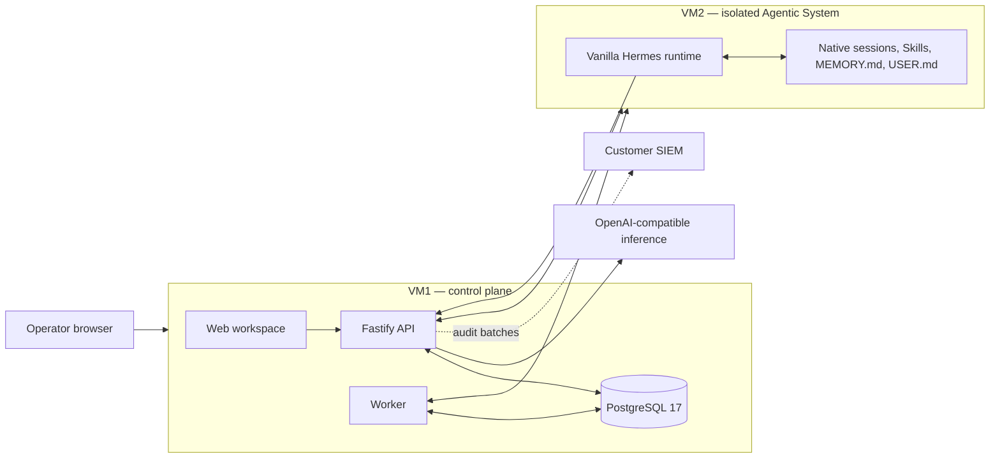

# OrcaSynapse Architecture

OrcaSynapse is an on-premises control plane around a vanilla Hermes runtime. The product governs identity, configuration, models, profiles, prompts, guardrails, toolset admission, operations, and audit evidence without becoming a second agent runtime or memory system.

## Deployment baseline

- **VM1** runs the browser workspace, API, worker, Nginx, and stock PostgreSQL 17.
- **VM2** runs Hermes natively under a hardened systemd unit. Hermes owns its session transcripts and file-backed memory.
- **Inference** is an operator-approved OpenAI-compatible endpoint reached through VM1's scoped gateway.
- **SIEM** forwarding is optional and exports retained audit events at least once.

## State ownership

| State | Owner | Location |
| --- | --- | --- |
| identities, roles, profiles, model routes, prompts, guardrails, tool admissions | OrcaSynapse | VM1 PostgreSQL |
| chat projection, run lifecycle, decisions, failures, evaluation evidence | OrcaSynapse | VM1 PostgreSQL |
| append-only audit trail and forwarding cursor | OrcaSynapse | VM1 PostgreSQL |
| native transcript and model context | Hermes | VM2 native session store |
| `MEMORY.md`, `USER.md`, Skills, runtime workspace | Hermes | VM2 Hermes state root |

OrcaSynapse sends its conversation UUID as the Hermes session ID. It never rebuilds model context from the PostgreSQL chat projection and never reads, mirrors, edits, embeds, or exposes Hermes memory files. PostgreSQL records sanitized operational evidence, not a parallel memory corpus.

Vanilla Hermes shares file-backed memory within its active home/profile even though transcripts are session-scoped. This pre-production baseline is therefore one trust boundary, not per-user memory isolation.

## Native run flow

1. The API authenticates the operator and resolves an active agent profile and model alias.
2. The worker verifies the active Hermes node, admitted native toolsets, and policy boundary.
3. The runtime client creates or reuses the Hermes native session and streams the turn through `/api/sessions/:id/chat/stream`.
4. Hermes retains conversational context and native memory on VM2.
5. OrcaSynapse stores the user-visible response plus bounded lifecycle, tool, usage, and failure projections for operations and audit.

An in-flight native turn is attached to the worker process; a worker restart can lose that live attachment, while the Hermes transcript remains durable.

## Security boundaries

- VM2 receives a node-scoped gateway credential, never the upstream inference credential.
- Signed heartbeats and desired-state messages use enrolled Ed25519 node identities with replay protection.
- The Hermes unit is unprivileged, filesystem-confined, and receives root-owned managed policy read-only.
- Native toolsets fail closed unless admitted by an operator; built-in memory is the intentional baseline capability.
- Secrets on VM1 use envelope encryption, and browser sessions are role- and scope-checked.
- VM2 has no PostgreSQL access, standing SSH control channel, or Docker socket access.

## Greenfield schema

`ai-v3.16.0` starts schema epoch `hermes-native-v1`. The migrator refuses a database with pre-existing public tables unless it already carries the matching epoch. This deliberately prevents an ambiguous partial conversion from earlier releases. Install VM1 and VM2 cleanly; the preserved `backup/pgvector` branch remains the rollback reference for the previous product generation.

The baseline requires no vector extension, embedding runtime, external memory service, Redis, queue broker, object store, or model router.
