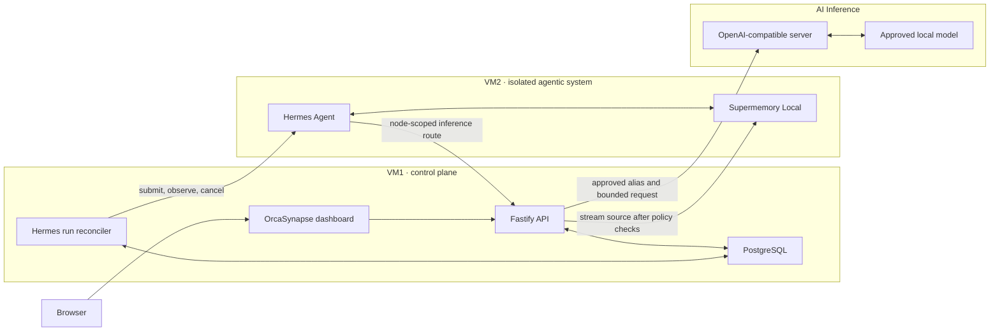

# OrcaSynapse Architecture

OrcaSynapse is the identity, policy, orchestration, and observability plane around an isolated Hermes runtime. It is not a second agent framework, file repository, vector database, or model server.

## Production baseline

The minimum deployment is two VMs plus an existing inference endpoint. VM1 runs OrcaSynapse and PostgreSQL. VM2 runs Hermes and Supermemory. The inference endpoint may be vLLM, llama.cpp, SGLang, Ollama, TGI, or another compatible server.

## One owner for each kind of state

| Component | Owns | Never owns |
| --- | --- | --- |
| OrcaSynapse | workforce and administrator identity, authorization, encrypted endpoints, Profile releases, policy, audit, metadata, incidents, and operational evidence | agent execution, embeddings, original files, or model weights |
| PostgreSQL | OrcaSynapse control-plane and durable Hermes-run state | source bytes, vectors, or Hermes session internals |
| Hermes | agent sessions, loop execution, Skills, tool and sub-agent behavior, and bounded native memory | enterprise authorization, PostgreSQL access, or inference credentials |
| Supermemory Local | semantic knowledge, long-duration agent memory, embeddings, and retrieval | enterprise authorization decisions or original-file authority |
| AI Inference | OpenAI-compatible model serving | routing authority, durable memory, or enterprise credentials |

There is no direct Chat-to-model path. Normal Chat creates a governed Hermes Agent Run. A PostgreSQL worker acquires an exclusive renewable processing lease, submits the run to VM2, follows safe lifecycle events, supports explicit cancellation, and finalizes both the run and linked Chat message. The browser stream is only a live subscriber: disconnecting it does not cancel durable execution. The run ID is the idempotency key; the conversation ID is the stable Hermes session ID.

After VM2 is enrolled and healthy, a Development administrator can use **Create & activate** once: OrcaSynapse runs the Hermes compatibility check, activates the immutable Profile Distribution, and enables the global execution boundary. Pilot and Production continue requiring promoted evaluation evidence before activation.

## Knowledge lifecycle

1. The browser uploads a source to OrcaSynapse.
2. OrcaSynapse authenticates the identity and validates classification, file name, MIME type, retention, and the 50 MB limit.
3. OrcaSynapse streams the multipart body to Supermemory using a server-side credential and an owner-derived container tag.
4. PostgreSQL stores only ownership, classification, checksum, size, external Supermemory ID, projected status, retention, and audit metadata.
5. OrcaSynapse polls Supermemory for indexing state. It keeps no retry copy; a failed transfer requires re-upload.
6. Deletion removes the Supermemory object and marks the metadata record deleted.

The Supermemory Local baseline handles text and text-based documents through the VM2 OpenAI-compatible inference route. New nodes pin v0.0.7-rc.2 for its upstream large-document workflow fix. Scanned PDFs, image-heavy documents, and images require an optional Gemini or Vertex document-understanding provider; the dashboard states this limitation instead of claiming universal local OCR.

## Memory boundaries

- Each enterprise identity receives a deterministic, hashed `orcasynapse-knowledge-*` container tag. OrcaSynapse never accepts an arbitrary namespace from the browser.
- Hermes uses its VM2-local Supermemory provider for durable agent recall and capture.
- Hermes `MEMORY.md` and `USER.md` remain small native runtime files because the upstream external-memory provider is additive.
- PostgreSQL records authorization and provenance; it is not a second vector plane.

## Runtime and tool boundaries

The VM2 installer pins the OrcaSynapse inference route, resolves the pulled Hermes container to an immutable registry digest, pins the Supermemory provider, and applies secret redaction and loop circuit breakers in Hermes managed configuration. The default distribution exposes no native model-callable MCP toolset. OrcaSynapse's governed MCP surface remains default-deny and currently exposes only its implemented read-only document-metadata handler. The dashboard does not advertise a consequential-action approval inbox because this release cannot originate those actions; legacy approval records remain migration-compatible but are not an active product surface.

Node lifecycle is an execution boundary:

- **Drain** rejects new work and lets accepted work finish.
- **Suspend** denies new and active work.
- **Resume** restores admission only after the signed heartbeat and Hermes connection are healthy.
- **Revoke** permanently disables node-scoped Hermes, Supermemory, and inference access.
- **Remove** deletes the dashboard registration only after revocation; the operator separately runs the generated VM2 cleanup command to destroy local runtime data.

## Network policy

| Source | Destination | Purpose |
| --- | --- | --- |
| Browser | OrcaSynapse HTTPS | dashboard and API only |
| OrcaSynapse | PostgreSQL | private control-plane data |
| OrcaSynapse | Hermes TCP 8642 | governed runs, status, and stop |
| OrcaSynapse | Supermemory TCP 6767 | knowledge upload, status, search, and deletion |
| Hermes | local Supermemory TCP 6767 | native agent memory |
| Hermes | OrcaSynapse internal inference API | node-scoped model access |
| OrcaSynapse | AI Inference | approved OpenAI-compatible model calls |

Deny browser access to VM2 and inference, Hermes access to PostgreSQL or Docker control, and unrestricted VM2 egress. Enrollment signatures identify the node but do not replace customer-approved TLS/mTLS and firewall controls.

## Durability and recovery

- Back up PostgreSQL with a tested customer RPO/RTO and point-in-time recovery where required.
- Back up the complete Supermemory data directory consistently; it contains semantic graph, auth, and embedding state.
- Back up Hermes persistent data when sessions, Skills, and native memory must survive VM replacement.
- Store the OrcaSynapse Installation Key and encrypted recovery kit off-host, then test recovery.
- Restore into an isolated environment and verify identity, Profile, model route, namespace, retrieval, and deletion behavior.
- Worker leases expire and can be recovered by another VM1 worker; terminal worker transitions also finalize linked Chat messages so browser or API-stream loss does not strand the conversation.

## Explicit non-dependencies

OrcaSynapse does not require Redis, Valkey, pg-boss, LiteLLM, S3-compatible storage, SeaweedFS, MinIO, pgvector, or a separate OCR service.
