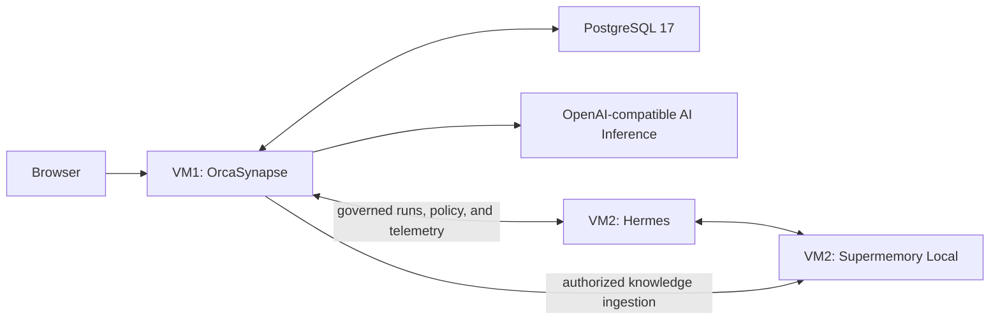

# OrcaSynapse Current-State Handoff

Last verified: 2026-08-03 (Asia/Jakarta)

This document is the sanitized transfer context for continuing OrcaSynapse work in another Codex session. Read it before changing code. It records the repository state, the deployed lab state, decisions already made, verified behavior, known contradictions, and the next coherent implementation slice. It intentionally contains no passwords, installation keys, API keys, enrollment claims, or private-key material.

## Start here

- Repository: <https://github.com/multichainerz/AI>
- Local workspace: `C:\Users\Veros\Documents\GitHub\MPM`
- Branch: `main`
- Baseline commit: `5209c11926de22bac26209a9f55624abb8d23da1` (`ai-v1.17.1`)
- Baseline relationship: local `main` and `origin/main` are synchronized (`0` ahead, `0` behind).
- Baseline verification: `pnpm verify` passes at this commit. Re-confirmed independently: 72 test files, 359 tests.
- Current working branch: `fix/worker-run-durability` at `ai-v1.19.0`, one commit ahead of `main`, not yet pushed. See "Latest verified build state" for what it contains.
- This file is the only expected uncommitted change unless later work says otherwise.

Do not copy credentials from terminals, VM environment files, Docker secrets, PostgreSQL, or service logs into issues, commits, or future handoff documents.

## Product definition

OrcaSynapse is an on-premises identity, policy, orchestration, inference-gateway, and observability plane for an isolated Hermes agent runtime. It is not another agent framework, model server, source-file repository, OCR product, or vector database.

The intended operator journey is:

1. Install VM1 with the public one-line installer.
2. Sign in with the generated temporary local administrator and change the password.
3. Connect and validate one OpenAI-compatible AI Inference endpoint.
4. Generate the VM2 installer and one-time enrollment claim.
5. Install the Agentic System on VM2; the installer provisions Hermes, Supermemory, managed policy, node identity, and signed monitoring.
6. Create and activate the first Hermes Profile.
7. Use Chat, Knowledge, Agents, Platform, and Operations from one dashboard.
8. Add OIDC or Microsoft Entra ID later for enterprise access and RBAC.

## Architectural invariants

1. OrcaSynapse owns enterprise identity, authorization, policy, encrypted configuration, orchestration, audit, and inference mediation.
2. Hermes is the only normal Chat and agent-execution path. Chat must never call the model directly.
3. Supermemory is the sole semantic memory and vector plane.
4. PostgreSQL stores control-plane state, metadata, sessions, audit, and durable run state - not vectors, model weights, or original enterprise files.
5. Source files are never persisted in OrcaSynapse and remain authoritative in customer storage. The upload is streamed straight through to Supermemory; there is no ephemeral staging store, and `scratch-store` was removed.
6. AI Inference serves models but does not own policy or durable memory.
7. Hermes receives a node-scoped OrcaSynapse inference credential; the inference server credential stays on VM1.
8. Hermes and Supermemory run together on isolated VM2. Hermes may use Supermemory as its durable semantic memory, while small native Hermes files such as `MEMORY.md` and `USER.md` remain additive runtime state.
9. There is no Redis, Valkey, pg-boss, LiteLLM, object store, pgvector, or separate OCR stack in the baseline architecture.

## Runtime topology



The minimum production-shaped deployment is two VMs plus an inference endpoint. The inference endpoint may be vLLM, llama.cpp, SGLang, Ollama, TGI, or another compatible OpenAI-style server.

## Technology and repository map

- Node.js 24+, pnpm 10, TypeScript 7
- React 19 and Vite 8 for the dashboard
- Fastify API
- PostgreSQL 17 and Prisma 7
- Docker Compose for VM1
- Official Hermes container plus Supermemory Local systemd service on VM2

Important locations:

| Path | Responsibility |
| --- | --- |
| `apps/web` | Dashboard and operator workflows |
| `apps/api` | Authentication, connections, inference gateway, Chat, Agents, Knowledge, Operations, onboarding, and runtime-node APIs |
| `apps/worker` | Durable Hermes Agent Run reconciliation and lifecycle processing |
| `packages/contracts` | Shared validated API contracts |
| `packages/database` | Prisma schema, migrations, and database bootstrap |
| `packages/runtime-clients` | Hermes and Supermemory server-side clients (renamed from `document-runtime`, which predated the removal of the local document pipeline) |
| `packages/security` | Password hashing, envelope encryption, capability checks, and recovery-kit primitives |
| `install.sh` | Public VM1 bootstrap wrapper |
| `scripts/install-orcasynapse.sh` | Full VM1 installer/update implementation |
| `scripts/install-agentic-node.sh` | VM2 Agentic System enrollment installer |
| `scripts/remove-agentic-node.sh` | VM2 destructive uninstall path |
| `compose.yaml` | VM1 PostgreSQL, migration, API, worker, and web services |
| `docs/ARCHITECTURE.md` | Intended system boundaries |
| `docs/AGENTIC_SYSTEM_ENROLLMENT_RUNBOOK.md` | VM2 enrollment and recovery behavior |

## What is implemented

### VM1 installation and administration

- Public GitHub-hosted one-line installer with branded terminal progress.
- Docker and Compose preflight/provisioning.
- PostgreSQL, migrations, API, worker, and web dashboard deployment.
- Generated database, encryption, installation-recovery, and temporary local-administrator material.
- Safe handling of an existing installation, including update, preserve, or explicit cleanup paths.
- Local administrator authentication and forced first-password change.
- Installation key is offline recovery material, not the routine dashboard login.

### AI Inference

- Guided endpoint normalization, discovery, model listing, health validation, credential storage, and activation.
- OpenAI-compatible inference abstraction rather than vLLM-specific naming.
- Compatibility handling for vLLM, llama.cpp, SGLang, Ollama, TGI, and similar endpoints.
- OrcaSynapse-owned policy and node-scoped inference routing for VM2.

### Agentic System enrollment

- Dashboard-generated, one-time VM2 enrollment claim.
- Installer unavailable until the administrator and AI Inference prerequisites are ready.
- Mandatory Ubuntu preflight (`require_ubuntu_host` hard-fails on any other distribution; VM1 by contrast accepts Debian or Ubuntu), Docker setup, local Ed25519 node identity, signed enrollment, and resumable protected state.
- Hermes container installation, immutable image resolution, managed configuration, guarded tool baseline, and health checks.
- Supermemory Local installation, model-download progress, embedding-plan observation, Hermes memory-provider installation, registration, and signed heartbeats.
- Node drain, suspend, revoke, and destructive removal controls.

### Hermes Profiles and Chat

- Immutable Profiles aligned with Hermes terminology, including `SOUL.md`, Skills, prompts, tools, guardrails, and lifecycle state.
- Development shortcut to create, validate, and activate the first Profile after VM2 compatibility passes.
- Chat creates governed Hermes Agent Runs; it does not call inference directly.
- PostgreSQL-backed durable execution, exclusive renewable run leases, idempotent submission, resumable event streams, cancellation, and single-writer finalization.
- Server-side: structured message deltas, tool and sub-agent events, allow-once/deny approvals, usage and latency telemetry, feedback, fork, archive, cancel, and guarded deletion.
- Client-side only: conversation search, export, and retry. `GET /conversations` accepts no query parameter; the dashboard filters the returned list locally and builds the export in the browser. Do not describe these as API capabilities.

### Knowledge and memory

- Knowledge uploads are authenticated and streamed server-side to Supermemory.
- PostgreSQL stores metadata, ownership, classification, checksum, projected status, retention, and audit - not source bytes.
- Owner-derived Supermemory container tags prevent arbitrary browser-selected namespaces.
- Deletion removes the Supermemory object and marks OrcaSynapse metadata deleted.
- Supermemory is also configured as the Hermes durable memory provider.

### Operations and enterprise access

- Service topology, connection health, runtime-node health, incidents, audit, guardrail posture, workflow metrics, and release evidence.
- Local administrator and recovery foundations are implemented.
- OIDC/Microsoft Entra ID connection and enterprise-session foundations exist, but customer-specific identity acceptance remains a deployment gate.
- Tenancy is achieved per deployment: one installation serves one organization. `ownerSubject` scopes documents, conversations, and Supermemory container tags to a user within that organization, and there is deliberately no in-installation tenant boundary. Do not reintroduce multi-tenancy as pending work.

## Latest verified build state

Command:

```powershell
pnpm verify
```

Result on baseline commit `5209c11`:

- TypeScript typecheck: passed across all workspace projects.
- Tests: 72 test files and 359 tests passed.
- Production build: passed.
- Prisma schema validation: passed.
- Web production build: passed; the largest generated chunks are the application shell (`index`, 380.87 kB) and Chat workspace (`chat-view`, 179.72 kB).

Since that capture, `ai-v1.19.0` on branch `fix/worker-run-durability` landed five worker defects found by review rather than by a failing test. `pnpm verify` passes there with 72 test files and 368 tests; worker coverage went from 14 to 23 tests. The fixes are:

1. Run discovery omitted `WAITING_FOR_APPROVAL`, permanently stranding any run whose worker restarted with an approval outstanding, leaving its chat message `PENDING`.
2. Batch dispatch head-of-line blocked; replaced with slot accounting. The concurrency ceiling stays at five, so peak inference load is unchanged.
3. `Promise.all` let `stop()` report a clean shutdown while runs were still executing.
4. The worker's history trim could delete an assistant turn while keeping its question, because guardrails cap input at 32,000 characters but allow up to 1,000,000 output characters.
5. Two early returns kept a lease the worker had already acquired, leaving a run no worker was driving untouchable for the full lease term.

## Local lab deployment

The development host uses WSL `Ubuntu-26.04` with LXD virtual machines:

- `synapse-dashboard`: VM1 control plane
- `synapse-agent`: VM2 Agentic System

LXD addresses are dynamic; use this instead of relying on a recorded IP:

```powershell
wsl.exe -d Ubuntu-26.04 -u root -- /snap/bin/lxc list --format compact
```

Both VMs were listed as running at handoff capture. Immediately after the WSL/LXD environment resumed, the guest agents and services were still initializing, so a transient `LXD VM agent is not currently running` or `activating` result is not evidence of an OrcaSynapse regression. Wait for the guest agent before inspecting services.

The previously verified VM2 state is:

- Hermes enrolled and reachable through OrcaSynapse.
- Supermemory Local currently remains on `0.0.5`.
- The persisted embedding plan is `local / Xenova/bge-m3 / 1024`.
- Runtime startup logs - not merely the plan file - confirmed `Xenova/bge-m3 / 1024d` loaded and its worker became ready.
- Supermemory extraction uses the OrcaSynapse OpenAI-compatible route and the configured local chat model.

Never include the Supermemory API key, node private key, installation key, administrator password, or enrollment claim in another session.

## Critical unresolved Supermemory contradiction

This is the highest-priority issue for the next session.

The repository currently defaults new VM2 enrollments to Supermemory `0.0.7-rc.2` in contracts, Prisma defaults, UI, installer expectations, migrations, and documentation. That change was made because the release fixes a large-document Rivet workflow limit.

However, later verification found an open upstream bug showing that the published `0.0.7-rc.2` binary ignores these documented variables:

```text
SUPERMEMORY_EMBEDDING_PROVIDER
SUPERMEMORY_EMBEDDING_MODEL
SUPERMEMORY_EMBEDDING_DIMENSIONS
SUPERMEMORY_EMBEDDING_BASE_URL
```

The affected binary falls back to local `Xenova/bge-base-en-v1.5` at 768 dimensions. Upstream explicitly lists `0.0.6` and `0.0.7-rc.2` as affected:

- <https://github.com/supermemoryai/supermemory/issues/1336>
- <https://github.com/supermemoryai/supermemory/releases/tag/server-v0.0.7-rc.2>

The exact release documentation advertises `Xenova/bge-m3`, but the binary behavior and open bug contradict the documentation. Treat runtime logs and an end-to-end retrieval test as authoritative.

Consequences:

- Do not deploy `0.0.7-rc.2` expecting multilingual BGE-M3.
- Do not infer the executing model only from `embedding-plan.json`.
- The current live `0.0.5` VM2 genuinely loaded BGE-M3 and should not be reinstalled merely to obtain the release candidate.
- Indonesian retrieval would regress materially if VM2 silently changed to English-focused BGE-base.
- The repository defaults and documentation are presently inconsistent with the now-verified runtime reality.

## Current document-ingestion failure

The failed PDF upload is not a BGE-M3 failure. VM2 logs showed the document stopped in extraction before embedding:

1. Supermemory attempted its document-understanding path.
2. Mistral OCR returned `401`.
3. The Gemini fallback returned `403`.
4. No extracted text reached BGE-M3.

BGE-M3 embeds text; it does not parse PDF structure or OCR scanned pages. Reinstalling VM2 will not correct invalid or unavailable upstream document-understanding providers.

This creates the current release trade-off:

| Supermemory release | Verified advantage | Verified problem |
| --- | --- | --- |
| `0.0.5` | Local BGE-M3 actually loads at 1024 dimensions | Current PDF extraction path fails for the tested document and older workflow limits remain |
| `0.0.7-rc.2` | Upstream large-document/Rivet workflow fix | Embedding configuration is ignored; runtime falls back to English BGE-base 768d |

## Recommended next implementation slice

Do not solve the document problem by silently accepting BGE-base. The coherent path is:

### 1. Correct the release policy

- Restore the new-node baseline to the actually verified `0.0.5` release until upstream fixes issue `#1336`, or introduce an explicitly audited custom build if the organization accepts maintaining it.
- Update all matching defaults and claims in contracts, Prisma schema/migration, runtime-node UI, installer guards, tests, PRD, architecture, model runbook, and enrollment runbook.
- Add an explicit blocked-release rule for `0.0.7-rc.2` when multilingual BGE-M3 is required.
- Preserve existing VM2 data and do not mutate its 1024-dimensional embedding plan in place.

Known stale references can be found with:

```powershell
rg -n "0\.0\.7-rc\.2|bge-m3|bge-base" scripts apps packages docs README.md deploy
```

Two corrections to the framing above, confirmed against the tree:

- The contradiction is **internal to the repository**, not repository-versus-reality. `scripts/install-agentic-node.sh` already names issue `#1336` and warns when the runtime loads a different embedding model than requested, and the enrollment runbook already documents that fallback. What disagrees with the installer is the rest of the tree: contracts, the Prisma default, the migration, the runtime-node panel, and `docs/ARCHITECTURE.md` still steer to `0.0.7-rc.2` with no embedding caveat. Preserve the installer's existing warning rather than adding it fresh; the work is to upgrade it to a hard failure or a visibly degraded node state.
- **`apps/api/src/documents/prisma-document-manager.ts` ships operator-facing guidance that contradicts this plan.** On a large-document failure it instructs the operator to "Upgrade or re-enroll VM2 with the supported 0.0.7-rc.2 release." That message must change with the release policy; it is the highest-impact stale reference because it reaches operators directly rather than sitting in documentation.
- The installer's existing block on `0.0.6` is for the RivetKit packaging defect (`#1315`, `#1324`), which is a **different** bug from `#1336`. Do not merge the two block rules.

### 2. Decouple local text extraction from semantic indexing

Implement a narrow OrcaSynapse-owned extraction boundary while keeping Supermemory as the only durable semantic store:

```text
authorized upload
  -> bounded ephemeral local extraction
  -> normalized UTF-8 text
  -> Supermemory 0.0.5 ingestion
  -> BGE-M3 embedding and durable memory
  -> immediate temporary-file deletion
```

Initial supported formats should be deliberately small:

- TXT and Markdown: validate and normalize directly.
- Text-bearing PDF: local text extraction.
- DOCX: local text extraction.
- Scanned or image-only documents: report a clear `OCR provider required` state until an optional, explicitly configured on-prem OCR adapter exists.

Constraints:

- Do not restore a permanent OrcaSynapse file store.
- Do not add a second vector database.
- Do not advertise universal OCR.
- Apply size, decompression, page-count, timeout, MIME, filename, and process-resource bounds.
- Delete ephemeral bytes on success, failure, timeout, and cancellation.
- Confirm the exact Supermemory `0.0.5` text-ingestion request contract against the running service before implementing the final client call.
- Preserve owner-derived container tags, provenance metadata, deletion, and audit behavior.

### 3. Add runtime truth to readiness

- Enrollment must fail or remain visibly degraded if the observed embedding model/dimensions do not match the requested plan.
- Add a disposable multilingual indexing/retrieval test, not only log parsing.
- Add a disposable document extraction -> text ingestion -> search test.
- Show separate readiness for extraction and embedding so `Memory healthy` cannot conceal `Documents unavailable`.

### 4. Update deployment safely

- VM1 can be updated in place after the API/web/worker changes; a fresh deployment should not be required.
- Keep the current VM2 unchanged while it is running verified `0.0.5` with BGE-M3.
- Only rerun/re-enroll VM2 if the installer or VM2 runtime itself is intentionally changed and tested.
- Back up PostgreSQL and the Supermemory data directory before any release or embedding-plan migration.

## Acceptance criteria for the next slice

1. New enrollments cannot claim BGE-M3 readiness when the runtime loaded BGE-base.
2. Existing VM2 remains on BGE-M3/1024 without reindexing.
3. A UTF-8 text file can be uploaded, indexed, searched, and deleted end to end.
4. A text-bearing PDF and DOCX follow bounded local extraction and become searchable through BGE-M3.
5. An image-only PDF produces a precise OCR-required message without leaking or retaining source bytes.
6. Chat still reaches Hermes through a durable Agent Run and can retrieve authorized Supermemory knowledge.
7. `pnpm verify` and installer recovery tests pass.
8. Architecture, UI labels, readiness calculations, runbooks, and runtime behavior agree.

## Useful verification commands

Repository:

```powershell
git status -sb
git log -8 --oneline
pnpm verify
```

LXD VM inventory:

```powershell
wsl.exe -d Ubuntu-26.04 -u root -- /snap/bin/lxc list --format compact
```

VM1 services after the LXD guest agent is ready:

```powershell
wsl.exe -d Ubuntu-26.04 -u root -- /snap/bin/lxc exec synapse-dashboard -- docker compose -f /opt/orcasynapse/compose.yaml ps
```

VM2 service health without exposing configuration secrets:

```powershell
wsl.exe -d Ubuntu-26.04 -u root -- /snap/bin/lxc exec synapse-agent -- systemctl status orcasynapse-supermemory.service --no-pager
wsl.exe -d Ubuntu-26.04 -u root -- /snap/bin/lxc exec synapse-agent -- docker ps
```

Embedding runtime evidence:

```powershell
wsl.exe -d Ubuntu-26.04 -u root -- /snap/bin/lxc exec synapse-agent -- journalctl -u orcasynapse-supermemory.service --no-pager | Select-String -Pattern 'embeddings  local|local embeddings|bge-m3|bge-base'
```

Avoid dumping complete environment files or unredacted logs because they may contain credentials.

## Production gates still outside code-only acceptance

- Customer-approved TLS/mTLS and firewall evidence.
- Signed, immutable image and binary policy.
- PostgreSQL, Hermes, and Supermemory backup/restore drills against defined RPO/RTO.
- GPU concurrency, cancellation, and soak testing with the chosen model.
- OIDC/Microsoft Entra ID group mapping and deprovisioning acceptance.
- Owner-scope isolation testing between users inside the organization. Tenancy is achieved per deployment: one installation serves one organization, so there is no in-installation tenant boundary to certify.
- Infrastructure, security, product, and business approval.
