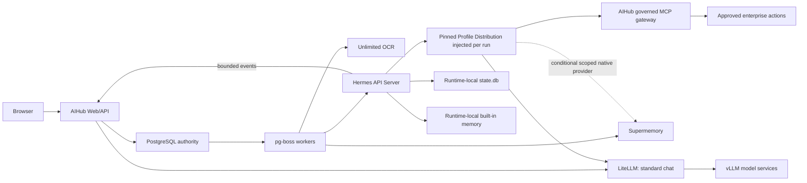

# Phase 9 - Cohesion, Architecture, Guardrails, and Enterprise Onboarding

**Status:** Recalibrated installer/wizard and single-node enrollment foundation implemented; signed release provenance, customer PKI/mTLS, and target-environment acceptance remain open
**Documentation baseline:** Primary documentation for every named component, reviewed 2026-07-30
**Compatibility rule:** Production must pin every package, model revision, container digest, API revision, database patch release, GPU driver, and CUDA/runtime combination. Upstream `main`, `latest`, a model card, or a documented feature is design input—not proof that the deployed artifact supports AIHub's exact contract.

## 1. Purpose

Phase 9 is a production-cohesion and customer-experience phase. It will validate the system already built, remove overlapping responsibilities, optimize the main AI flows and their guardrails, and provide a guided installation and onboarding experience.

The phase has four required outcomes:

1. **Cohesion check:** prove that implemented behavior, documentation, configuration, UI, data ownership, failure handling, and operational claims agree.
2. **Architecture optimization:** minimize components and integration paths while retaining isolation, recoverability, auditability, and on-premises operability.
3. **Flow and guardrail optimization:** make chat, documents, knowledge, Hermes, MCP, approval, cancellation, and recovery paths consistent and fail closed.
4. **Enterprise onboarding:** guide a customer from a clean deployment to a verified production candidate without making AIHub a remote-root or SSH-password vault.

### Implemented local foundation

- Persistent, optimistic-revision component compatibility records with exact observed-version and evidence requirements.
- Explicit LiteLLM ownership, Supermemory storage/embedding, Hermes memory, and GPU scheduling decisions with conditional blockers.
- A resumable eight-stage Deployment workspace with topology-derived gates, integrated into the responsive dashboard.
- Atomic single-use installation claiming, scoped OIDC administrator-group sessions, and an audited local-root replacement-claim path.
- Automated validation evidence, authority-labelled external attestations, and encrypted off-host recovery-kit export/verification.
- Node.js type/runtime-major alignment through a repository-wide Node 24 type override.
- Official Hermes Runs capability/toolset compatibility fixes and bounded SSE lifecycle projection into PostgreSQL.
- Profile Distribution desired state with `SOUL.md`, checksummed Skill references, deterministic SHA-256 digest, run pinning, and an evidence-gated `STANDBY` lifecycle.

These controls are implemented software behavior, not evidence that a customer deployment has passed. The remaining target work includes the signed release/image provenance pipeline, customer PKI/mTLS and offline-bundle automation, multi-node lifecycle, controlled delegation/native-memory modes, signed handover export, and the full compatibility, restore, security, GPU, and acceptance suite below.

Single-node Hermes enrollment now uses a one-time claim, a node-generated Ed25519 identity, replay-protected heartbeats, automatic connector creation, bidirectional reachability evidence, and revocation without standing SSH trust. Customer-approved TLS is still mandatory and PKI/mTLS remains a Production gate. AIHub intentionally does not install Profiles into upstream Hermes: the official Docker guidance favors one container per Profile, while AIHub's governed execution model pins and injects the immutable `SOUL.md` behavior per Runs API request. Controlled delegation and optional native-memory expansion remain Phase 9 outcomes.

## 2. Principles and boundaries

- The AIHub application introduces no Redis, Valkey, S3, SeaweedFS, MinIO, or AIHub-owned vector database.
- PostgreSQL and `pg-boss` are the single durable AIHub control, audit, workflow, retry, and scheduling plane.
- Supermemory is the single durable **enterprise semantic-knowledge and approved agent-memory** plane. Its private embedded or supported external backing store is not part of the AIHub schema.
- Enterprise repositories remain authoritative for original documents. AIHub extraction bytes and page images are ephemeral.
- Hermes SQLite is private runtime state, not an alternative AIHub database and not a shared multi-host service.
- Hermes built-in `MEMORY.md` and `USER.md` memory remains active according to upstream behavior inside the runtime node's `HERMES_HOME`; it must not become an enterprise record, secret store, second semantic authority, or claimed Profile-isolation boundary.
- Hermes Kanban remains disabled as a durable authority because it would overlap with PostgreSQL and `pg-boss`.
- Browsers communicate only with AIHub. They never receive connector, Hermes, LiteLLM, or service credentials.
- Hermes reaches only LiteLLM, the AIHub-governed MCP gateway, and explicitly approved infrastructure endpoints.
- `SOUL.md`, Skills, prompts, and model instructions describe behavior; they never grant authorization.
- Every mutable action is authorized again at the MCP/action boundary and may require human approval.
- AIHub stores routine endpoints and credentials through its encrypted credential store in PostgreSQL. This is not HashiCorp Vault or Vault KV. The installer generates the database credential and separately mounted AIHub credential-encryption key that cannot safely be stored in the database it unlocks.

## 3. Official component contract baseline

Every contract is classified as:

- **Documented:** directly supported by the cited upstream interface and still verified against the pinned artifact.
- **AIHub decision:** an MPM architecture or security choice, not a vendor feature claim.
- **Conditional:** deployment-, model-, edition-, or version-dependent and blocked until a target-environment compatibility test passes.

| Component | Repository baseline or intended role | Official contract and Phase 9 decision | Gate |
|---|---|---|---|
| Node.js | `>=24`; application runtime; repository overrides `@types/node` to the Node 24 line | Pin a supported Node 24 patch release and container digest. Keep all transitive `@types/node` resolutions on the deployed runtime major so types cannot make Node 26-only APIs appear safe. | Documented + type/runtime alignment + patch/soak test |
| TypeScript | `7.0.2`; compile-time only | TypeScript 7 is the native Go compiler and does not expose the previous programmatic compiler API. AIHub currently uses `tsc`; verify Vite, Vitest, Prisma generation, IDE, and any API-dependent tooling before retaining it. | Conditional toolchain suite; documented TS 6 fallback |
| React / Vite | React `19.2.8`, Vite `8.1.5`; web UI/build | React is the UI runtime. Vite is development/build tooling—not a Node.js or `pnpm` replacement—and Vite 8's Node requirement is satisfied by Node 24. Nginx serves the production static bundle. | Documented + browser/accessibility suite |
| Container/web/conversion runtime | Mutable `node:24-bookworm-slim`, `nginx:1.29-alpine`, and unversioned Debian LibreOffice/Poppler packages | Pin image digests and converter package versions/snapshots. Validate Nginx SPA/static headers and health behavior. Run untrusted LibreOffice/Poppler conversion with a fresh writable profile, no macros/network, least privilege, CPU/memory/time/page/output limits, and malformed-document tests. | Supply-chain and document-sandbox gate |
| Fastify | `5.10.0`; API | Fastify v5 supports Node 20+ and requires complete JSON schemas for route request/response validation. Audit every external route, payload limit, error serializer, proxy setting, and streaming endpoint. | Contract/schema audit |
| PostgreSQL | `postgres:17-alpine`; AIHub authority | Pin the current PostgreSQL 17 patch image. Define connection budgets, TLS, backups, point-in-time recovery where required, upgrades, and restore evidence. Do not use an unqualified mutable image in production. | Recovery, capacity, and upgrade test |
| Prisma | `7.9.1` + `@prisma/adapter-pg` | Prisma 7 requires driver adapters; pooling and timeouts come from `pg`. Configure explicit pool, connect, query/statement, and shutdown limits across API and workers. `prisma migrate deploy` applies migrations but does not detect drift, so CI must validate migration history separately. | Pool and migration gate |
| `pg-boss` | `12.26.3`; durable AIHub jobs | PostgreSQL `SKIP LOCKED`, transactional enqueue, retries, scheduling, priority, and dead-letter behavior fit the central work plane. “Exactly once” delivery does not make external side effects exactly once; handlers still require operation IDs, idempotency, and unknown-outcome reconciliation. | Failure/idempotency suite |
| LiteLLM Proxy | External endpoint; inference gateway | LiteLLM owns model aliases, provider credentials, inference routing/fallback, virtual-key budgets, usage, and configured guardrail execution. AIHub owns identity, resource/tool authorization, approvals, and desired policy. Baseline mode references preconfigured immutable aliases/guardrail names; management-API reconciliation is a later, pinned integration—not an assumed feature. | Choose integration mode; route/failure tests |
| vLLM | Conditional internal OpenAI-compatible model serving behind LiteLLM | Use documented health, version, models, metrics, chat/responses/embeddings interfaces as supported by each served model. Chat templates, reasoning/tool parsers, multimodal schema, and parallel tool calls are model-dependent. AIHub and Hermes route inference through LiteLLM; direct vLLM access is optional read-only operator telemetry. | Conditional per-model conformance and load suite when MPM operates vLLM |
| Poolside Laguna S 2.1 | `poolside/Laguna-S-2.1-NVFP4`; Hermes model | The official model card specifies 117.6B total/8.5B active parameters, about 71 GB of NVFP4 weights, `poolside_v1` tool/reasoning parsers, and vLLM `>=0.25.0`. Correct spelling is **NVFP4**. Pin model revision, license acceptance, parser, sampling, and maximum admitted context. | GPU/capacity/license gate |
| Unlimited-OCR | Separate OCR service | Upstream documents direct Transformers `.infer()`/`.infer_multi()` and PDF/page processing and announces vLLM support; it does not establish AIHub's current generic `/v1/chat/completions` adapter as its canonical API. Retain the adapter only if the pinned service passes the AIHub OCR contract; otherwise provide a dedicated service adapter around the official inference path. | Blocking OCR contract and corpus test |
| Supermemory Local | Enterprise semantic knowledge/memory API, locally bundled or customer operated | Current official Local documentation describes an embedded graph engine, local embeddings, encrypted embedded storage, a local Memory API, custom base URL, model locking, and optional PostgreSQL+pgvector. AIHub validates the supported API and never reads or chooses the private schema during routine onboarding. Backing-store and embedding choices remain Supermemory deployment evidence. Never place Supermemory tables in AIHub's database/schema. | Edition, API, isolation, deletion, and restore gate |
| Qwen3 Embedding | Optional Supermemory embedding route | Supermemory Local already includes local embedding, so Qwen3 is optional rather than baseline infrastructure. If selected, pin variant, revision, dimensions, normalization, instruction template, and language behavior before the first index; any incompatible change requires a controlled rebuild. | Retrieval benchmark and rebuild plan |
| Hermes Agent | Isolated Profile runtime | Pin a release/image and verify API Server health/capabilities, Runs, events/SSE, approvals, stop, auth, Profiles, Profile Distributions, `state.db`, memory providers, Toolsets, Skills, `SOUL.md`, and delegation. The request `model` field is not proof of the configured runtime model. AIHub reconciles Profile desired state; it does not assume undocumented remote configuration APIs. | Blocking Hermes compatibility suite |
| MCP | AIHub governed tool boundary | Pin one stable protocol revision and run conformance tests for initialization, Streamable HTTP, version negotiation, discovery, calls, cancellation, errors, and authorization. Token passthrough is forbidden; tool discovery and every invocation remain authorization-dependent. | Protocol/security conformance gate |
| OIDC | Enterprise authentication | Validate discovery, issuer, audience, signature/JWKS rotation, authorization code + PKCE, state, nonce, redirect URI, clock skew, group mapping, logout, and revocation against the customer's provider. Bootstrap may proceed without OIDC, but Production may not activate. | Production-blocking provider conformance gate |
| AIHub signed installer | Supported deployment path | The signed release-bundle installer and its pinned internal manifest are the sole supported entry path. Unexposed services remain private, health checks are declared, and shared writable files have deliberate locking. AIHub receives neither reusable host credentials nor a Docker socket. | Clean-install, upgrade, rollback, and boundary test |
| NVIDIA RTX PRO 6000 Blackwell | Conditional 96 GB local GPU host | Official capacity is 96 GB ECC GDDR7. Laguna's approximate 71 GB weights leave no basis to promise 256K context, production batching, OCR, and a large embedding model concurrently. Choose measured safe co-residency, dedicated services/additional GPU, or an explicitly degraded serialized workload policy. External-inference topology does not require a local GPU. | Conditional blocking GPU admission and soak test |

The repository baseline is therefore coherent but not yet production-proven. Its core split—AIHub control data in PostgreSQL, durable jobs in `pg-boss`, enterprise semantic knowledge in Supermemory, runtime-local Hermes state, and inference through LiteLLM/vLLM—matches the documented components. The unproven parts are now explicit compatibility gates instead of architecture claims.

## 4. Hermes terminology contract

| Product concept | Official Hermes term | AIHub use |
|---|---|---|
| Upstream persistent specialist | **Profile** | Independent `HERMES_HOME`, configuration, `SOUL.md`, Skills, sessions, and gateway lifecycle; the baseline installer does not remotely create multiple Docker Profiles |
| Portable specialist release | **Profile Distribution** | Reviewed, immutable, non-secret expert content and metadata that AIHub pins and injects per governed run |
| Personality | **`SOUL.md`** | Identity, tone, and behavioral defaults; never permissions |
| Project instructions | **`AGENTS.md`** | Workspace or repository guidance |
| Reusable task instructions | **Skill** with `SKILL.md` | Checksummed content installed from an approved catalogue |
| Temporary child | **Subagent** created by `delegate_task` | Bounded child reasoning within a parent run |
| Durable multi-Profile board | **Hermes Kanban** | Optional upstream single-host SQLite board; disabled as an AIHub authority |
| HTTP integration | **API Server** in gateway mode | Authenticated capability, run, event, status, and stop interface |
| Local repeated-tool protection | **`tool_loop_guardrails`** | Runtime circuit breaker; defense in depth only |

**Runtime node**, **standby**, and **Agent Chat** are AIHub control-plane terms. A short-lived subagent must not be presented as a persistent Profile.

## 5. Cohesive data and control ownership

### 5.1 Authoritative stores

| Data or decision | Authority | Notes |
|---|---|---|
| Tenants, users, roles, desired configuration, encrypted connector secrets | PostgreSQL | Managed through AIHub after bootstrap |
| Profile releases, activation, policy assignments, grants and approvals | PostgreSQL | Immutable versions are pinned to runs |
| AIHub conversations, sanitized run/event projections, audit and evaluation evidence | PostgreSQL | Enterprise dashboard and reporting authority |
| Durable jobs, retries, schedules, leases and expert-to-expert routing | PostgreSQL + `pg-boss` | No second queue authority |
| Active Hermes session messages, tool-call history, context lineage and native resume | Runtime-local Hermes `state.db` | SQLite WAL; private to the enrolled node's single `HERMES_HOME` |
| Runtime-local built-in memory | Hermes `MEMORY.md` and `USER.md` | Upstream keeps built-in memory active; exclude enterprise records and secrets and do not claim isolation between AIHub Profile Distributions |
| Normalized durable enterprise knowledge and approved agent memory | Supermemory | Receives only policy-approved promoted content |
| Supermemory indexes, embeddings, graph, credentials, and private backing store | Supermemory deployment | Embedded by default; optional supported PostgreSQL+pgvector is separately operated and never shares the AIHub schema |
| Original enterprise files | Customer repositories | AIHub does not become a file repository |
| OCR inputs, converted pages and normalized pre-publication content | Encrypted scratch | Purged after publication, rejection, deletion, or expiry |

### 5.2 `state.db`, built-in memory, PostgreSQL, and Supermemory

Supermemory does not replace Hermes `state.db`, does not reduce its writes during a run, and does not disable Hermes built-in memory. These stores contain different data products:

- Hermes writes operational session state to `state.db` so a Profile can execute and resume a conversation.
- Hermes keeps built-in Profile memory active through `MEMORY.md` and `USER.md`; Phase 9 constrains those files to non-secret behavioral and runtime notes.
- AIHub receives a one-way, bounded and redacted event projection for user history, audit, approvals, status, and operations.
- Knowledge is promoted separately to Supermemory only after scope checks, redaction, provenance capture, and policy approval.

AIHub must not read, write, migrate, or synchronize SQLite rows directly. Commands flow from AIHub to the Hermes API Server; events flow back through the documented API or a narrow reviewed adapter. Correlation uses AIHub run, conversation, Profile release, runtime-node, and Hermes session identifiers.

The baseline enrolled node has one `HERMES_HOME` and one active runtime owner. Its SQLite file is placed on a protected persistent local volume, never a shared network filesystem. Retention is configurable; active sessions are preserved. Losing `state.db` loses native Hermes resume capability even when the AIHub audit projection remains available, so backup and restore behavior must be tested and stated honestly. Multiple AIHub Profile Distributions may share this execution boundary, but they do not gain separate upstream filesystems; one-container-per-Profile isolation remains a future explicitly reconciled topology.

The official Hermes Supermemory provider is additive: built-in memory stays active, the provider can prefetch before turns, synchronize turns after responses, extract on session end, mirror built-in writes, and expose provider tools. Therefore Phase 9 defines two supported modes:

1. **Governed mediated mode (default):** the Hermes external memory provider is off. AIHub performs authorized retrieval and controlled publication through its backend adapter and passes only scoped context to a run.
2. **Native provider mode (conditional):** a pinned Hermes Profile connects directly to a scoped Supermemory endpoint only after tests prove custom base URL behavior, per-user/container isolation, tool/write control, redaction, retention/deletion, failure handling, and no cross-tenant leakage. Automatic transcript synchronization is not enabled merely because the plugin exists.

In either mode, Supermemory remains the enterprise semantic authority, while Hermes built-in files stay limited and auditable as runtime-local configuration.

### 5.3 Control topology

There is no browser-to-Hermes route, no Hermes access to PostgreSQL credentials, and no unrestricted Hermes access to Supermemory or enterprise repositories.

## 6. Optimized product flows

### 6.1 Standard chat

1. AIHub authenticates the user and resolves the active prompt, guardrail, model route, and permitted knowledge scope.
2. AIHub retrieves authorized context when enabled and rechecks every source against current PostgreSQL ownership.
3. AIHub calls LiteLLM and streams the response through its own authenticated channel.
4. PostgreSQL records the conversation, route, policy versions, sources, usage, feedback, and audit events.

Standard chat does not invoke Hermes.

### 6.2 Agent Chat and governed runs

1. AIHub authorizes the user, selected active Profile release, model route, knowledge scope, tools, limits, and delegation policy.
2. PostgreSQL commits the run envelope and durable job atomically.
3. A worker selects an enrolled compatible runtime node and submits the pinned run to the Hermes API Server.
4. The node proves the applied Profile Distribution, configured model route, tool/reasoning parser, and effective runtime policy; AIHub does not trust a request `model` label as enforcement.
5. Hermes uses its local `state.db` for execution and native session continuity.
6. AIHub consumes documented run status and events/SSE through a bounded adapter; high-volume token deltas are coalesced and retention-limited.
7. Tool calls return through the AIHub MCP gateway for current authorization and approval.
8. Completion, cancellation, timeout, or failure updates the PostgreSQL run and user-facing conversation.

PostgreSQL remains the durable run authority. `delegate_task` is limited to temporary within-run fan-out. A durable specialist handoff creates another AIHub-governed Profile run through `pg-boss`.

### 6.3 Documents and knowledge

1. AIHub accepts an upload or future enterprise-source fetch into encrypted scratch.
2. The worker converts pages, invokes the pinned Unlimited-OCR adapter contract, normalizes text, and applies classification and ownership metadata. OpenAI-compatible multimodal serving is an adapter option, not an assumed upstream Unlimited-OCR API.
3. Approved content is published once to Supermemory using stable identity and generation semantics.
4. AIHub purges all bytes and intermediates from scratch after confirmed publication or terminal lifecycle events.
5. PostgreSQL retains metadata, provenance, state, and evidence—not source bytes, normalized bodies, vectors, or embeddings.

### 6.4 Governed tool action

1. Hermes receives only the tool schema and run-scoped capability allowed for that exact run.
2. The MCP gateway authenticates the capability and re-evaluates user, Profile release, tool, resource, environment, and revocation state.
3. Consequential actions create an expiring approval rather than executing immediately.
4. The worker rechecks mutable authorization before dispatching an approved action.
5. Idempotency, bounded retries, result redaction, and immutable audit prevent duplicate or hidden effects.

### 6.5 Failure and recovery

- Unknown side-effect outcomes are surfaced for reconciliation; they are not blindly retried.
- Cancellation and revocation propagate to queued work, the Hermes parent run, and owned subagents where the pinned API supports it.
- Event-stream interruption resumes from a documented cursor or reconciles from run status without inventing events.
- Node loss does not convert the AIHub audit projection into a fake Hermes session. Native resume requires the corresponding restored `state.db`; otherwise a new governed session is created explicitly.
- Supermemory failure retains eligible scratch only within its bounded lifetime, after which the enterprise source must be supplied again.

## 7. Guardrail responsibility matrix

| Layer | Primary responsibility | Must not be treated as |
|---|---|---|
| AIHub identity and policy | Tenant/user authorization, Profile access, knowledge scope, grants, approvals, limits, revocation | Model-safety filter only |
| LiteLLM | Approved model routing, provider credentials, token/budget constraints, inference-level policy | Enterprise resource authorization |
| Hermes Profile and Toolsets | Reasoning behavior, available runtime tools, delegation width/depth, iterations, local loop protection | Final authorization boundary |
| Network policy | Reachable hosts, ports, DNS and egress destinations | Application permission model |
| AIHub MCP gateway | Final per-call tool/resource/action authorization, idempotency and approval enforcement | Broad connector credential proxy |
| Supermemory adapter/provider | Scoped publication/retrieval, provenance, deletion, and memory-egress controls | Raw conversation or audit archive; ungoverned auto-sync destination |
| Output/event boundary | Secret, sensitive-argument, hidden-prompt and chain-of-thought redaction | Replacement for upstream least privilege |

The effective run policy is an immutable composition of the user, Profile release, environment, model route, knowledge scope, tool grants, delegation limits, approval rules, and current revocation state. A downstream layer may narrow this policy but may never widen it.

LiteLLM configuration has one owner per setting. In baseline mode AIHub stores the expected alias, endpoint, and guardrail identifiers and validates the externally managed proxy. If a future supported management API is selected, AIHub stores desired state and reconciles it with versioned drift, rollback, and audit; operators must not independently edit the same managed settings.

## 8. Delivery sequence

### 9.0 - Actual-state cohesion audit

#### Scope

- Inventory every API, worker, UI screen, Prisma model, queue, connector, configuration key, runbook, deployment service, and product claim.
- Trace standard chat, documents, retrieval, Hermes runs, MCP calls, approvals, monitoring, cancellation, deletion, and recovery end to end.
- Classify each capability as implemented, target-environment dependent, planned, obsolete, or contradictory.
- Reconcile UI labels and schemas with official Hermes terminology.
- Turn the component baseline in Section 3 into a machine-readable bill of materials and compatibility matrix with exact package/model revisions, image digests, driver/CUDA versions, API/protocol revisions, license/support decisions, owners, and rollback targets.
- Verify Node/`@types/node` runtime alignment, TypeScript/Vite/Vitest build compatibility, Fastify route schemas, Prisma/`pg` pool limits and timeouts, PostgreSQL migration history/drift, and `pg-boss` idempotency against the repository's actual code.
- Pin the exact Hermes, LiteLLM, vLLM, OCR, Supermemory, PostgreSQL, Prisma, Node.js, MCP, OIDC, signed-installer manifest, and container contracts.
- Produce data-ownership, trust-boundary, network-flow, secret-flow, and failure-mode decision records.

#### Exit gate

- No capability is presented as ready without code and acceptance evidence.
- Every durable record and operational decision has one named authority.
- Every external dependency has a pinned contract, owner, failure behavior, and compatibility test.
- Architecture contradictions become explicit remediation items before new Phase 9 runtime features begin.

### 9.1 - Architecture and codebase optimization

#### Scope

- Remove remaining AIHub application dependencies on Redis, Valkey, S3, SeaweedFS, MinIO, direct pgvector, duplicate vectors, and obsolete connectors from active code, configuration, UI, tests, and documentation; preserve immutable database-migration history where required for safe upgrades. A private Supermemory-supported backend remains a Supermemory deployment detail, not an AIHub vector plane.
- Consolidate service clients, timeouts, retry classes, circuit breakers, health contracts, redaction, correlation IDs, and error mapping.
- Keep standard chat direct through AIHub to LiteLLM and Agent Chat through governed Hermes runs.
- Keep durable work in PostgreSQL/`pg-boss`; keep Hermes Kanban disabled.
- Select one LiteLLM control mode: externally managed aliases validated by AIHub (baseline), or a pinned management-API reconciler with drift detection and rollback. Do not allow split ownership of the same setting.
- Select Supermemory Local's private embedded backing store for the streamlined pilot unless measured recovery, scale, or HA needs justify an officially supported separately operated backend. Never reuse AIHub's PostgreSQL schema.
- Treat Qwen3 Embedding as optional; prefer Supermemory's local embedding for the first capacity baseline unless retrieval evidence requires Qwen3.
- Build a dedicated Unlimited-OCR service adapter if the pinned official inference deployment does not pass AIHub's existing OpenAI-compatible OCR contract.
- Formalize one-way Hermes event projection and bounded event retention.
- Define runtime-local `state.db` persistence, retention, backup, restore, node affinity, drain, upgrade, and loss behavior.
- Define the governed mediated and conditional native Hermes/Supermemory memory modes and prevent built-in memory files from holding enterprise content or secrets.
- Measure database, event, queue, GPU memory, KV-cache headroom, concurrency, OCR contention, retrieval, and interaction latency before optimizing or adding infrastructure.

#### Exit gate

- No unnecessary service is required to deploy the baseline.
- No database is written by two independent authorities.
- Retries are bounded and safe for the operation's idempotency class.
- The selected LiteLLM and Supermemory operating modes have one configuration owner, a supported backup/restore path, and no hidden AIHub dependency.
- The production GPU admission policy is backed by tests of the exact Laguna/vLLM/driver/CUDA combination and does not assume concurrent OCR or embedding capacity.
- Load and failure measurements support the chosen topology and retention limits.

### 9.2 - Flow and guardrail optimization

#### Scope

- Implement a single versioned effective-policy calculation used by chat, runs, tools, approvals, and UI explanations.
- Ensure LiteLLM, Hermes Toolsets, network controls, MCP authorization, approval, and output redaction have non-overlapping documented duties.
- Validate prompt-injection, data-exfiltration, privilege-expansion, SSRF, tool-loop, delegation-bomb, cross-user retrieval, replay, cancellation, and stale-policy cases.
- Validate Supermemory publication/retrieval/deletion and, if enabled, every Hermes native-provider prefetch, turn-sync, session-extraction, mirrored-write, and provider-tool path as controlled data egress.
- Validate vLLM chat templates, model aliases, reasoning/tool parsers, tool-call behavior, streaming, cancellation, and error mapping through the exact LiteLLM route.
- Validate MCP version negotiation and authorization without token passthrough, including discovery-time filtering and per-call reauthorization.
- Default to zero Hermes tools, leaf subagents, `max_spawn_depth: 1`, bounded child concurrency, timeouts, iterations, and approved model routes.
- Add safe run timelines without chain-of-thought, hidden prompts, capabilities, credentials, or unredacted tool arguments/results.
- Make every denial actionable to an authorized operator without disclosing security-sensitive detail to ordinary users.

#### Exit gate

- A Profile, Skill, prompt, subagent, connector, or model response cannot widen its own authority.
- Revocation and kill switches stop new work immediately and interrupt supported active work.
- Negative tests cover every trust-boundary transition and approval bypass path.
- Safe telemetry is sufficient for incident reconstruction without storing hidden reasoning or secrets.

### 9.3 - Enterprise installation and onboarding wizard

#### Canonical installation contract

The primary customer journey begins with one supported Linux server and one pinned, signed installer. The installer, not the browser, validates Docker/Compose, starts the AIHub control plane and PostgreSQL, applies Prisma and `pg-boss` migrations, generates the database credential and AIHub credential-encryption key, creates protected persistent and ephemeral volumes, and starts health checks. NVIDIA driver installation remains a host prerequisite when local GPU workloads are selected.

The successful installer prints only the dashboard URL and a short-lived, single-use installation claim. The claim is stored and compared only as a digest, is consumed atomically when it creates the first setup session, and cannot become an API credential. If the session is lost before enterprise identity is ready, a customer with local root authority may explicitly generate a replacement claim. AIHub never asks for a reusable SSH password or exposes the database credential or credential-encryption key in the browser.

The initially supported topology choices are:

| Mode | Placement | Intended use | Production interpretation |
|---|---|---|---|
| Compact | AIHub control plane and a hardened Hermes container on one server; inference may be local or external | Evaluation and smaller deployments | Container isolation is recorded honestly and is not described as a separate-VM boundary |
| Control-plane only | AIHub and PostgreSQL on the supplied server; existing AI services are connected by API | Enterprise deployments with customer-operated services | Each external dependency must pass its contract and network-boundary tests |
| Segmented production | AIHub control plane, isolated Hermes node, and inference/GPU services on separate trust zones | Strongest production boundary | Runtime enrollment, certificates, recovery, and negative network tests are blocking |

#### Customer-facing wizard stages

1. **Claim installation:** redeem the one-time claim, establish the protected setup session, and record the installed release and host identity.
2. **System and topology:** run host, network, storage, time, TLS, backup, container, and conditional GPU probes; select Compact, Control-plane only, or Segmented production.
3. **Identity and recovery:** install the final TLS trust, configure OIDC and group mapping, assign recovery ownership, export an encrypted recovery kit, verify the kit, and retire bootstrap access before production.
4. **AI services:** enter, encrypt, test, stage, and activate LiteLLM, Unlimited-OCR, Supermemory, and Hermes connections. LiteLLM is the single inference gateway. A direct vLLM connection is optional, read-only operational telemetry and never a second model-routing authority.
5. **Knowledge workflow:** test source/upload, transient conversion, OCR, normalized publication, authorized retrieval/deletion, and complete scratch purge. Enterprise repositories remain authoritative for originals and Supermemory remains authoritative for semantic knowledge.
6. **Hermes and Profiles:** use a managed Compact runtime, an existing endpoint, or one-time signed remote enrollment; then create and validate the first immutable Profile Distribution with `SOUL.md`, checksummed Skills, model alias, knowledge, memory, Toolsets, MCP grants, limits, and lifecycle policy. AIHub pins that distribution to each run rather than mutating upstream Profile files.
7. **Guardrails and tools:** apply conservative defaults, zero-tool validation, network restrictions, MCP allowlists, approvals, redaction, bounded delegation, and kill-switch ownership before optionally enabling governed tools.
8. **Validate and activate:** execute the automated acceptance suite, resolve blocking failures, record explicit waivers where policy permits, select Development, Pilot, or Production, and export the signed handover report.

The database/encryption bootstrap is deliberately absent from the customer-facing wizard because it must already be working for the dashboard to load. After completion, Setup becomes the persistent **Deployment** workspace for health, nodes, recovery, upgrades, evidence, topology changes, and revalidation rather than restarting a first-run wizard.

#### Credential-key recovery

- The installer creates the AIHub credential-encryption key as protected host material; it is never stored in PostgreSQL and is never shown as plaintext in the dashboard.
- The wizard exports an encrypted recovery kit protected by a customer recovery passphrase or enterprise public key. The kit contains the material and metadata needed to recover the credential-encryption root without exposing its plaintext.
- Production activation requires an externally retained recovery kit, named recovery owners, a current PostgreSQL backup, and a successful verification or restore exercise. The recovery copy must not share the same failure domain as the AIHub server.
- Losing both the mounted key and every recovery copy does not destroy PostgreSQL metadata, but encrypted connector credentials become unrecoverable and must be replaced. The product and runbooks must state this plainly.
- Key rotation is a controlled operation that re-encrypts stored credential payloads and records immutable audit evidence; it is not an ordinary connector edit.

#### Automated state and evidence model

- Wizard step state is derived from saved configuration, validation jobs, lifecycle records, and authority decisions. Routine operators do not manually mark a technical component `PASSED` or type arbitrary evidence references.
- Connection tests, compatibility suites, recovery exercises, Profile digests, and negative-security tests produce immutable evidence automatically with subject, version, time, outcome, and correlation identifiers.
- An authorized external-attestation flow remains for customer-owned controls that AIHub cannot test. It records authority, rationale, scope, expiry, and an immutable reference; an attestation is never disguised as an automated pass.
- The component compatibility register remains available under Advanced Readiness. Its requirements are computed from topology and selected features: the signed installer is always required, vLLM/GPU are conditional on local inference, remote-node enrollment is conditional on Segmented production, and OIDC is blocking at Production rather than at first claim.
- Supermemory's private storage and embedding implementation is not a routine AIHub wizard decision. AIHub validates the supported Supermemory API contract; internal backing-store choices belong to that deployment's compatibility evidence.

#### Experience requirements

- The wizard is resumable, idempotent, accessible, mobile-usable, and clear about which system an action changes.
- Secrets are write-only after entry, encrypted at rest, never returned to the browser, and testable without revealing values.
- Validation errors provide a safe diagnosis and concrete remediation.
- AIHub never asks for or retains reusable SSH passwords, root keys, deployment-platform administrator credentials, or hypervisor credentials.
- The bootstrap installer may apply only its pinned AIHub manifest. AIHub does not receive a Docker socket or arbitrary command execution. The customer supplies a supported, prepared Linux host; broader OS and infrastructure provisioning remains outside AIHub.
- Air-gapped onboarding supports signed challenges, checksummed images, SBOMs, offline bundles, and manually transferred responses.
- The wizard distinguishes documented compatibility from a merely reachable endpoint and blocks activation when a required contract test fails.
- Every mutating step uses an idempotency key and a durable PostgreSQL/`pg-boss` job where asynchronous work is required. Interruption resumes without duplicate installations, nodes, connections, identities, or activations.

#### Exit gate

- A new customer can reach a verified zero-tool Agent Chat from one clean supported host using the signed installer and dashboard wizard; extra hosts are requested only by a selected topology or local-service requirement.
- Routine service endpoints and credentials are configured from AIHub after the installer-generated database and credential-encryption bootstrap.
- The one-time installation claim cannot be replayed, and Production cannot activate until enterprise identity, verified off-host recovery, and the current Phase 8 readiness controls and four authority approvals are ready.
- Re-running any successful step is safe and does not overwrite active configuration or Profile state.
- An interrupted installation resumes without creating duplicate nodes, connections, identities, or jobs.

### 9.4 - Governed Profiles, Agent Chat, and runtime operations

#### Scope

- Extend the implemented signed single-node enrollment with customer PKI/mTLS, approved capacity labels, controlled replacement, and multi-node scheduling only after routing semantics are explicit.
- Reconcile immutable Profile Distributions without credentials, sessions, native memory, logs, or runtime state.
- Manage `SOUL.md`, approved Skills, configured model route, memory mode, knowledge, Toolsets, MCP grants, delegation, limits, evaluation, standby/default routing, and activation as separate versioned concerns.
- Add Agent Chat through the authenticated Hermes Runs API while keeping the browser isolated from Hermes credentials and endpoints.
- Ingest supported Runs status/events and show safe parent, tool, approval, and temporary `delegate_task` subagent status without exposing chain-of-thought.
- Add node drain, maintenance, upgrade, rollback, certificate rotation, Profile resynchronization, and replacement workflows.

#### Exit gate

- An authorized user can chat with an approved Profile and inspect a correlated safe activity timeline.
- The exact Profile Distribution digest and effective policy are immutable and auditable per run.
- Suspending a Profile or revoking a node prevents new work immediately.
- Replacement restores desired Profile releases; native session resume is claimed only when the corresponding `state.db` was restored successfully.

### 9.5 - Production regression and acceptance

#### Scope

- Rerun Phase 1-8 tests and invalidate any evidence made stale by the optimized architecture.
- Exercise node, worker, database, event stream, model, GPU pressure, OCR, Supermemory, identity, certificate, and network failures.
- Test backup/restore separately for PostgreSQL, Supermemory persistent data, AIHub encryption material, and Hermes `state.db`.
- Re-run the pinned component compatibility matrix on every supported upgrade and fail deployment on incompatible migrations, APIs, models, parsers, embeddings, or protocol revisions.
- Complete penetration, supply-chain, accessibility, mobile, load, soak, recovery, training, support, and pilot acceptance.
- Record residual risk and obtain refreshed Security, Infrastructure, Product, and Business decisions.

#### Exit gate

- All four Phase 9 outcomes have current evidence and named owners.
- Clean installation, upgrade, rollback, node replacement, and disaster-recovery exercises pass their objectives.
- The architecture remains fail closed when any dependency is unavailable, incompatible, stale, or revoked.
- No unresolved critical cohesion, authorization, data-loss, or cross-tenant defect remains.

## 9. Customer installation journey

The intended customer experience is:

1. provide one supported server and run the pinned, signed AIHub installer;
2. open the printed dashboard URL and redeem the short-lived installation claim;
3. select the deployment topology and resolve automatically detected host blockers;
4. configure identity, final TLS, recovery ownership, and verify an off-host encrypted recovery kit;
5. enter and contract-test routine AI service endpoints and credentials in AIHub;
6. validate the document-to-Supermemory flow and scratch deletion;
7. enroll or validate Hermes, create the first Profile Distribution, and move it to `STANDBY`;
8. apply conservative guardrails, prove zero-tool Agent Chat, and then test any governed tools;
9. run the readiness suite, select Development/Pilot/Production, activate for an approved group, and export handover evidence.

The persistent Deployment workspace now uses the single-use claim, automated derived stages, conditional component requirements, immutable evidence, recovery-kit verification, and target activation described above. Hermes compatibility and promoted Profile Distribution evidence allow a Profile to enter `STANDBY`; that real standby state then completes the `hermes-profiles` stage, avoiding circular evidence. Architecture or target changes reset dependent component and stage status before another activation can occur. External attestations remain available only for customer-owned controls and are explicitly labelled as external rather than automated. Production activation also consumes the current Phase 8 readiness authority: local implementation and unit tests do not substitute for target-environment compatibility, restore, GPU, security, and organizational acceptance exercises.

AIHub guides, configures, tests, and records evidence. It does not become a general infrastructure orchestrator, a HashiCorp Vault deployment, or an administrator-credential vault.

## 10. MPM decisions required

- approved component placement, security zones, DNS, TLS, certificate authority, and egress model;
- supported Linux distributions, CPU architectures, online/offline release-bundle channels, and installer upgrade windows;
- pinned service versions, image registry, signing, SBOM, vulnerability, and upgrade policy;
- exact Supermemory Local artifact/edition/support entitlement, embedded-versus-supported-external backing store, telemetry setting, embedding route, and rebuild policy;
- LiteLLM ownership mode: externally managed validated aliases or pinned AIHub reconciliation through a supported management API;
- whether one GPU is accepted with measured workload limits, or OCR/model serving requires another GPU/service host;
- PostgreSQL, Supermemory, AIHub credential-encryption-key, and Hermes session recovery objectives;
- session, audit-event, conversation, knowledge, and scratch retention requirements;
- initial Profile roles, `SOUL.md` owners, Skill catalogue, model routes, groups, knowledge scopes, tool grants, and approvers;
- delegation, concurrency, token, duration, cost, and GPU-capacity limits;
- acceptance conversations, documents, retrieval questions, governed actions, prohibited behaviors, and recovery exercises;
- SIEM target, operational ownership, support escalation, training audience, and formal approvers.

## 11. Explicit non-goals

- Replacing Hermes SQLite with PostgreSQL or reading `state.db` directly from AIHub.
- Disabling or replacing Hermes built-in memory by assumption; it is constrained because upstream documents it as always active.
- Treating Supermemory as a raw transcript, tool-log, or compliance archive.
- Sharing AIHub's PostgreSQL schema with Supermemory, or treating Supermemory's optional PostgreSQL+pgvector backend as an AIHub vector database.
- Enabling Hermes Kanban as a second durable work queue.
- Storing original enterprise files permanently in AIHub.
- Collecting SSH passwords, reusable root keys, hypervisor credentials, or Docker socket access.
- Exposing the Hermes Dashboard, TUI gateway, plugin routes, or service credentials to users.
- Letting Profiles download arbitrary Skills or mutate active releases from the internet.
- Treating `SOUL.md`, prompts, Skills, LiteLLM, or `tool_loop_guardrails` as enterprise authorization.
- Assuming Unlimited-OCR exposes AIHub's generic OpenAI-compatible multimodal contract without testing the pinned serving adapter.
- Assuming a 96 GB GPU can concurrently deliver Laguna at maximum context, Unlimited-OCR, and Qwen3 Embedding without measured admission limits.
- Giving temporary subagents independent persistent identities or unrestricted capabilities.
- Claiming high availability merely because services are distributed across multiple VMs.

## 12. Official component references

### AIHub application and data plane

- [Node.js 24 archive and LTS releases](https://nodejs.org/en/download/archive/v24)
- [TypeScript 7.0 announcement](https://devblogs.microsoft.com/typescript/announcing-typescript-7-0/)
- [React 19](https://react.dev/blog/2024/12/05/react-19)
- [Vite 8](https://main.vite.dev/blog/announcing-vite8)
- [Nginx static-serving and configuration guide](https://nginx.org/en/docs/beginners_guide.html)
- [LibreOffice command-line and headless conversion parameters](https://help.libreoffice.org/latest/en-US/text/shared/guide/start_parameters.html)
- [Poppler project and releases](https://poppler.freedesktop.org/)
- [Fastify v5 migration guide](https://fastify.dev/docs/v5.0.x/Guides/Migration-Guide-V5/)
- [PostgreSQL 17 documentation](https://www.postgresql.org/docs/17/)
- [Prisma ORM v7 upgrade guide](https://docs.prisma.io/docs/guides/upgrade-prisma-orm/v7)
- [Prisma Migrate deploy](https://docs.prisma.io/docs/cli/migrate/deploy)
- [`pg-boss`](https://github.com/timgit/pg-boss)

### Inference, models, OCR, and memory

- [LiteLLM Proxy documentation](https://docs.litellm.ai/)
- [vLLM online serving](https://docs.vllm.ai/en/latest/serving/online_serving/)
- [vLLM multimodal inputs](https://docs.vllm.ai/en/v0.8.1/serving/multimodal_inputs.html)
- [Poolside Laguna S 2.1 NVFP4 model card](https://huggingface.co/poolside/Laguna-S-2.1-NVFP4)
- [Unlimited-OCR repository and inference examples](https://github.com/baidu/Unlimited-OCR)
- [Supermemory Local repository](https://github.com/supermemoryai/supermemory)
- [Supermemory Local changelog](https://supermemory.ai/changelog/local/)
- [Supermemory memory operations](https://supermemory.ai/docs/memory-operations)
- [Supermemory document operations](https://supermemory.ai/docs/document-operations)
- [Supermemory pricing and self-hosting tiers](https://supermemory.ai/pricing/)
- [Qwen3 Embedding model card](https://huggingface.co/Qwen/Qwen3-Embedding-8B)
- [NVIDIA RTX PRO 6000 Blackwell Workstation Edition](https://www.nvidia.com/en-us/products/workstations/professional-desktop-gpus/rtx-pro-6000/)

### Hermes Agent

- [API Server](https://github.com/NousResearch/hermes-agent/blob/main/website/docs/user-guide/features/api-server.md)
- [Programmatic integration](https://github.com/NousResearch/hermes-agent/blob/main/website/docs/developer-guide/programmatic-integration.md)
- [Profiles](https://github.com/NousResearch/hermes-agent/blob/main/website/docs/user-guide/profiles.md)
- [Profile Distributions](https://github.com/NousResearch/hermes-agent/blob/main/website/docs/user-guide/profile-distributions.md)
- [Personality and `SOUL.md`](https://github.com/NousResearch/hermes-agent/blob/main/website/docs/user-guide/features/personality.md)
- [Sessions and `state.db`](https://github.com/NousResearch/hermes-agent/blob/main/website/docs/user-guide/sessions.md)
- [Session storage architecture](https://github.com/NousResearch/hermes-agent/blob/main/website/docs/developer-guide/session-storage.md)
- [Memory](https://github.com/NousResearch/hermes-agent/blob/main/website/docs/user-guide/features/memory.md)
- [Memory providers](https://github.com/NousResearch/hermes-agent/blob/main/website/docs/user-guide/features/memory-providers.md)
- [Skills quickstart](https://github.com/NousResearch/hermes-agent/blob/main/website/docs/getting-started/quickstart.md)
- [Tools and Toolsets](https://github.com/NousResearch/hermes-agent/blob/main/website/docs/user-guide/features/tools.md)
- [Toolsets reference](https://github.com/NousResearch/hermes-agent/blob/main/website/docs/reference/toolsets-reference.md)
- [Subagent delegation](https://github.com/NousResearch/hermes-agent/blob/main/website/docs/user-guide/features/delegation.md)
- [Hooks](https://github.com/NousResearch/hermes-agent/blob/main/website/docs/user-guide/features/hooks.md)
- [Kanban multi-Profile collaboration](https://github.com/NousResearch/hermes-agent/blob/main/website/docs/user-guide/features/kanban.md)
- [Docker deployment and sandboxing](https://github.com/NousResearch/hermes-agent/blob/main/website/docs/user-guide/docker.md)
- [Configuration](https://github.com/NousResearch/hermes-agent/blob/main/website/docs/user-guide/configuration.md)

### Protocol, identity, and deployment

- [MCP Streamable HTTP transport, current revision 2026-07-28](https://modelcontextprotocol.io/specification/2026-07-28/basic/transports)
- [MCP Streamable HTTP transport, compatibility revision 2025-11-25](https://modelcontextprotocol.io/specification/2025-11-25/basic/transports)
- [MCP authorization](https://modelcontextprotocol.io/specification/2025-06-18/basic/authorization)
- [MCP security best practices](https://modelcontextprotocol.io/docs/tutorials/security/security_best_practices)
- [OpenID Connect Core 1.0](https://openid.net/specs/openid-connect-core-1_0-18.html)
- [Docker Compose secrets](https://docs.docker.com/compose/how-tos/use-secrets/)
